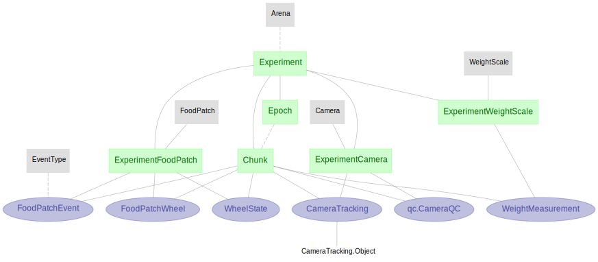

# DataJoint Pipeline for Project Aeon

This pipeline models the data organization and data flow custom-built for Project Aeon. You can find Aeon acquisition system here: [aeon_aquisition](https://github.com/SainsburyWellcomeCentre/aeon_acquisition)

## Pipeline architecture

Figure below presents an abbreviated view of the pipeline, showing the core tables
and the overall dataflow

From the diagram above, we can see that the pipeline is organized in layers of
tables, going top down, from `lookup`-tier (in gray) and `manual`-tier (in green) tables 
to `imported`-tier (in purple) and `computed`-tier (in red) tables.

Such is also the way the data flows through the pipeline, by a combination of ingestion and 
computation routines.

## Core tables

#### Experiment and data acquisition

1. `Experiment` - the `aquisition.Experiment` table stores meta information about the experiments
done in Project Aeon, with secondary information such as the lab/room the experiment is carried out, 
which animals participating, the directory storing the raw data, etc.

2. `Epoch` - A recording period reflecting on/off of the hardware acquisition system.
The `aquisition.Epoch` table records all acquisition epochs and their associated configuration for 
any particular experiment (in the above `aquisition.Experiment` table). 

3.`Chunk` - the raw data are acquired by Bonsai and stored as 
a collection of files every one hour - we call this one-hour a time chunk. 
The `aquisition.Chunk` table records all time chunks and their associated raw data files for 
any particular experiment (in the above `aquisition.Experiment` table). A chunk must belong to one epoch.

#### Devices

5. `ExperimentCamera` - the cameras and associated specifications used for this experiment - 
e.g. camera serial number, frame rate, location, time of installation and removal, etc.

6. `ExperimentFoodPatch` - the food-patches and associated specifications used for this experiment - 
e.g. patch serial number, sampling rate of the wheel, location, time of installation and removal, etc.

7. `ExperimentWeightScale` - the scales for measuring animal weights, usually placed at the nest, one per nest

#### Data streams

8. `FoodPatchEvent` - all events (e.g. pellet triggered, pellet delivered, etc.) 
from a particular `ExperimentFoodPatch`

9. `FoodPatchWheel` - wheel data (angle, intensity) from a particular `ExperimentFoodPatch`

10. `WheelState` - wheel states (threshold, d1, delta) associated with a given `ExperimentFoodPatch`

11. `WeightMeasurement` - scale measurements associated with a given `ExperimentScale`

#### Position data

12. `qc.CameraQC` - quality control procedure applied to each `ExperimentCamera` (e.g. missing frame, etc.)

13. `tracking.CameraTracking` - position tracking for object(s), from each `ExperimentCamera`

#### Standard analyses

14. `Visit` - a `Visit` is defined as a ***period of time*** 
that a particular ***animal*** spends time at a particular ***place***

15. `VisitSubjectPosition` - position data (x, y, z, area) of the subject for any particular visit. 
Position data per visit are stored in smaller time slices (10-minute long) allowing for 
more efficient searches, queries and fetches from the database.

16. `VisitSummary` - a table for computation and storing some summary statistics on a 
per-session level - i.e. total pellet delivered, total distance the animal travelled, total 
distance the wheel travelled (or per food-patch), etc.

17. `VisitTimeDistribution` - a table for computation and storing where the animal is at, 
for each timepoint, e.g. in the nest, in corridor, in arena, in each of the food patches. 
This can be used to produce the ethogram plot.

## Pipeline Diagram

The diagram below shows the high level overview of the diagram (only the subset of the tables that are most relevant).

The diagram below shows the analysis portion of the pipeline (work in progress).

## Operating the pipeline - how the auto ingestion/processing work?

Some meta information about the experiment is entered - e.g. experiment name, participating 
animals, cameras, food patches setup, etc.
+ These information are either entered by hand, or parsed and inserted from configuration 
    yaml files.
+ For experiments these info can be inserted by running  
  + [create_experiment_01](populate/create_experiment_01.py)
  + [create_socialexperiment_0](populate/create_socialexperiment_0.py)
  + [create_experiment_02](populate/create_experiment_02.py)
  (just need to do this once)

Tables in DataJoint are written with a `make()` function - 
instruction to generate and insert new records to itself, based on data from upstream tables. 
Triggering the auto ingestion and processing/computation routine is essentially 
calling the `.populate()` method for all relevant tables.

These routines are prepared in this [auto-processing script](populate/process.py). 
Essentially, turning on the auto-processing routine amounts to running the 
following 2 commands (in different processing threads)

    aeon_ingest high
    
    aeon_ingest mid

