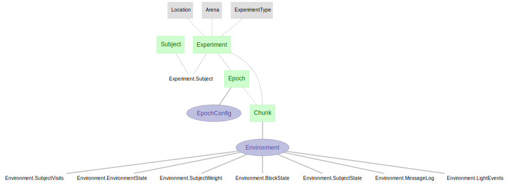
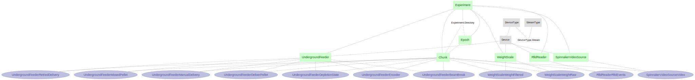
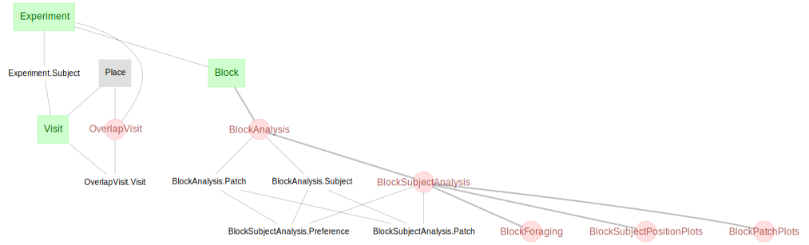

# DataJoint Pipeline for Project Aeon

This DataJoint pipeline models the data organization and data flow tailored to the project's Aeon requirements. You can access the Aeon acquisition system here: [aeon_aquisition](https://github.com/SainsburyWellcomeCentre/aeon_acquisition)

## Pipeline Architecture

The following diagrams provide a high-level overview of the pipeline's components and processes:

The diagram below illustrates the structure of the **acquisition-related tasks within the pipeline**, focusing on the most relevant subset of tables.

The diagram below represents the **data stream flow within the pipeline**, highlighting the subset of tables critical to understanding the process.

  

The diagram below illustrates the **Pyrat synchronization process within the pipeline**, highlighting the key tables involved in syncing data across different components.

The diagram below shows the **analysis portion of the pipeline**.

The pipeline is structured into hierarchical layers of tables, which are depicted in the diagrams above. These layers include:

+ `lookup`-tier tables (gray): Define static reference information
+ `manual`-tier tables (green): Contain user-inputted data
+ `imported`-tier tables (purple): Store data ingested from external sources
+ `computed`-tier tables (red): Represent results of automated computations

Data flows through the pipeline in a top-down manner, driven by a combination of ingestion and computation routines. This layered organization facilitates efficient data processing and modular analysis.

## Core tables

#### Experiment and data acquisition

+ `Experiment` - The `aquisition.Experiment` table stores meta information about the experiments
done in Project Aeon, with secondary information such as the lab/room the experiment is carried out,
which animals participating, the directory storing the raw data, etc.

+ `Epoch` - A recording period reflecting on/off of the hardware acquisition system.
The `aquisition.Epoch` table records all acquisition epochs and their associated configuration for
any particular experiment (in the above `aquisition.Experiment` table).

+ `Chunk` - The raw data are acquired by Bonsai and stored as
a collection of files every one hour - we call this one-hour a time chunk.
The `aquisition.Chunk` table records all time chunks and their associated raw data files for
any particular experiment (in the above `aquisition.Experiment` table). A chunk must belong to one epoch.

#### Position data

+ `qc.CameraQC` - A quality control procedure applied to each `ExperimentCamera` (e.g. missing frame, etc.)

+ `tracking.SLEAPTracking` - Position tracking of object(s) from a particular `VideoSource` per chunk. Key tables include:
    - `PoseIdentity` - Identifies the Subject (i.e. Identity) and stores the name of the body part used as "anchor_part".
    - `Part` - Contains the inferred x,y positions over time for all body parts, as derived from the SLEAP model.

#### Standard analyses

+ `Visit` - A `Visit` is defined as a period of time during which a particular animal remains at a specific place.

+ `Block` - A `Block` refers to a specific period of time, typically lasting around 3 hours, during which the reward rate for each patch is predefined to facilitate certain animal behaviors.

+ `BlockAnalysis` - A higher-level aggregation of events and metrics occurring within a defined block of time during an experiment.This analysis computes patch-related and subject-related metrics separately, without combining or cross-correlating data between them. It provides an overview of behavior and environmental interactions at a broader level, integrating data from multiple subjects and patches.

+ `BlockSubjectAnalysis` - A detailed analysis focusing on individual subjects within a block, explicitly combining a subject's interactions with specific patches. This involves examining how a subject interacts with a particular patch, including metrics such as total interaction time and overall time spent at the patch. Key components include:
    - `Patch`: Tracks the interactions of each subject with specific patches (areas of interests)
    - `Preference`: Measures a subject's preference for specific patches using various analyses, including cumulative preferences based on time spent and distance traveled in relation to each patch.

#### Data stream

+ `SpinnakerVideoSource` - Tracks the placement and operation of a Spinnaker video source at a specific location during a defined period in an experiment. This class includes metadata such as the installation time of the device, enabling the tracking of video data associated with the device.

+ `RfidReader` - Represents the placement and operation of an RFID reader at a specific location for a defined period in an experiment. It records the installation time of the device and facilitates the collection of RFID event data, such as RFID tag detections. The data stream includes sample counts, timestamps, and RFID tag events.

+ `WeightScale` - Monitors the placement and operation of a weight scale within an experiment. It records the installation time of the weight scale and other related metadata, enabling the collection of weight measurements. The data streams include sample counts, timestamps, and weight readings.

+ `UndergroundFeeder` - Tracks the operation of an underground feeder device in a specific experiment. It stores installation time and other metadata, such as configuration and calibration settings. The data stream includes events like beam breaks, pellet deliveries, and depletion states.

## Operating the pipeline - how the auto ingestion/processing work?

Some meta information about the experiment is entered - e.g. experiment name, participating
animals, cameras, food patches setup, etc.

+ These information are either entered by hand, or parsed and inserted from configuration
    yaml files.
+ For experiments these info can be inserted by running
  + [create_socialexperiment_0](create_experiments/create_socialexperiment_0.py)
  + [create_experiment_02](create_experiments/create_experiment_02.py)
  + [create_socialexperiment](create_experiments/create_socialexperiment.py)
  (just need to do this once)

Tables in DataJoint are written with a `make()` function -
instruction to generate and insert new records to itself, based on data from upstream tables.
Triggering the auto ingestion and processing/computation routine is essentially
calling the `.populate()` method for all relevant tables.

These routines are prepared in this [auto-processing script](populate/worker.py).
Essentially, turning on the auto-processing routine amounts to running the
following 4 commands , either in sequence or in parallel (with different processing threads).
Data ingestion/populate with DataJoint is idempotent, so it is safe to run the same command multiple times.

    aeon_ingest pyrat_worker

    aeon_ingest acquisition_worker

    aeon_ingest streams_worker

    aeon_ingest analysis_worker
