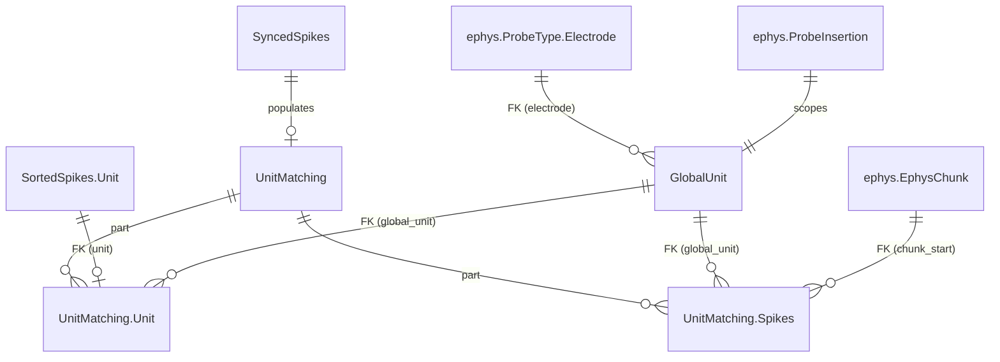

# Unit Matching Specifications

## Table of Contents
1. [Overview](#overview)
2. [Database Schema](#database-schema)
3. [Algorithm](#algorithm)
4. [Ownership Convention for Overlapping Chunks](#ownership-convention-for-overlapping-chunks)
5. [Integration with Existing Pipeline](#integration-with-existing-pipeline)
6. [Re-processing and Deletion](#re-processing-and-deletion)
7. [Query Patterns](#query-patterns)
8. [Design Decisions and Rationale](#design-decisions-and-rationale)

---

## Overview

### Purpose

Long-running AEON experiments record neural activity across multiple consecutive ephys blocks, each independently spike-sorted. The same neuron appears as a different `unit` ID in each block's sorting results. The unit matching system solves this by assigning a persistent **global unit** identity to neurons across blocks, enabling longitudinal analysis of single-neuron activity over days or weeks.

The system works by exploiting temporal overlap between consecutive ephys blocks: when two blocks share a time window, the same neurons produce spikes in both blocks' sorted data. By comparing spike times in the overlap region, the system identifies which units across blocks correspond to the same neuron.

### Prerequisites

Unit matching sits at the end of the spike sorting pipeline. An ephys block must have completed the full chain before it is eligible for matching:

```
SortingTask → PreProcessing → SpikeSorting → PostProcessing
→ SortedSpikes → SyncedSpikes → [OfficialCuration + ApplyOfficialCuration]
→ UnitMatching (this system)
```

Specifically, `UnitMatching.key_source` requires that `ApplyOfficialCuration` exists for the block, ensuring only curated (quality-controlled) results enter the matching pipeline.

### Key Concepts

A **global unit** is a persistent neuron identity scoped to a single probe insertion (i.e., one physical probe in one experiment). Global unit IDs are integers starting at 1, unique within a `(experiment_name, insertion_number)` scope.

A **matched unit** links a block-specific `SortedSpikes.Unit` to its assigned global unit. Each block's unit maps to exactly one global unit. A global unit may be matched to units from multiple blocks (that's the whole point).

**Temporal overlap** between consecutive ephys blocks is the mechanism that enables matching. The overlap region contains spikes from the same neurons captured by both blocks' independent sorting runs. The matching algorithm compares spike times in this overlap window to identify corresponding units.

The **ownership convention** determines which block "owns" the spike data for a given (global_unit, chunk) pair when multiple blocks cover the same chunk. This prevents duplicate rows in `Spikes`.

### Critical Constraint: Temporal Ordering

Ephys blocks **must** be processed in temporal order (by `block_start`). Block N compares its units against previously-matched blocks (1..N-1). Processing out of order produces incorrect global unit assignments.

This constraint is enforced at two levels:

1. **`key_source` gate**: Only yields the block with the earliest unprocessed `block_start` per insertion. Under `populate(reserve_jobs=True)`, a worker that finishes the earliest block causes the next `key_source` evaluation to advance to the next block. Workers processing different insertions can run in parallel; within an insertion, processing is serialized.

2. **`make()` guard**: Before processing, verifies that no earlier eligible block (by `block_start`) for the same insertion remains unprocessed. This is a defense-in-depth check that catches direct `make(key)` calls bypassing `key_source`, or hypothetical bugs in the key_source logic.

```python
# key_source: only the earliest unprocessed block per insertion
eligible = SyncedSpikes & spike_sorting_curation.ApplyOfficialCuration
candidates = eligible - self
next_per_insertion = dj.U(
    "experiment_name", "insertion_number"
).aggr(candidates, next_start="MIN(block_start)")
return candidates * next_per_insertion & "block_start = next_start"
```

```python
# make() guard: verify all predecessors are done
earlier_eligible = eligible & insertion_key & f'block_start < "{key["block_start"]}"'
unprocessed_earlier = earlier_eligible - self
if unprocessed_earlier:
    raise ValueError("Temporal ordering violation: earlier blocks not yet processed.")
```

**Interaction with `reserve_jobs=True`**: When Worker A reserves the earliest block for insertion I1, Worker B's `key_source` also returns that same block (it's not yet in `self`). But the job reservation system prevents B from reserving the already-reserved key. With no other candidates for I1, Worker B idles or processes a different insertion. When A finishes, the next `populate()` cycle advances to the next block.

---

## Database Schema

### Table Definitions

```
UnitMatchingMethod (Lookup)
    matching_method: varchar(32)
    ---
    matching_method_description: varchar(1000)

UnitMatching (Computed)
    -> SyncedSpikes                         # inherits full block key
    ---
    -> UnitMatchingMethod                   # non-PK: which method was used
    execution_time: datetime
    execution_duration: float               # hours

    UnitMatching.Unit (Part)
        -> master
        -> SortedSpikes.Unit                # adds `unit` to PK
        ---
        -> GlobalUnit                    # global_unit as dependent FK
        match_confidence=null: float
        match_comment='': varchar(1000)

    UnitMatching.Spikes (Part)
        -> master
        -> GlobalUnit                    # adds global_unit to PK
        -> ephys.EphysChunk                 # adds chunk_start to PK
        ---
        spike_times: longblob               # datetime64[ns] (UTC), HARP-synced — same format as SyncedSpikes.Unit
        spike_count: int
        unique index (experiment_name, insertion_number, global_unit, chunk_start)  # schema-enforced: one row per (insertion, unit, chunk)

GlobalUnit (Manual)
    -> ephys.ProbeInsertion                 # experiment_name, insertion_number
    global_unit: int                     # unique ID within this insertion
    ---
    -> ephys.ProbeType.Electrode      # peak electrode (denormalized, updated each block)
    global_unit_comment='': varchar(1000)
```

### Entity Relationship Diagram



### Design Notes

- **`UnitMatchingMethod` as non-PK FK**: Only one matching result per block. The method is recorded for provenance but does not multiply the key space. This means one canonical set of global units per insertion — no parallel method comparison. This is a deliberate simplification; if method comparison becomes needed, it can be added later by promoting the FK back to PK.

- **`GlobalUnit` is Manual with denormalized electrode**: Populated programmatically by `UnitMatching.make()`, not by DataJoint's `populate()` machinery. This means it cannot be auto-cleared. Orphaned entries (those with no remaining `Unit` references) must be cleaned up explicitly during re-processing. The peak `electrode` is denormalized from `SortedSpikes.Unit` and stored directly on `GlobalUnit`. It is updated each time a new block is matched (latest block = best estimate of the unit's electrode position). This enables a clean unit roster query — `GlobalUnit & insertion_key` returns one row per unit with its electrode, no joins required.

- **`unique index` on `Spikes`**: The Part table PK includes the master's block key, so the same `(global_unit, chunk_start)` from different blocks would be valid at the PK level. The unique index on `(experiment_name, insertion_number, global_unit, chunk_start)` provides a schema-level guarantee that only one block can own a given (insertion, unit, chunk) pair. The index is scoped per-insertion because `global_unit` IDs are only unique within an insertion — two insertions in the same experiment can both have `global_unit=1`.

- **`UnitMatching.Unit` references `SortedSpikes.Unit` via formal FK**: This enforces referential integrity (cannot match a non-existent unit). Since `UnitMatching` sits downstream of `SortedSpikes` in the pipeline, and curation cleanup deletes `UnitMatching` before `SortedSpikes`, cascade ordering is correct.

---

## Algorithm

### Matching Method: `spike_time_overlap`

The current (and only) matching method uses SpikeInterface's `compare_two_sorters()` to identify corresponding units between ephys blocks based on spike time coincidence in the overlap window.

#### Steps

1. **Load this block's synced spike times** from `SyncedSpikes.Unit`. Concatenate across chunks per unit. Convert `datetime64[ns]` to epoch seconds for the overlap comparison and SpikeInterface compatibility.

2. **Find overlapping previous blocks**: Query all previously-completed `UnitMatching` entries for the same `(experiment_name, insertion_number)`. Filter to those whose `(block_start, block_end)` overlaps with this block's time range.

3. **For each overlapping previous block**:
   a. Load the previous block's synced spike times (same format).
   b. Compute the overlap window: `overlap_start = max(this.block_start, prev.block_start)`, `overlap_end = min(this.block_end, prev.block_end)`.
   c. Restrict both blocks' spike times to the overlap window, converting to relative times (seconds from overlap start).
   d. Convert to sample indices at 30 kHz and build `NumpySorting` objects.
   e. Run `compare_two_sorters(delta_time=0.4)` (0.4 ms coincidence window).
   f. Extract matched pairs. For each match, look up the previous block's unit's `global_unit` assignment (via `UnitMatching.Unit`). Assign this block's unit to the same global unit.

4. **Assign new global units** for unmatched units: find the current maximum `global_unit` ID for this insertion, increment sequentially.

5. **Insert `GlobalUnit`** entries for newly created global units, with peak electrode from `SortedSpikes.Unit`.

6. **Update electrode** on existing `GlobalUnit` entries for matched units (overwrite with this block's peak electrode — latest block = best estimate).

7. **Insert `UnitMatching`** master entry with execution metadata. (Master must exist before Part inserts.)

8. **Insert `UnitMatching.Unit`** entries linking each block's unit to its global unit.

9. **Insert `UnitMatching.Spikes`** entries following the ownership convention (see next section).

#### Parameters

| Parameter | Value | Description |
|-----------|-------|-------------|
| `delta_time` | 0.4 ms | Spike time coincidence window for `compare_two_sorters` |
| Sampling frequency | 30,000 Hz | Used internally to convert timestamps to sample indices for SpikeInterface comparison |

---

## Ownership Convention for Overlapping Chunks

### Problem

When two ephys blocks overlap in time, the same `EphysChunk` (1-hour raw data segment) is sorted independently by both blocks. For a global unit present in both blocks, `SyncedSpikes.Unit` contains spike times from both blocks for the overlapping chunks. Without a convention, `Spikes` would contain duplicate rows for the same `(global_unit, chunk)` from different blocks.

Duplicates cause incorrect downstream analysis: inflated spike counts, artificial short ISIs, and wrong firing rate estimates.

### Convention: Earlier Block Owns

**Rule: for each `(global_unit, chunk)` pair, the first block (in processing order) to write a `Spikes` row wins. Later blocks skip that pair.**

Since blocks are processed in temporal order, "first to process" = "earlier block" for chunks in the overlap region.

Implementation in `UnitMatching.make()`:

```python
for gu_id in this_block_global_units:
    for chunk_key in this_block_chunks:
        # Check if ANY block already wrote this (global_unit, chunk)
        if self.Spikes & {"global_unit": gu_id, "chunk_start": chunk_key["chunk_start"]}:
            continue  # earlier block owns it
        # Get synced spikes for this block's unit in this chunk
        # ... insert if spikes exist
```

### Edge Cases

| Scenario | Behavior |
|----------|----------|
| Non-overlapping chunks | Each chunk covered by exactly one block. No ambiguity. |
| Overlapping chunks, same global unit in both blocks | Earlier block writes the row. Later block skips. |
| New global unit in later block (not matched to prior) | No prior data exists for this unit. Later block writes all its chunks, including overlap ones. |
| Unit has no spikes in a chunk (silent period) | No row written. A later block that does have spikes for this unit in this chunk will write it. |

### Invariant

After all blocks are processed, each `(global_unit, chunk_start)` pair appears in **at most one** `UnitMatching.Spikes` row across all blocks. This invariant is enforced at two levels:

1. **Schema-level**: A `unique index (experiment_name, insertion_number, global_unit, chunk_start)` on `Spikes` guarantees that the database rejects any duplicate per-insertion `(global_unit, chunk_start)` insertion, regardless of which block attempts it. The index is scoped per-insertion because `global_unit` IDs are only unique within an insertion. A later block trying to write an already-owned pair will raise an `IntegrityError`.

2. **Code-level**: The `make()` method checks for existing rows before inserting, skipping already-owned pairs. This prevents the `IntegrityError` from ever being raised during normal operation and provides clear logging of skipped chunks.

---

## Integration with Existing Pipeline

### Pipeline Position

```
SortingTask (Manual)
  → PreProcessing (Computed)
    → SpikeSorting (Computed)
      → PostProcessing (Computed)
        → SIExport (Computed)
        → SortedSpikes (Imported)
          → Waveform (Imported)
          → SortingQuality (Imported)
          → SyncedSpikes (Imported)
            → UnitMatching (Computed)     ← NEW
              ├─ .Unit (Part)             ← NEW
              └─ .Spikes (Part)← NEW

GlobalUnit (Manual)                    ← NEW (populated by UnitMatching.make())
```

### Curation Gate

`UnitMatching.key_source` restricts to blocks that have `ApplyOfficialCuration`. This means:
- Raw (uncurated) blocks are never matched
- The matching uses curated spike sorting results
- Changing a curation requires re-running the matching (see next section)

### Worker Integration

`UnitMatching` is a `Computed` table and can be registered with a DataJoint worker for automated processing. The `key_source` gate (see [Critical Constraint: Temporal Ordering](#critical-constraint-temporal-ordering)) ensures that `populate(reserve_jobs=True)` respects temporal ordering even under parallel execution — workers processing different insertions run in parallel, while blocks within an insertion are serialized automatically.

---

## Re-processing and Deletion

### Scenario: Re-curation of an EphysBlock

When a block's curation is changed (via `restore_raw_sorting()` → new curation → `ApplyOfficialCuration`):

1. `restore_raw_sorting()` deletes `UnitMatching` for the block → cascades to `Unit` and `Spikes` Part rows for that block.
2. Orphaned `GlobalUnit` entries (those with no remaining `Unit` references from any block) are explicitly deleted.
3. `SortedSpikes` and downstream tables are deleted and re-populated with the new curation.
4. `UnitMatching.populate()` re-runs for the block, re-matching and re-writing `Spikes`.

**Important**: Later blocks' `UnitMatching` entries are NOT automatically invalidated. If the re-curation changes which units exist or how they match, downstream blocks may have stale global unit assignments. In this case, the user should re-run matching for affected downstream blocks as well.

### Cascade Behavior

```
Delete UnitMatching entry
  → Cascades to UnitMatching.Unit (Part)
  → Cascades to UnitMatching.Spikes (Part)

Delete SortedSpikes.Unit
  → Blocked if UnitMatching.Unit references it
  → Solution: delete UnitMatching first (handled by restore_raw_sorting)
```

### Cleanup Steps in `restore_raw_sorting()`

```
Step 1: Delete OfficialCuration (cascades to ApplyOfficialCuration)
Step 2: Delete UnitMatching for this block (cascades to Unit + Spikes)
Step 3: Delete orphaned GlobalUnit entries
Step 4: Delete SortedSpikes (cascades to Waveform, SortingQuality, SyncedSpikes)
```

Note: Step 2 no longer requires `force=True` on Part tables (unlike the previous design where `GlobalUnit.Matched` was a Part of `GlobalUnit` but referenced `SortedSpikes.Unit`). With `Unit` as a Part of `UnitMatching`, deleting `UnitMatching` cleanly cascades.

---

## Query Patterns

The primary query interface is designed around a natural workflow: start from an insertion, discover its units (with electrode), then access spike times filterable by chunk for alignment with other data streams.

### Unit roster: all global units for an insertion (with electrode)

```python
insertion_key = {"experiment_name": "exp02", "insertion_number": 1}

# One row per global unit, with electrode — the primary entry point
GlobalUnit & insertion_key
```

Returns `(experiment_name, insertion_number, global_unit, probe_type, electrode)` — one row per unit. No joins needed.

### Spike times for a unit across all time

```python
(UnitMatching.Spikes & insertion_key & {"global_unit": 5}).fetch(
    "chunk_start", "spike_times", "spike_count", order_by="chunk_start"
)
```

Returns one row per chunk (guaranteed by unique index). Block key fields (block_start, block_end, etc.) exist in the PK but are not fetched.

### Spike times filtered by chunk range (for alignment with other streams)

```python
# Time window — align with behavioral or other neural data by chunk
(UnitMatching.Spikes & insertion_key & {"global_unit": 5}
 & f'chunk_start BETWEEN "{start}" AND "{end}"'
).fetch("chunk_start", "spike_times", order_by="chunk_start")

# Single chunk
(UnitMatching.Spikes & insertion_key
 & {"global_unit": 5, "chunk_start": chunk_ts}
).fetch1("spike_times")
```

### All units + all spikes for an insertion

```python
(UnitMatching.Spikes & insertion_key).fetch(
    "global_unit", "chunk_start", "spike_times", "spike_count",
    order_by="global_unit, chunk_start"
)
```

### Which blocks contributed to a global unit?

```python
UnitMatching.Unit & insertion_key & {"global_unit": 5}
```

Returns one row per block where the unit was matched, with the block-specific `unit` ID and match confidence.

### Global unit assignments for a specific block

```python
UnitMatching.Unit & block_key
```

### Raw (non-deduplicated) spike times via join

```python
SyncedSpikes.Unit * UnitMatching.Unit & insertion_key & {"global_unit": 5}
```

Returns per-block per-chunk spike times with global unit labels. Overlap chunks appear with multiple rows (one per block). Use `UnitMatching.Spikes` for the deduplicated version.

---

## Design Decisions and Rationale

### Why `UnitMatchingMethod` is a non-PK FK

**Decision**: One matching result per block. The method is recorded but does not partition the data.

**Rationale**: Making it a PK would mean every downstream query must carry `matching_method`, and global units would be scoped per-method (allowing parallel sets). In practice, the team uses one matching method consistently. The simpler design avoids combinatorial complexity. If method comparison becomes necessary, the FK can be promoted to PK.

### Why `Unit` is a Part of `UnitMatching` (not `GlobalUnit`)

**Decision**: `UnitMatching.Unit` instead of `GlobalUnit.Matched`.

**Rationale**: Part table lifecycle should be governed by the master. `Unit` rows are created and destroyed with their block's `UnitMatching` entry. Placing them under `GlobalUnit` (which has a different lifecycle — it persists across blocks) creates cascade problems: deleting `SortedSpikes.Unit` is blocked by `GlobalUnit.Matched`'s FK, requiring `force=True` hacks. Under `UnitMatching`, the cascade is clean: delete `UnitMatching` → cascades to `Unit` and `Spikes`.

### Why `Spikes` is a Part of `UnitMatching` (not standalone)

**Decision**: Part table with ownership convention, not a standalone Computed table.

**Alternatives considered**:
- **Standalone Computed keyed on `(GlobalUnit, EphysChunk)`**: Clean one-row-per-pair semantics, but the cartesian `key_source` (all units x all chunks) is prohibitively large. A restricted `key_source` is complex to express correctly.
- **No table at all** (use `SyncedSpikes.Unit * UnitMatching.Unit` join): Simplest schema, but overlap chunks produce duplicate rows. Every downstream analysis must implement deduplication.
- **Part of `UnitMatching`** with ownership convention: Avoids cartesian explosion (scoped to block's chunks). Ownership convention guarantees at most one row per (unit, chunk), enforced by a `unique index (experiment_name, insertion_number, global_unit, chunk_start)` at the schema level. Lifecycle managed by cascade.

The Part table approach was chosen because it provides pre-materialized, deduplicated spike times (the primary analysis output) while keeping the scope naturally bounded per block.

### Why `GlobalUnit` is Manual (not Computed)

**Decision**: `GlobalUnit` is a Manual table populated programmatically by `UnitMatching.make()`.

**Rationale**: Global units are created incrementally as blocks are processed. They persist across blocks — a global unit created by block 1 is referenced by blocks 2, 3, etc. A Computed table would need a well-defined `key_source` that doesn't exist (you can't predict which global units will be needed before running the matching). The Manual tier correctly reflects that these entries are managed by application logic, not by DataJoint's populate machinery.
