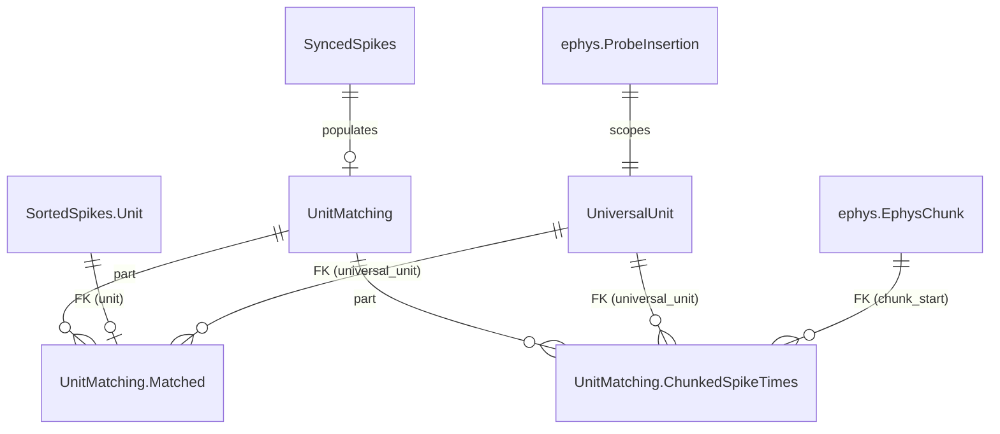

# Unit Matching Specifications

## Table of Contents
1. [Overview](#overview)
2. [Database Schema](#database-schema)
3. [Algorithm](#algorithm)
4. [Ownership Convention for Overlapping Chunks](#ownership-convention-for-overlapping-chunks)
5. [Integration with Existing Pipeline](#integration-with-existing-pipeline)
6. [Re-processing and Deletion](#re-processing-and-deletion)
7. [Query Patterns](#query-patterns)
8. [Design Decisions and Rationale](#design-decisions-and-rationale)

---

## Overview

### Purpose

Long-running AEON experiments record neural activity across multiple consecutive ephys blocks (sessions), each independently spike-sorted. The same neuron appears as a different `unit` ID in each session's sorting results. The unit matching system solves this by assigning a persistent **universal unit** identity to neurons across sessions, enabling longitudinal analysis of single-neuron activity over days or weeks.

The system works by exploiting temporal overlap between consecutive ephys blocks: when two blocks share a time window, the same neurons produce spikes in both blocks' sorted data. By comparing spike times in the overlap region, the system identifies which units across sessions correspond to the same neuron.

### Prerequisites

Unit matching sits at the end of the spike sorting pipeline. A session must have completed the full chain before it is eligible for matching:

```
SortingTask → PreProcessing → SpikeSorting → PostProcessing
→ SortedSpikes → SyncedSpikes → [OfficialCuration + ApplyOfficialCuration]
→ UnitMatching (this system)
```

Specifically, `UnitMatching.key_source` requires that `ApplyOfficialCuration` exists for the session, ensuring only curated (quality-controlled) results enter the matching pipeline.

### Key Concepts

A **universal unit** is a persistent neuron identity scoped to a single probe insertion (i.e., one physical probe in one subject). Universal unit IDs are integers starting at 1, unique within a `(experiment_name, subject, insertion_number)` scope.

A **matched unit** links a session-specific `SortedSpikes.Unit` to its assigned universal unit. Each session unit maps to exactly one universal unit. A universal unit may be matched to units from multiple sessions (that's the whole point).

**Temporal overlap** between consecutive ephys blocks is the mechanism that enables matching. The overlap region contains spikes from the same neurons captured by both blocks' independent sorting runs. The matching algorithm compares spike times in this overlap window to identify corresponding units.

The **ownership convention** determines which session "owns" the spike data for a given (universal_unit, chunk) pair when multiple sessions cover the same chunk. This prevents duplicate rows in `ChunkedSpikeTimes`.

### Critical Constraint: Temporal Ordering

Sessions **must** be processed in temporal order (by `block_start`). Session N compares its units against previously-matched sessions (1..N-1). Processing out of order produces incorrect universal unit assignments.

This constraint is enforced at two levels:

1. **`key_source` gate**: Only yields the session with the earliest unprocessed `block_start` per insertion. Under `populate(reserve_jobs=True)`, a worker that finishes the earliest session causes the next `key_source` evaluation to advance to the next block. Workers processing different insertions can run in parallel; within an insertion, processing is serialized.

2. **`make()` guard**: Before processing, verifies that no earlier eligible session (by `block_start`) for the same insertion remains unprocessed. This is a defense-in-depth check that catches direct `make(key)` calls bypassing `key_source`, or hypothetical bugs in the key_source logic.

```python
# key_source: only the earliest unprocessed block per insertion
eligible = SyncedSpikes & spike_sorting_curation.ApplyOfficialCuration
candidates = eligible - self
next_per_insertion = dj.U(
    "experiment_name", "subject", "insertion_number"
).aggr(candidates, next_start="MIN(block_start)")
return candidates * next_per_insertion & "block_start = next_start"
```

```python
# make() guard: verify all predecessors are done
earlier_eligible = eligible & insertion_key & f'block_start < "{key["block_start"]}"'
unprocessed_earlier = earlier_eligible - self
if unprocessed_earlier:
    raise ValueError("Temporal ordering violation: earlier sessions not yet processed.")
```

**Interaction with `reserve_jobs=True`**: When Worker A reserves the earliest session for insertion I1, Worker B's `key_source` also returns that same session (it's not yet in `self`). But the job reservation system prevents B from reserving the already-reserved key. With no other candidates for I1, Worker B idles or processes a different insertion. When A finishes, the next `populate()` cycle advances to the next block.

---

## Database Schema

### Table Definitions

```
UnitMatchingMethod (Lookup)
    matching_method: varchar(32)
    ---
    matching_method_description: varchar(1000)

UnitMatching (Computed)
    -> SyncedSpikes                         # inherits full session key
    ---
    -> UnitMatchingMethod                   # non-PK: which method was used
    execution_time: datetime
    execution_duration: float               # hours

    UnitMatching.Matched (Part)
        -> master
        -> SortedSpikes.Unit                # adds `unit` to PK
        ---
        -> UniversalUnit                    # universal_unit as dependent FK
        match_confidence=null: float
        match_comment='': varchar(1000)

    UnitMatching.ChunkedSpikeTimes (Part)
        -> master
        -> UniversalUnit                    # adds universal_unit to PK
        -> ephys.EphysChunk                 # adds chunk_start to PK
        ---
        spike_times: longblob               # float64 epoch seconds (UTC), HARP-synced
        spike_count: int
        unique index (experiment_name, subject, insertion_number, universal_unit, chunk_start)  # schema-enforced: one row per (insertion, unit, chunk)

UniversalUnit (Manual)
    -> ephys.ProbeInsertion                 # experiment_name, subject, insertion_number
    universal_unit: int                     # unique ID within this insertion
    ---
    universal_unit_comment='': varchar(1000)
```

### Entity Relationship Diagram



### Design Notes

- **`UnitMatchingMethod` as non-PK FK**: Only one matching result per session. The method is recorded for provenance but does not multiply the key space. This means one canonical set of universal units per insertion — no parallel method comparison. This is a deliberate simplification; if method comparison becomes needed, it can be added later by promoting the FK back to PK.

- **`UniversalUnit` is Manual**: Populated programmatically by `UnitMatching.make()`, not by DataJoint's `populate()` machinery. This means it cannot be auto-cleared. Orphaned entries (those with no remaining `Matched` references) must be cleaned up explicitly during re-processing.

- **`unique index` on `ChunkedSpikeTimes`**: The Part table PK includes the master's session key, so the same `(universal_unit, chunk_start)` from different sessions would be valid at the PK level. The unique index on `(experiment_name, subject, insertion_number, universal_unit, chunk_start)` provides a schema-level guarantee that only one session can own a given (insertion, unit, chunk) pair. The index is scoped per-insertion because `universal_unit` IDs are only unique within an insertion — two insertions for the same subject can both have `universal_unit=1`.

- **`UnitMatching.Matched` references `SortedSpikes.Unit` via formal FK**: This enforces referential integrity (can't match a non-existent unit). Since `UnitMatching` sits downstream of `SortedSpikes` in the pipeline, and curation cleanup deletes `UnitMatching` before `SortedSpikes`, cascade ordering is correct.

---

## Algorithm

### Matching Method: `spike_time_overlap`

The current (and only) matching method uses SpikeInterface's `compare_two_sorters()` to identify corresponding units between sessions based on spike time coincidence in the overlap window.

#### Steps

1. **Load this session's synced spike times** from `SyncedSpikes.Unit`. Concatenate across chunks per unit. Convert `datetime64[ns]` to float64 epoch seconds.

2. **Find overlapping previous sessions**: Query all previously-completed `UnitMatching` entries for the same `(experiment_name, subject, insertion_number)`. Filter to those whose `(block_start, block_end)` overlaps with this session's time range.

3. **For each overlapping previous session**:
   a. Load the previous session's synced spike times (same format).
   b. Compute the overlap window: `overlap_start = max(this.block_start, prev.block_start)`, `overlap_end = min(this.block_end, prev.block_end)`.
   c. Restrict both sessions' spike times to the overlap window, converting to relative times (seconds from overlap start).
   d. Convert to sample indices at 30 kHz and build `NumpySorting` objects.
   e. Run `compare_two_sorters(delta_time=0.4)` (0.4 ms coincidence window).
   f. Extract matched pairs. For each match, look up the previous session's unit's `universal_unit` assignment (via `UnitMatching.Matched`). Assign this session's unit to the same universal unit.

4. **Assign new universal units** for unmatched units: find the current maximum `universal_unit` ID for this insertion, increment sequentially.

5. **Insert `UniversalUnit`** entries for newly created universal units.

6. **Insert `UnitMatching.Matched`** entries linking each session unit to its universal unit.

7. **Insert `UnitMatching.ChunkedSpikeTimes`** entries following the ownership convention (see next section).

8. **Insert `UnitMatching`** master entry with execution metadata.

#### Parameters

| Parameter | Value | Description |
|-----------|-------|-------------|
| `delta_time` | 0.4 ms | Spike time coincidence window for `compare_two_sorters` |
| Sampling frequency | 30,000 Hz | Used to convert epoch seconds to sample indices for SpikeInterface |

---

## Ownership Convention for Overlapping Chunks

### Problem

When two ephys blocks overlap in time, the same `EphysChunk` (1-hour raw data segment) is sorted independently by both blocks. For a universal unit present in both blocks, `SyncedSpikes.Unit` contains spike times from both sessions for the overlapping chunks. Without a convention, `ChunkedSpikeTimes` would contain duplicate rows for the same `(universal_unit, chunk)` from different sessions.

Duplicates cause incorrect downstream analysis: inflated spike counts, artificial short ISIs, and wrong firing rate estimates.

### Convention: Earlier Session Owns

**Rule: for each `(universal_unit, chunk)` pair, the first session (in processing order) to write a `ChunkedSpikeTimes` row wins. Later sessions skip that pair.**

Since sessions are processed in temporal order, "first to process" = "earlier session" for chunks in the overlap region.

Implementation in `UnitMatching.make()`:

```python
for uu_id in this_session_universal_units:
    for chunk_key in this_session_chunks:
        # Check if ANY session already wrote this (uu, chunk)
        if self.ChunkedSpikeTimes & {"universal_unit": uu_id, "chunk_start": chunk_key["chunk_start"]}:
            continue  # earlier session owns it
        # Get synced spikes for this session's unit in this chunk
        # ... insert if spikes exist
```

### Edge Cases

| Scenario | Behavior |
|----------|----------|
| Non-overlapping chunks | Each chunk covered by exactly one session. No ambiguity. |
| Overlapping chunks, same universal unit in both sessions | Earlier session writes the row. Later session skips. |
| New universal unit in later session (not matched to prior) | No prior data exists for this unit. Later session writes all its chunks, including overlap ones. |
| Unit has no spikes in a chunk (silent period) | No row written. A later session that does have spikes for this unit in this chunk will write it. |

### Invariant

After all sessions are processed, each `(universal_unit, chunk_start)` pair appears in **at most one** `UnitMatching.ChunkedSpikeTimes` row across all sessions. This invariant is enforced at two levels:

1. **Schema-level**: A `unique index (experiment_name, subject, insertion_number, universal_unit, chunk_start)` on `ChunkedSpikeTimes` guarantees that the database rejects any duplicate per-insertion `(universal_unit, chunk_start)` insertion, regardless of which session attempts it. The index is scoped per-insertion because `universal_unit` IDs are only unique within an insertion. A later session trying to write an already-owned pair will raise an `IntegrityError`.

2. **Code-level**: The `make()` method checks for existing rows before inserting, skipping already-owned pairs. This prevents the `IntegrityError` from ever being raised during normal operation and provides clear logging of skipped chunks.

---

## Integration with Existing Pipeline

### Pipeline Position

```
SortingTask (Manual)
  → PreProcessing (Computed)
    → SpikeSorting (Computed)
      → PostProcessing (Computed)
        → SIExport (Computed)
        → SortedSpikes (Imported)
          → Waveform (Imported)
          → SortingQuality (Imported)
          → SyncedSpikes (Imported)
            → UnitMatching (Computed)     ← NEW
              ├─ .Matched (Part)          ← NEW
              └─ .ChunkedSpikeTimes (Part)← NEW

UniversalUnit (Manual)                    ← NEW (populated by UnitMatching.make())
```

### Curation Gate

`UnitMatching.key_source` restricts to sessions that have `ApplyOfficialCuration`. This means:
- Raw (uncurated) sessions are never matched
- The matching uses curated spike sorting results
- Changing a curation requires re-running the matching (see next section)

### Worker Integration

`UnitMatching` is a `Computed` table and can be registered with a DataJoint worker for automated processing. The `key_source` gate (see [Critical Constraint: Temporal Ordering](#critical-constraint-temporal-ordering)) ensures that `populate(reserve_jobs=True)` respects temporal ordering even under parallel execution — workers processing different insertions run in parallel, while sessions within an insertion are serialized automatically.

---

## Re-processing and Deletion

### Scenario: Re-curation of a Session

When a session's curation is changed (via `restore_raw_sorting()` → new curation → `ApplyOfficialCuration`):

1. `restore_raw_sorting()` deletes `UnitMatching` for the session → cascades to `Matched` and `ChunkedSpikeTimes` Part rows for that session.
2. Orphaned `UniversalUnit` entries (those with no remaining `Matched` references from any session) are explicitly deleted.
3. `SortedSpikes` and downstream tables are deleted and re-populated with the new curation.
4. `UnitMatching.populate()` re-runs for the session, re-matching and re-writing `ChunkedSpikeTimes`.

**Important**: Later sessions' `UnitMatching` entries are NOT automatically invalidated. If the re-curation changes which units exist or how they match, downstream sessions may have stale universal unit assignments. In this case, the user should re-run matching for affected downstream sessions as well.

### Cascade Behavior

```
Delete UnitMatching entry
  → Cascades to UnitMatching.Matched (Part)
  → Cascades to UnitMatching.ChunkedSpikeTimes (Part)

Delete SortedSpikes.Unit
  → Blocked if UnitMatching.Matched references it
  → Solution: delete UnitMatching first (handled by restore_raw_sorting)
```

### Cleanup Steps in `restore_raw_sorting()`

```
Step 1: Delete OfficialCuration (cascades to ApplyOfficialCuration)
Step 2: Delete UnitMatching for this session (cascades to Matched + ChunkedSpikeTimes)
Step 3: Delete orphaned UniversalUnit entries
Step 4: Delete SortedSpikes (cascades to Waveform, SortingQuality, SyncedSpikes)
```

Note: Step 2 no longer requires `force=True` on Part tables (unlike the previous design where `UniversalUnit.Matched` was a Part of `UniversalUnit` but referenced `SortedSpikes.Unit`). With `Matched` as a Part of `UnitMatching`, deleting `UnitMatching` cleanly cascades.

---

## Query Patterns

### Get all spikes for a universal unit across all time

```python
(UnitMatching.ChunkedSpikeTimes & {"universal_unit": 5}).fetch(
    "chunk_start", "spike_times", "spike_count", order_by="chunk_start"
)
```

Note: the result includes session key fields (block_start, block_end, etc.) inherited from the master. These can be ignored — the ownership convention guarantees one row per (universal_unit, chunk_start).

### Get all sessions where a universal unit was observed

```python
UnitMatching.Matched & {"universal_unit": 5}
```

### Get universal unit assignments for a specific session

```python
UnitMatching.Matched & session_key
```

### Get synced spike times via join (alternative to ChunkedSpikeTimes)

```python
SyncedSpikes.Unit * UnitMatching.Matched & {"universal_unit": 5}
```

This returns per-session per-chunk spike times with universal unit labels. Overlap chunks will appear with multiple rows (one per session). Use `ChunkedSpikeTimes` for the deduplicated version.

### List all universal units for an insertion

```python
UniversalUnit & {"experiment_name": "...", "subject": "...", "insertion_number": 1}
```

---

## Design Decisions and Rationale

### Why `UnitMatchingMethod` is a non-PK FK

**Decision**: One matching result per session. The method is recorded but does not partition the data.

**Rationale**: Making it a PK would mean every downstream query must carry `matching_method`, and universal units would be scoped per-method (allowing parallel sets). In practice, the team settles on one matching method and uses it consistently. The simpler design avoids combinatorial complexity. If method comparison becomes necessary, the FK can be promoted to PK.

### Why `Matched` is a Part of `UnitMatching` (not `UniversalUnit`)

**Decision**: `UnitMatching.Matched` instead of `UniversalUnit.Matched`.

**Rationale**: Part table lifecycle should be governed by the master. `Matched` rows are created and destroyed with their session's `UnitMatching` entry. Placing them under `UniversalUnit` (which has a different lifecycle — it persists across sessions) creates cascade problems: deleting `SortedSpikes.Unit` is blocked by `UniversalUnit.Matched`'s FK, requiring `force=True` hacks. Under `UnitMatching`, the cascade is clean: delete `UnitMatching` → cascades to `Matched` and `ChunkedSpikeTimes`.

### Why `ChunkedSpikeTimes` is a Part of `UnitMatching` (not standalone)

**Decision**: Part table with ownership convention, not a standalone Computed table.

**Alternatives considered**:
- **Standalone Computed keyed on `(UniversalUnit, EphysChunk)`**: Clean one-row-per-pair semantics, but the cartesian `key_source` (all units x all chunks) is prohibitively large. A restricted `key_source` is complex to express correctly.
- **No table at all** (use `SyncedSpikes.Unit * UnitMatching.Matched` join): Simplest schema, but overlap chunks produce duplicate rows. Every downstream analysis must implement deduplication.
- **Part of `UnitMatching`** with ownership convention: Avoids cartesian explosion (scoped to session's chunks). Ownership convention guarantees at most one row per (unit, chunk), enforced by a `unique index (experiment_name, subject, insertion_number, universal_unit, chunk_start)` at the schema level. Lifecycle managed by cascade.

The Part table approach was chosen because it provides pre-materialized, deduplicated spike times (the primary analysis output) while keeping the scope naturally bounded per session.

### Why `UniversalUnit` is Manual (not Computed)

**Decision**: `UniversalUnit` is a Manual table populated programmatically by `UnitMatching.make()`.

**Rationale**: Universal units are created incrementally as sessions are processed. They persist across sessions — a universal unit created by session 1 is referenced by sessions 2, 3, etc. A Computed table would need a well-defined `key_source` that doesn't exist (you can't predict which universal units will be needed before running the matching). The Manual tier correctly reflects that these entries are managed by application logic, not by DataJoint's populate machinery.
