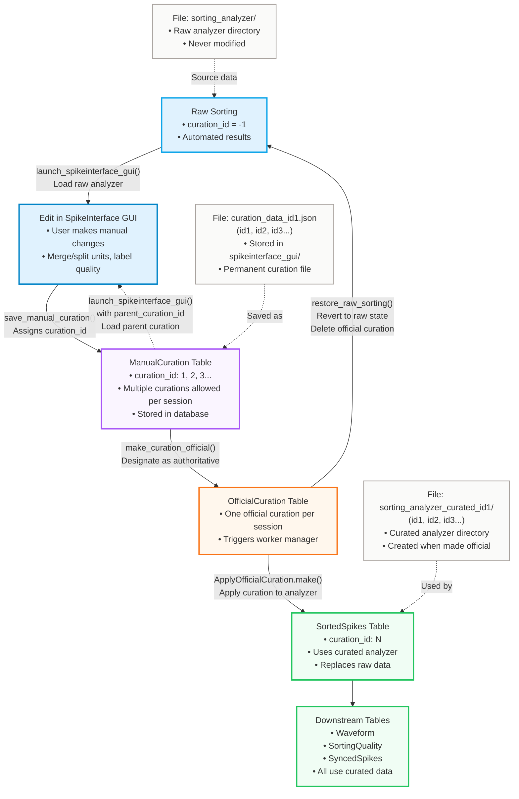

# Spike Sorting Curation Specifications

## Table of Contents
1. [Overview](#overview)
2. [Database Schema](#database-schema)
3. [File System Organization](#file-system-organization)
4. [Core Functions](#core-functions)
5. [User Workflows](#user-workflows)
6. [Implementation Details](#implementation-details)
7. [Integration with Existing Pipeline](#integration-with-existing-pipeline)

---

## Overview

### Purpose

The spike sorting curation system addresses a critical need in neuroscience data processing: while automated spike sorting algorithms can identify and classify neural spikes, their results often require manual refinement to correct errors, merge split units, remove noise, and improve overall quality. This system provides a complete workflow for manual curation using the SpikeInterface GUI, allowing researchers to iteratively refine their spike sorting results while maintaining a clear record of all changes and their lineage.

The system is designed around a flexible curation model that supports multiple manual curations per session, enabling researchers to experiment with different curation strategies or refine their work over time. Each curation is saved with a unique identifier, allowing comparison and iteration. Once a researcher is satisfied with a particular curation, they can designate it as "official," which triggers automatic application of the curation to all downstream database tables. This ensures that subsequent analyses use the curated data while preserving the original raw sorting results for reference or re-analysis.

The architecture separates concerns cleanly: user-facing scripts in the `scripts` folder provide simple interfaces for common operations, while the core logic resides in the pipeline module (`spike_sorting_curation.py`), ensuring that all curation operations are properly integrated with the DataJoint database schema. This design allows the system to automatically track curation lineage, manage file storage, and coordinate with the worker manager for asynchronous processing.

### Workflow Overview

The following diagram provides a high-level overview of the curation workflow:



### Key Concepts

Understanding the curation system requires familiarity with several key concepts. **Raw sorting** refers to the initial automated spike sorting results before any manual intervention. These results are never modified by the curation system, ensuring that the original data remains available for comparison or re-analysis.

A **manual curation** represents a set of manual changes made to the raw sorting results. These changes can include merging units that were incorrectly split, splitting units that were incorrectly merged, labeling units for quality assessment, or removing units that represent noise. Each manual curation is saved with a unique `curation_id` (starting at 1 and incrementing), allowing multiple curations to coexist for the same session.

An **official curation** is a single manual curation that has been designated as the authoritative version for a session. When a curation is made official, the system applies it to all downstream database tables, ensuring that subsequent analyses use the curated data. The system maintains a clear distinction between raw sorting (with `curation_id=-1`) and curated sorting (with `curation_id` equal to the official curation's ID), allowing the pipeline to automatically select the appropriate data source.

The **curation_id** serves as the unique identifier for each manual curation. It starts at 1 for the first curation of a session and increments for each subsequent curation. This ID is used throughout the system to track curation lineage, with each curation optionally referencing a `parent_curation_id` to indicate which previous curation (if any) it was based on.

### Module Organization

The curation system is organized into two main components. The core module, located at `aeon/dj_pipeline/spike_sorting_curation.py`, contains all the essential logic for curation operations, including database table definitions, helper functions for path resolution, and the main curation functions. This centralization ensures that all curation operations follow consistent patterns and properly integrate with the DataJoint pipeline.

User-facing scripts in `aeon/dj_pipeline/scripts/` provide convenient entry points for common operations. The `launch_si_gui.py` script wraps the core `launch_spikeinterface_gui()` function, while `save_curation.py` provides wrappers for saving curations, making them official, and restoring raw sorting. These scripts demonstrate proper usage patterns and can be customized by users for their specific workflows. By keeping the core logic in the pipeline module and the scripts as thin wrappers, the system maintains a clear separation between implementation and interface.

---

## Database Schema

The curation system's database schema is designed to track the complete lifecycle of manual curations while maintaining clear relationships with the existing spike sorting pipeline. The design follows DataJoint's hierarchical table structure, with manual tables for user-initiated actions and imported tables for automated processing. This approach ensures that curation metadata is properly integrated with the broader pipeline while maintaining data integrity through foreign key relationships.

### Tables

#### `CurationMethod` (Lookup Table)

The `CurationMethod` table serves as a lookup table that defines the available curation methods or tools that can be used for manual curation. This table currently contains two entries: "Phy" and "SpikeInterface", though the system is designed to support additional curation tools in the future. The table's primary key is `curation_method`, a varchar(16) field that stores the method name. This lookup table ensures consistency in how curation methods are referenced throughout the system and allows for easy extension if new curation tools are added.

#### `ManualCuration` (Manual Table)

The `ManualCuration` table is the central repository for all manual curation metadata. Each entry in this table represents a single manual curation session, storing information about when the curation was performed, what method was used, and how it relates to other curations. The table's primary key inherits from `spike_sorting.SpikeSorting`, ensuring that each curation is uniquely associated with a specific sorting task, and includes a `curation_id` integer field that uniquely identifies each curation within that sorting task.

The table includes several important attributes. The `curation_datetime` field stores the UTC timestamp when the curation was performed, providing an audit trail of when work was done. The `parent_curation_id` field tracks curation lineage: if set to -1, the curation is based directly on the raw sorting results; otherwise, it contains the `curation_id` of a previous manual curation that this one was based on. This allows researchers to build upon previous work while maintaining a clear history of how curations evolved. The `curation_method` field references the `CurationMethod` lookup table, indicating which tool was used (currently "SpikeInterface" for all curations). Finally, the `description` field provides a 1000-character space for user-defined notes about the curation, allowing researchers to document their rationale or observations.

The `ManualCuration.File` part table stores the file path information for each curation. It includes a `file_name` field storing the filename (e.g., "curation_data_id1.json") and a `file` field that uses DataJoint's filepath storage to reference the actual curation JSON file on disk. This separation allows the system to track file locations while keeping the main table focused on curation metadata.

When an official curation is applied (via `ApplyOfficialCuration`), the system also stores the path to the curated analyzer directory in `ManualCuration.File` with `file_name="curation_applied_analyzer"`. This allows the system to fetch the applied analyzer directory path from the database instead of relying on naming conventions, making the system more maintainable and flexible.

#### `OfficialCuration` (Manual Table)

The `OfficialCuration` table designates which manual curation should be considered the "official" version for a given session. This table has a simple structure: its primary key inherits from `spike_sorting.SortedSpikes`, ensuring a one-to-one relationship with sorted spike data, and it contains a single attribute `curation_id` that references the `ManualCuration` table. This design enforces the constraint that only one curation can be official at a time for any given sorting session.

When a researcher designates a curation as official, an entry is created in this table. This action triggers the worker manager to populate the `ApplyOfficialCuration` table, which handles the actual application of the curation to the database. The separation between designation (in `OfficialCuration`) and application (in `ApplyOfficialCuration`) allows the system to track both the user's intent and the system's execution of that intent.

#### `ApplyOfficialCuration` (Imported Table)

The `ApplyOfficialCuration` table is an imported table that tracks the actual application of an official curation to the database. Unlike the manual tables, this table is populated automatically by the worker manager when an `OfficialCuration` entry is created. The table's primary key inherits from `OfficialCuration`, creating a one-to-one relationship that ensures each official curation designation has a corresponding application record.

The table stores execution metadata including `execution_time` (when the curation was applied), `new_unit_count` (how many new units were created through merges or splits), and `removed_unit_count` (how many units were removed). These metrics provide insight into the impact of the curation on the data. The table's `make()` method contains the core logic for applying a curation: it loads the curation JSON file, applies the changes to the sorting analyzer using SpikeInterface's `apply_curation()` function, saves the curated analyzer to disk, and coordinates the deletion and re-population of downstream database tables.

### Table Relationships and Data Flow

The curation system's tables are carefully interconnected to maintain data integrity and enable efficient querying. The `ManualCuration` table inherits its primary key from `spike_sorting.SpikeSorting`, creating a direct link to the sorting task. The `OfficialCuration` table inherits from `spike_sorting.SortedSpikes`, which itself depends on `SpikeSorting` through the `PostProcessing` table, creating a chain of dependencies that ensures official curations are only created for valid sorting sessions.

The `SortedSpikes` table includes a `curation_id` attribute (not part of the primary key) that indicates which curation is currently applied. This attribute is set to -1 for raw (uncurated) sorting results, or to the `curation_id` of the official curation if one has been applied. This design allows downstream tables like `Waveform` and `SortingQuality` to automatically determine which analyzer to use by reading the `curation_id` from `SortedSpikes`, ensuring that all downstream processing uses consistent data sources.

The relationship between `OfficialCuration` and `ApplyOfficialCuration` creates a clear separation between user intent (designating a curation as official) and system execution (applying that curation). This separation allows the system to track both what the user requested and how the system fulfilled that request, providing transparency and enabling debugging if issues arise during curation application.

---

## File System Organization

The curation system organizes files in a structured hierarchy that separates raw data from curated data, temporary working files from permanent storage, and ensures that multiple curations can coexist without conflicts. This organization strategy preserves the original raw sorting results while allowing researchers to create and compare multiple curated versions.

### Directory Structure

For each sorting session, the system creates a directory structure that mirrors the database hierarchy while providing clear separation between different types of data. The structure begins at the sorting root directory (typically a mounted server volume) and follows this pattern:

```
{sorting_root_dir}/
  {experiment_name}/
    ephys_blocks/
      {block_start}_{block_end}/
        {electrode_group}/
          {sorting_method}_{paramset_id}/
            sorting_analyzer/                    # Raw analyzer (never modified)
              spikeinterface_gui/
                curation_data.json              # Active curation file (temporary)
                curation_metadata.json          # Metadata file (temporary, tracks parent_curation_id)
                curation_data_id1.json          # Saved curation ID 1
                curation_data_id2.json          # Saved curation ID 2
                ...
            sorting_analyzer_curated_id{curation_id}/  # Official curated analyzer
```

The `sorting_analyzer` directory contains the raw sorting analyzer, which is never modified by the curation system. This ensures that the original automated sorting results remain available for comparison or re-analysis. Within this directory, the `spikeinterface_gui` subdirectory contains all curation-related files. The raw analyzer itself is a SpikeInterface `SortingAnalyzer` object that combines the recording data with the sorting results and includes all computed extensions (waveforms, quality metrics, etc.).

When an official curation is applied, the system creates a separate directory named `sorting_analyzer_curated_id{curation_id}` that contains a new `SortingAnalyzer` object with the curation applied. This separation ensures that the raw analyzer remains untouched while providing a complete curated analyzer that can be used for downstream analysis. The curated analyzer includes all the same extensions as the raw analyzer, but with the curation changes applied and metrics recomputed as needed.

### Path Resolution

The system derives all file paths from database configuration rather than requiring users to provide local paths. This approach ensures consistency across different users and environments while working seamlessly with both local mounts and server paths.

The sorting root directory is retrieved using the `get_sorting_root_dir()` function from `aeon.dj_pipeline.utils.paths`. This function uses the repository configuration (typically "ceph_aeon") to determine the base path and returns the absolute path to `{repository_path}/aeon/dj_store/ephys-processed`. This centralized path resolution ensures that all users working with the same repository configuration will access the same data locations.

The output directory for a specific sorting session is stored in the `PreProcessing` table's `sorting_output_dir` field as a relative path. The system retrieves this path using `sorting_root_dir / (PreProcessing & key).fetch1("sorting_output_dir")`, combining the root directory with the session-specific relative path. This design allows the system to work with data stored in various locations while maintaining a consistent interface.

The analyzer directories follow a predictable pattern. The raw analyzer is always located at `output_dir / "sorting_analyzer"`, while curated analyzers are stored at `output_dir / f"sorting_analyzer_curated_id{curation_id}"`. When an official curation is applied, the system stores the curated analyzer directory path in `ManualCuration.File` with `file_name="curation_applied_analyzer"`, allowing the system to fetch the path from the database instead of constructing it from a naming convention. This provides a single source of truth and makes the system more maintainable.

### File Lifecycle and Naming Conventions

The curation system manages several types of files with different lifecycles. Understanding these lifecycles is important for understanding how the system works and for troubleshooting issues.

The `curation_data.json` file is a temporary working file used by the SpikeInterface GUI. This file is created when a user launches the GUI (either starting from raw data or loading a parent curation) and is actively modified as the user makes changes in the GUI. The file is deleted after the curation is saved to the database with a `curation_id`, ensuring that each curation session starts with a clean slate. If a user launches the GUI and finds an existing `curation_data.json` file, the system warns them that this file represents unsaved work and may belong to another user.

The `curation_metadata.json` file is another temporary file that tracks the `parent_curation_id` between GUI launch and save operations. When a user launches the GUI with a `parent_curation_id` parameter, the system creates this metadata file to remember which curation the new one is based on. When the curation is saved, the system reads this metadata file to set the `parent_curation_id` in the database, then deletes the file. If the user launches the GUI without a parent curation, any existing metadata file is deleted to ensure a clean state.

Saved curation files follow the pattern `curation_data_id{curation_id}.json` and are permanent storage files. These files are created when a curation is saved to the database and are never automatically deleted by the system. They serve as the source of truth for what changes were made in each curation and are referenced by the database through the `ManualCuration.File` table. The naming convention makes it easy to identify which curation a file represents and ensures that multiple curations can coexist in the same directory.

Curated analyzer folders are created when an official curation is applied and follow the pattern `sorting_analyzer_curated_id{curation_id}`. These folders contain complete `SortingAnalyzer` objects with the curation applied and all extensions recomputed. They are permanent storage that remains on disk even if the curation is later replaced or the raw sorting is restored, allowing researchers to access historical curated versions if needed. The path to each curated analyzer directory is stored in `ManualCuration.File` with `file_name="curation_applied_analyzer"`, providing a database-backed source of truth for the directory location.

---

## Core Functions

The curation system provides several functions that work together to enable the complete curation workflow. These functions are organized into helper functions (used internally) and user-facing functions (called directly by researchers or scripts). Understanding how these functions interact is key to understanding the system's operation.

### Helper Functions (Internal)

#### `_get_analyzer_dir_from_key(key: dict) -> Path`

This internal helper function, located in `spike_sorting_curation.py`, serves as the central path resolution mechanism for all curation operations. It takes a database key dictionary (containing fields like `experiment_name`, `block_start`, `block_end`, `electrode_group`, and `paramset_id`) and constructs the absolute path to the sorting analyzer directory.

The function works by first retrieving the sorting root directory using `get_sorting_root_dir()` from the paths utility module. It then queries the `PreProcessing` table using the provided key to fetch the `sorting_output_dir` field, which contains the relative path from the sorting root to the session's output directory. Finally, it combines these paths with the "sorting_analyzer" directory name to return the complete path. This centralized path resolution ensures consistency across all curation functions and eliminates the need for users to manually specify file paths.

---

### User-Facing Functions

#### `launch_spikeinterface_gui(key: dict, parent_curation_id: Optional[int] = None) -> None`

The `launch_spikeinterface_gui()` function, located in `spike_sorting_curation.py`, is the entry point for manual curation work. It prepares the environment for curation and launches the SpikeInterface GUI, allowing researchers to interactively refine their spike sorting results.

The function takes two parameters: a `key` dictionary containing session identification fields (`experiment_name`, `block_start`, `block_end`, `electrode_group`, and `paramset_id`), and an optional `parent_curation_id` that specifies an existing curation to build upon. If `parent_curation_id` is not provided, the function starts from the raw sorting results.

The function begins by constructing the analyzer directory path using the `_get_analyzer_dir_from_key()` helper and verifies that the directory exists, raising a helpful error if it doesn't. It then ensures that the `spikeinterface_gui` subdirectory exists, creating it if necessary.

If a `parent_curation_id` is provided, the function handles loading the parent curation. It first queries the `ManualCuration.File` table to retrieve the path to the parent curation's JSON file. Before copying this file, it checks if `curation_data.json` already exists and warns the user if it does, as overwriting it would destroy unsaved work. If the path is clear, it copies the parent curation file to `curation_data.json` and creates a `curation_metadata.json` file containing the `parent_curation_id`. This metadata file ensures that when the curation is later saved, the system knows which curation it was based on, enabling proper lineage tracking.

If no `parent_curation_id` is provided, the function checks for any existing `curation_metadata.json` file and deletes it if found, ensuring a clean state when starting from raw data. It also checks for an existing `curation_data.json` file and, if found, logs a warning that includes the file's modification time and how many days ago it was modified. This warning helps users identify if they're picking up where they left off or if another user has unsaved work.

Once the file preparation is complete, the function loads the sorting analyzer from the analyzer directory using SpikeInterface's `load_sorting_analyzer()` function. It then attempts to launch the GUI using `spikeinterface_gui.run_mainwindow()`, which provides the full desktop GUI experience. If the `spikeinterface_gui` package is not available, it falls back to SpikeInterface's built-in viewer. After the GUI closes, the function logs a reminder to save the curation using the `save_manual_curation()` function.

The function performs several file operations depending on the scenario. If loading a parent curation, it creates both `curation_data.json` and `curation_metadata.json`. If starting from raw data and a metadata file exists, it deletes the metadata file. The function also reads the parent curation file from the database if a parent is specified.

---

#### `save_manual_curation(key: dict, description: str = "") -> int`

The `save_manual_curation()` function, located in `spike_sorting_curation.py`, completes the curation workflow by saving the manual changes made in the GUI to the database. This function takes the temporary `curation_data.json` file created during GUI work and makes it a permanent, tracked curation with a unique identifier.

The function accepts a `key` dictionary containing session identification fields and an optional `description` string that allows researchers to add notes about the curation. It returns the `curation_id` that was assigned to the saved curation, which can be used for making the curation official or for reference in future work.

The function begins by constructing the analyzer directory path and locating the `curation_data.json` file. If this file doesn't exist, it raises a `FileNotFoundError` with instructions to ensure the curation was saved in the GUI. This check prevents users from attempting to save when no curation work has been done.

Once the file is located, the function retrieves the `SpikeSorting` key from the database to ensure the session is valid. It then determines the next available `curation_id` by querying the `ManualCuration` table for all existing curation IDs for this session. If no curations exist yet, it assigns ID 1; otherwise, it assigns the maximum existing ID plus one. This simple incrementing scheme ensures unique IDs while being easy to understand and track.

The function then copies `curation_data.json` to a permanent file named `curation_data_id{curation_id}.json`. Before deleting the original file, it verifies that the copy succeeded and validates that the copied file contains valid JSON. This safety check ensures that if something goes wrong during the copy or if the file is corrupted, the original file is preserved and the user can recover their work.

After the file is safely copied and validated, the function deletes the original `curation_data.json` file. This cleanup ensures that the next time the GUI is launched, it starts with a clean slate. The function then reads the `curation_metadata.json` file if it exists to retrieve the `parent_curation_id`. If the metadata file doesn't exist (indicating the curation was based on raw data), it defaults to -1. If the metadata file exists but is corrupted or unreadable, the function gracefully handles the error and defaults to -1, logging a warning.

With the parent curation ID determined, the function inserts a new entry into the `ManualCuration` table. This entry includes the current UTC timestamp, the parent curation ID, the curation method ("SpikeInterface"), and the optional description. It then inserts a corresponding entry into the `ManualCuration.File` part table, storing the filename and file path. Finally, it deletes the `curation_metadata.json` file since this information is now stored in the database, and returns the assigned `curation_id`.

The function performs several file operations: it reads both `curation_data.json` and `curation_metadata.json` (if it exists), creates the permanent `curation_data_id{curation_id}.json` file, and deletes both temporary files after successful save. On the database side, it inserts entries into both `ManualCuration` and `ManualCuration.File` tables.

---

#### `make_curation_official(key: dict, curation_id: int) -> None`

The `make_curation_official()` function, located in `spike_sorting_curation.py`, designates a previously saved manual curation as the official version for a session. This function is the bridge between manual curation work and downstream analysis, as making a curation official triggers its application to all database tables.

The function takes a `key` dictionary identifying the session and a `curation_id` specifying which manual curation should become official. It performs several validation checks before creating the official curation entry.

First, it retrieves the `SpikeSorting` key from the database to ensure the session is valid. It then verifies that the specified `curation_id` exists in the `ManualCuration` table for this session, ensuring that only valid curations can be made official. Next, it retrieves the `SortedSpikes` key for the raw sorting (with `curation_id=-1`), which is required for the `OfficialCuration` table's primary key structure.

The function then checks if an `OfficialCuration` entry already exists for this session. If one exists with a different `curation_id`, it raises a `ValueError` with instructions to restore the raw sorting first. This prevents accidentally overwriting an existing official curation without explicit user action. If an `OfficialCuration` entry already exists with the same `curation_id`, the function logs an informational message and returns without error, making the operation idempotent and safe to call multiple times.

If all checks pass, the function inserts a new entry into the `OfficialCuration` table. This insertion triggers the worker manager to detect the new entry and automatically populate the `ApplyOfficialCuration` table, which handles the actual application of the curation. The function itself does not wait for this processing to complete, as it is handled asynchronously by the worker manager.

The function performs database operations by reading from `ManualCuration` and `SortedSpikes` tables to validate the request, then inserting into `OfficialCuration`. The insertion triggers the worker manager to populate `ApplyOfficialCuration`, which will apply the curation and update all downstream tables.

---

#### `restore_raw_sorting(key: dict) -> None`

The `restore_raw_sorting()` function, located in `spike_sorting_curation.py`, provides a way to revert a session back to its raw (uncurated) state by removing the official curation designation. This function is useful when researchers want to start over with curation or when they need to apply a different curation as official.

The function takes only a `key` dictionary identifying the session. It first checks if an `OfficialCuration` entry exists for this session. If no official curation exists, there's nothing to restore, so the function logs an informational message and returns gracefully.

If an official curation does exist, the function fetches the `curation_id` from the `OfficialCuration` entry for logging purposes, then deletes the `OfficialCuration` entry. Due to DataJoint's cascade deletion rules, this automatically deletes the corresponding `ApplyOfficialCuration` entry as well.

The function then deletes the `SortedSpikes` entry for the curated data. This deletion cascades to all downstream tables that depend on `SortedSpikes`, including `SortedSpikes.Unit`, `Waveform` (and its part tables), `SortingQuality` (and its part tables), and `SyncedSpikes`. This ensures that all curated data is removed from the database.

After the deletions are complete, the worker manager detects that `SortedSpikes` needs to be populated and automatically re-populates it using the raw analyzer. This re-population also triggers re-population of all downstream tables, effectively restoring the session to its pre-curation state in the database.

Importantly, the function does not delete any files from disk. The curated analyzer folders remain on disk for reference, allowing researchers to access historical curated versions if needed. This design preserves data while allowing the database to be reset to the raw state.

The function performs database operations by deleting from `OfficialCuration` (which cascades to `ApplyOfficialCuration`), `SortedSpikes` (which cascades to all downstream tables), and triggers the worker manager to re-populate these tables using raw data. It performs no file operations, leaving all disk files intact.

---

### Table Methods

#### `ApplyOfficialCuration.make(key)`

The `ApplyOfficialCuration.make()` method, located in `spike_sorting_curation.py` as a class method of the `ApplyOfficialCuration` table, contains the core logic for applying an official curation to the database. This method is automatically called by the worker manager when `ApplyOfficialCuration.populate(key)` is executed, which happens after an `OfficialCuration` entry is created.

The method begins by retrieving the `curation_id` from the `OfficialCuration` entry associated with the provided key. It then queries the `ManualCuration.File` table to fetch the path to the curation JSON file for that `curation_id`. This file contains all the manual changes (merges, splits, labels, removals) that were made during curation.

The method loads the curation dictionary from the JSON file and retrieves the output directory from the `PreProcessing` table. It then loads the original sorting analyzer from the `sorting_analyzer` directory, which contains the raw (uncurated) sorting results. Before applying the curation, it tracks the original unit IDs so it can later calculate how many units were added or removed.

The actual curation application is performed using SpikeInterface's `apply_curation()` function. This function takes the sorting analyzer and curation dictionary as inputs and uses "soft" merging mode, which enables lazy recomputation of extensions. This means that only units affected by the curation have their metrics recomputed, while unchanged units retain their existing computed values. This approach is much more efficient than full recalculation, especially for large datasets. The function returns a new `SortingAnalyzer` object in memory with the curation applied.

After applying the curation, the method tracks how many new units were created (through splits or merges) and how many were removed. It then saves the curated analyzer to a new directory named `sorting_analyzer_curated_id{curation_id}` and stores the directory path in `ManualCuration.File` with `file_name="curation_applied_analyzer"`. This separation ensures that the raw analyzer in `sorting_analyzer` remains untouched, and the database provides a reliable source of truth for the curated analyzer location.

Before proceeding with database updates, the method checks the current curation state in `SortedSpikes`. If the `curation_id` in `SortedSpikes` already matches the curation being applied, it logs an informational message and returns, making the operation idempotent. If a different curation is currently applied, it raises a `ValueError` with instructions to restore the raw sorting first. This validation prevents inconsistent states and ensures that curations are applied in a controlled manner.

If the current state is raw (indicated by `curation_id=-1`), the method deletes the existing `SortedSpikes` entry. This deletion automatically cascades to all downstream tables due to DataJoint's foreign key relationships, removing all raw sorting data from the database. The method then performs a sanity check, asserting that the downstream tables (`Waveform`, `SortingQuality`, `SyncedSpikes`) are indeed empty, which should always be true due to cascade deletion but provides an extra safety check.

After all validations and deletions are complete, the method inserts an entry into the `ApplyOfficialCuration` table, recording the execution time and the unit count changes. This entry serves as a record that the curation was successfully applied. The worker manager then detects that `SortedSpikes` needs to be populated and automatically re-populates it. Since the curated analyzer is now in the expected location (the standard `sorting_analyzer` path is used by `SortedSpikes.make()` when it detects an official curation), the re-population will use the curated data. This re-population also triggers re-population of all downstream tables, ensuring that the entire pipeline uses the curated data.

The method performs file operations by reading the curation JSON file and the raw analyzer from `sorting_analyzer/`, then creating the curated analyzer in `sorting_analyzer_curated_id{curation_id}/`. On the database side, it deletes from `SortedSpikes` (which cascades to downstream tables) and inserts into `ApplyOfficialCuration`. The worker manager then handles populating `SortedSpikes`, `Waveform`, `SortingQuality`, and `SyncedSpikes` with curated data.

A key implementation detail is that the method uses SpikeInterface's `apply_curation()` with `merging_mode="soft"` for efficient lazy recomputation. The raw analyzer always remains in `sorting_analyzer/` and is never modified, while the curated analyzer is saved to a separate folder with a descriptive name that includes the `curation_id`.

---

## User Workflows

The curation system supports several common workflows that researchers use in their daily work. Understanding these workflows helps clarify how the system's components work together and provides practical guidance for using the system effectively. Each workflow represents a complete end-to-end process from starting curation work to having curated data available for analysis.

### Workflow 1: Create a New Manual Curation (from Raw)

This is the most common workflow, used when a researcher wants to create their first curation of a session starting from the raw automated sorting results.

The workflow begins by launching the SpikeInterface GUI. The researcher imports the curation module and constructs a key dictionary identifying the session:

```python
from aeon.dj_pipeline import spike_sorting_curation

key = {
    "experiment_name": "my_experiment",
    "block_start": "2024-01-01 10:00:00",
    "block_end": "2024-01-01 12:00:00",
    "electrode_group": "0-143",
    "paramset_id": "250"
}

spike_sorting_curation.launch_spikeinterface_gui(key)
```

When the GUI launches, it loads the raw sorting analyzer and presents it for manual curation. The researcher then performs their curation work, making manual changes such as merging units that were incorrectly split, splitting units that were incorrectly merged, labeling units for quality assessment, or removing units that represent noise. Throughout this work, the researcher periodically clicks "Save in analyzer" in the GUI to save their progress to the `curation_data.json` file. This periodic saving protects against data loss if the GUI crashes or the session is interrupted.

Once the curation work is complete, the researcher saves the curation to the database by calling:

```python
curation_id = spike_sorting_curation.save_manual_curation(key, description="First pass curation")
```

This function assigns a unique `curation_id` (starting at 1 for the first curation), copies `curation_data.json` to a permanent file named `curation_data_id{curation_id}.json`, deletes the temporary `curation_data.json` file, and creates entries in the `ManualCuration` and `ManualCuration.File` tables. The function returns the assigned `curation_id`, which the researcher can use for reference or for making the curation official later.

---

### Workflow 2: Create a Curation Based on a Parent Curation

This workflow is used when a researcher wants to refine or build upon a previous curation rather than starting from raw data. This is common when iteratively improving curation quality or when multiple researchers are collaborating on the same session.

The workflow begins by launching the GUI with a `parent_curation_id` parameter:

```python
parent_curation_id = 1  # Existing curation to base on
spike_sorting_curation.launch_spikeinterface_gui(key, parent_curation_id=parent_curation_id)
```

When the GUI launches with a parent curation, it loads the parent curation file and applies it to the analyzer before presenting it to the researcher. This means the GUI shows the analyzer with all the parent curation's changes already applied, allowing the researcher to see the current state and make additional refinements. The system also creates a `curation_metadata.json` file that tracks which curation this new one is based on.

The researcher then performs additional curation work, making changes on top of the parent curation. They save their progress in the GUI as before. When ready, they save the new curation:

```python
curation_id = spike_sorting_curation.save_manual_curation(key, description="Refinement of curation 1")
```

The save function reads the `curation_metadata.json` file to determine the `parent_curation_id` and stores it in the database entry. This creates a clear lineage showing that this curation was based on curation 1. The system copies the curation file to a permanent location, deletes both temporary files (`curation_data.json` and `curation_metadata.json`), and creates the database entries. The result is a new curation with `curation_id=2` (assuming curation 1 was the first) that has `parent_curation_id=1`, clearly showing the relationship between the curations.

---

### Workflow 3: Make a Curation Official

This workflow is used when a researcher has completed their curation work and wants to apply it to all downstream database tables so that subsequent analyses use the curated data.

The workflow begins by designating a curation as official:

```python
curation_id = 2  # The curation to make official
spike_sorting_curation.make_curation_official(key, curation_id)
```

This function creates an entry in the `OfficialCuration` table, which triggers the worker manager to detect that `ApplyOfficialCuration` needs to be populated. The worker manager then calls `ApplyOfficialCuration.populate(key)`, which in turn calls `ApplyOfficialCuration.make(key)`.

The `make()` method performs the actual application of the curation. It loads the curation JSON file, loads the raw sorting analyzer, and applies the curation using SpikeInterface's `apply_curation()` function with soft merging mode for efficient lazy recomputation. It saves the curated analyzer to `sorting_analyzer_curated_id{curation_id}/` and stores the path in `ManualCuration.File` with `file_name="curation_applied_analyzer"`. It then deletes the old `SortedSpikes` entry (which cascades to all downstream tables). The worker manager then automatically re-populates `SortedSpikes` and all downstream tables (`Waveform`, `SortingQuality`, `SyncedSpikes`) using the curated analyzer, which is located by fetching the path from the database.

The result is that `SortedSpikes` now has `curation_id={curation_id}` instead of -1, indicating that curated data is being used. All downstream tables automatically use the curated analyzer because they read the `curation_id` from `SortedSpikes` and fetch the analyzer directory path from `ManualCuration.File`. The raw analyzer remains untouched in `sorting_analyzer/`, and the curated analyzer is available in `sorting_analyzer_curated_id{curation_id}/`.

---

### Workflow 4: Restore to Raw Sorting

This workflow is used when a researcher wants to revert a session back to its raw (uncurated) state. This might be necessary if they want to start over with curation, apply a different curation as official, or if they discover issues with the current official curation.

The workflow is simple:

```python
spike_sorting_curation.restore_raw_sorting(key)
```

This function checks if an `OfficialCuration` exists for the session. If not, it logs an informational message and returns. If an official curation does exist, it deletes the `OfficialCuration` entry (which cascades to `ApplyOfficialCuration`) and deletes the `SortedSpikes` entry (which cascades to all downstream tables). The worker manager then detects that `SortedSpikes` needs to be populated and automatically re-populates it and all downstream tables using the raw analyzer.

The result is that `SortedSpikes` has `curation_id=-1` again, indicating raw sorting, and all downstream tables use raw data. Importantly, the curated analyzer folders remain on disk, allowing researchers to access historical curated versions if needed. This design preserves data while allowing the database to be reset to the raw state.

---

### Workflow 5: Combined Save and Make Official

This workflow combines saving a curation and making it official in a single operation, which is convenient when a researcher is confident that their curation is final and ready for use.

The workflow uses a convenience function from the scripts module:

```python
from aeon.dj_pipeline.scripts import save_curation

save_curation.save_and_make_official(key, description="Final curation")
```

This function first calls `save_manual_curation()` to save the curation and get its `curation_id`, then immediately calls `make_curation_official()` with that `curation_id`. This eliminates the need for the researcher to manually save and then make official in separate steps, streamlining the workflow when the curation is known to be final.

---

## Implementation Details

The curation system's implementation involves several important design decisions and technical approaches that ensure reliability, efficiency, and proper integration with the broader pipeline. Understanding these details helps explain why the system works the way it does and how it handles edge cases and potential issues.

### Path Management

The system's path management is designed to eliminate the need for users to manually specify file paths, instead deriving all paths from database configuration. This approach ensures consistency across different users and environments while working seamlessly with both local mounts and server paths.

The sorting root directory is retrieved using the `get_sorting_root_dir()` function from `aeon.dj_pipeline.utils.paths`. This function uses the repository configuration (typically "ceph_aeon") to determine the base path and returns the absolute path to `{repository_path}/aeon/dj_store/ephys-processed`. This centralized configuration ensures that all users working with the same repository configuration access the same data locations.

The output directory for each session is stored in the `PreProcessing` table's `sorting_output_dir` field as a relative path. The format follows the pattern `{experiment_name}/ephys_blocks/{block_start}_{block_end}/{electrode_group}/{sorting_method}_{paramset_id}`, which mirrors the database hierarchy. The absolute path is constructed by combining the sorting root directory with this relative path: `sorting_root_dir / PreProcessing.sorting_output_dir`.

This design means that users never need to provide a `local_root_dir` parameter or manually construct paths. The system automatically determines the correct paths based on the session key and repository configuration, working correctly whether the data is on a local mount, a network share, or a remote server.

---

### Curation Application

The system's curation application leverages SpikeInterface's built-in curation capabilities to efficiently apply manual changes to sorting results. The integration uses SpikeInterface's `apply_curation()` function, which takes a `SortingAnalyzer` object and a curation dictionary as inputs.

The curation dictionary is a JSON structure containing several types of changes. The `manual_labels` field is a dictionary mapping unit IDs to quality labels (e.g., "good", "noise", "mua"). The `removed` field is a list of unit IDs that should be removed entirely. The `merges` field is a list of lists, where each inner list contains unit IDs that should be merged into a single unit. The `splits` field is a dictionary mapping a unit ID to a list of new unit IDs that should replace it.

The system uses "soft" merging mode when applying curations, which enables lazy recomputation of extensions. This means that when units are merged, split, or otherwise modified, only those specific units have their metrics and waveforms recomputed. Units that are unchanged retain their existing computed values, avoiding unnecessary computation. This approach is much more efficient than full recalculation, especially for large datasets with many units, and can save significant time when applying curations.

The `apply_curation()` function returns a new `SortingAnalyzer` object in memory with the curation applied. This new object contains all the same extensions as the original (waveforms, quality metrics, etc.), but with the curation changes incorporated and affected extensions recomputed as needed.

---

### Database Integration

The curation system integrates with the existing spike sorting pipeline through careful modifications to existing tables and the addition of new curation-specific tables. The integration is designed to be backward compatible, ensuring that existing sessions continue to work without modification.

The `SortedSpikes` table was modified to include a `curation_id` attribute (not part of the primary key) that indicates which curation is currently applied. This attribute defaults to -1, indicating raw (uncurated) sorting. When an official curation is applied, this attribute is set to the `curation_id` of the official curation.

The `SortedSpikes.make()` method was modified to check for an `OfficialCuration` entry when determining which analyzer to load. If an official curation exists, it fetches the curated analyzer directory path from `ManualCuration.File` with `file_name="curation_applied_analyzer"`; otherwise, it uses the raw analyzer from `sorting_analyzer/`. The method stores the `curation_id` in the `SortedSpikes` entry, making it available for downstream tables.

Downstream tables like `Waveform` and `SortingQuality` were modified to read the `curation_id` from `SortedSpikes` and use it to determine which analyzer directory to use. This ensures that all downstream processing uses consistent data sources. The `SyncedSpikes` table automatically uses the correct analyzer because it depends on `SortedSpikes` and inherits the curation context.

The system leverages DataJoint's cascade deletion feature to ensure data consistency. When a `SortedSpikes` entry is deleted, DataJoint automatically deletes all dependent entries, including `SortedSpikes.Unit` (a part table), `Waveform` and its part tables (`UnitWaveform`, `ChannelWaveform`), `SortingQuality` and its part table (`Metric`), and `SyncedSpikes`. Similarly, deleting an `OfficialCuration` entry automatically deletes the corresponding `ApplyOfficialCuration` entry. This cascade behavior ensures that the database never has orphaned entries and maintains referential integrity.

---

### Worker Manager Integration

The curation system is designed to work with DataJoint's worker manager for asynchronous processing. This design separates user-initiated actions (creating entries in manual tables) from system-executed actions (populating imported tables), allowing the system to handle long-running operations without blocking users.

When an `OfficialCuration` entry is created, the worker manager automatically detects that `ApplyOfficialCuration` needs to be populated and triggers `ApplyOfficialCuration.populate(key)`. Similarly, when `SortedSpikes` entries are deleted, the worker manager detects that they need to be re-populated and handles that automatically. This asynchronous approach means that users don't have to wait for potentially time-consuming operations to complete.

The curation functions themselves never call `.populate()` directly. Instead, they only create or delete entries in manual tables, and the worker manager handles all population. This design ensures that population happens in a controlled, monitored environment and allows for proper error handling and logging.

---

### Error Handling

The system includes comprehensive error handling to provide helpful feedback and prevent data loss. When the analyzer directory is not found, the system raises a `FileNotFoundError` with a helpful message that guides users to verify their key and ensure that `PreProcessing` has been run. Similarly, when a curation file is not found during save, the system raises a `FileNotFoundError` with instructions to ensure the curation was saved in the GUI.

The system includes validation logic to prevent inconsistent states. When applying a curation, if the curation is already applied (indicated by matching `curation_id` in `SortedSpikes`), the system logs an informational message and returns, making the operation idempotent. If a different curation is currently applied, the system raises a `ValueError` with instructions to restore the raw sorting first. This prevents accidentally overwriting an existing official curation without explicit user action.

Before deleting the original `curation_data.json` file during save, the system validates that the copied file contains valid JSON. If validation fails, it preserves the original file and raises an error, preventing data loss. The system also includes warnings for concurrent editing scenarios, checking if `curation_data.json` exists when launching the GUI and warning users with the file's modification time and how many days ago it was modified. This helps users identify if they're picking up where they left off or if another user has unsaved work.

---

### Circular Dependency Handling

The curation system and the spike sorting pipeline have a circular dependency: the curation system needs to check `SortedSpikes` to determine curation state, while `SortedSpikes.make()` needs to check the curation system to determine which analyzer to use. This circular dependency is resolved using a lazy import pattern.

In `spike_sorting.py`, the `SortedSpikes.make()` method uses Python's `importlib` module to import the `spike_sorting_curation` module at runtime when needed, rather than at module load time. This defers the import until the method is actually called, avoiding the circular import error that would occur if both modules tried to import each other at load time.

The lazy import is located in `spike_sorting.py` in the `SortedSpikes.make()` method (around lines 628-633). This pattern allows the modules to reference each other without creating import cycles, while maintaining clear separation of concerns.

---

## Integration with Existing Pipeline

The curation system integrates seamlessly with the existing spike sorting pipeline, extending its functionality without breaking existing workflows. The integration is designed to be backward compatible, ensuring that all existing sessions continue to work without modification while new sessions can take advantage of curation capabilities.

### Dependencies

The curation system depends on several existing pipeline components. The `spike_sorting.PreProcessing` table provides the `sorting_output_dir` field that specifies where each session's data is stored. The `spike_sorting.SpikeSorting` table provides the primary key structure that curation tables inherit from, ensuring proper relationships between sorting tasks and their curations.

The system integrates with several downstream tables that process sorted spike data. The `spike_sorting.SortedSpikes` table was modified to support curation tracking, while `spike_sorting.Waveform` and `spike_sorting.SortingQuality` were modified to read curation information and use the appropriate analyzer. The `spike_sorting.SyncedSpikes` table automatically uses the correct analyzer because it depends on `SortedSpikes` and inherits the curation context.

The system also depends on the path management utility `aeon.dj_pipeline.utils.paths.get_sorting_root_dir()`, which provides centralized path resolution based on repository configuration. This utility ensures that all curation operations use consistent paths regardless of where the data is stored.

### Modifications to Existing Code

The integration required careful modifications to existing tables to support curation while maintaining backward compatibility. The `SortedSpikes` table was extended with a `curation_id` attribute (not part of the primary key) that defaults to -1, indicating raw sorting. The table's `make()` method was modified to check for an `OfficialCuration` entry when determining which analyzer to load. If an official curation exists, it uses the curated analyzer; otherwise, it uses the raw analyzer. The method stores the `curation_id` in the inserted entry, making it available for downstream tables.

The `Waveform` table's `make()` method was modified to read the `curation_id` from `SortedSpikes` and use it to construct the appropriate analyzer directory path. This ensures that waveform data is computed from the same analyzer source as the sorted spikes data. Similarly, the `SortingQuality` table's `make()` method was modified to read `curation_id` and use the appropriate analyzer, ensuring that quality metrics are computed from the correct data source.

All modifications were designed to be backward compatible. Existing sessions that were processed before the curation system was added continue to work exactly as before, using the raw analyzer by default (indicated by `curation_id=-1`). New sessions can take advantage of curation capabilities, and the system automatically handles both curated and uncurated sessions seamlessly.

---

## Summary

The spike sorting curation system provides a complete workflow for manual refinement of automated spike sorting results, integrated seamlessly with the DataJoint pipeline. The system's design philosophy centers on flexibility, data preservation, and ease of use, enabling researchers to iteratively improve their sorting results while maintaining clear records of all changes and their lineage.

### Key Design Decisions

Several key design decisions shape how the system works and why it's structured the way it is. The system supports multiple manual curations with unique IDs, allowing researchers to save different curation attempts and compare them. This flexibility is important because curation is often an iterative process where researchers refine their approach over time. The ability to save multiple curations enables experimentation without losing previous work.

Only one curation can be designated as "official" at a time for each session, ensuring that downstream analysis uses a single, well-defined dataset. This constraint prevents confusion about which version of the data should be used and ensures consistency across analyses. The separation between manual curations (which can be many) and official curation (which is one) provides flexibility during the curation process while maintaining clarity for analysis.

The system preserves the raw analyzer in a separate location (`sorting_analyzer/`) that is never modified, while saving curated analyzers to separate folders (`sorting_analyzer_curated_id{curation_id}/`). This design ensures that the original automated sorting results are always available for comparison or re-analysis, while curated versions are clearly identified and easily accessible.

All file paths are derived from database configuration rather than requiring users to provide local paths. This database-driven approach ensures consistency across different users and environments, works seamlessly with both local mounts and server paths, and eliminates a common source of errors from manual path specification.

The system integrates with DataJoint's worker manager for asynchronous processing, with all population handled automatically. Curation functions only create or delete entries in manual tables, and the worker manager handles all `.populate()` calls. This separation allows long-running operations to proceed without blocking users and provides proper error handling and monitoring.

The system uses SpikeInterface's "soft" merging mode for curation application, which enables lazy recomputation of extensions. This means only modified units have their metrics recomputed, while unchanged units retain their existing values. This approach is much more efficient than full recalculation, especially for large datasets.

All curation operations are designed to be idempotent, meaning they can be called multiple times safely without causing errors or inconsistent states. This design makes the system robust to accidental duplicate calls and simplifies error recovery.

Finally, the system automatically tracks parent curation relationships using a metadata file (`curation_metadata.json`) that persists between GUI launch and save operations. This ensures that when a curation is saved, the system correctly records which previous curation (if any) it was based on, enabling proper lineage tracking in the database.

### File Organization

The system organizes files in a clear hierarchy that separates raw data from curated data and temporary working files from permanent storage. The raw analyzer is always stored in `sorting_analyzer/` and is never modified, ensuring the original automated results remain available. Curated analyzers are saved to `sorting_analyzer_curated_id{curation_id}/`, with one folder per official curation. The active curation file `curation_data.json` is temporary and used by the GUI during curation work. The metadata file `curation_metadata.json` is also temporary and tracks parent curation relationships between GUI launch and save. Saved curation files follow the pattern `curation_data_id{curation_id}.json` and are permanent storage that remains on disk and is tracked in the database.

### Function Responsibilities

The system's functions each have clear, focused responsibilities. The `launch_spikeinterface_gui()` function handles GUI interaction and file preparation, ensuring the environment is ready for curation work. The `save_manual_curation()` function saves curation results to the database and manages file operations, creating permanent storage and cleaning up temporary files. The `make_curation_official()` function creates `OfficialCuration` entries, which triggers the worker manager to apply the curation. The `restore_raw_sorting()` function deletes official curation entries, triggering the worker manager to restore raw data. The `ApplyOfficialCuration.make()` method contains the core logic for applying curations, updating analyzers, and coordinating database updates. Finally, the `_get_analyzer_dir_from_key()` helper function provides centralized path resolution used by all curation functions.

Together, these components create a complete, integrated system that enables researchers to refine their spike sorting results while maintaining data integrity, clear lineage tracking, and seamless integration with the broader analysis pipeline.

