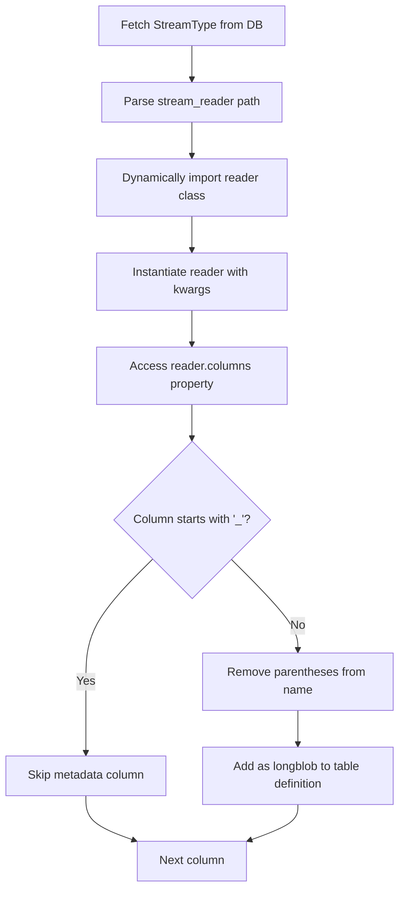

# Streams Maker Architecture

Auto-generates DataJoint table definitions for device and stream data based on Pydantic schema definitions.

## Overview

`streams_maker.py` bridges declarative Pydantic schema definitions (Experiment classes with Rig objects) and executable DataJoint tables (`streams.py`). It reads catalog entries from the database (`StreamType`, `DeviceType`, `Device`) and generates Python table classes dynamically.

## Architecture Flow

```
┌─────────────────────────────────┐
│ Experiment Class                │
│ (Pydantic BaseSchema)           │
│ • ForagingABC                   │
│ • Experiment.rig                │
└──────────────┬──────────────────┘
               │
               ▼
┌─────────────────────────────────┐
│ load_new_metadata.py             │
│ • get_experiment_class()         │
│ • extract_rig_from_metadata()    │
│ • get_device_info()              │
│ • get_device_mapper_from_rig()   │
│ • insert_device_types()          │
│ • ingest_epoch_metadata_from_rig()│
└──────────────┬──────────────────┘
               │
               ▼
┌─────────────────────────────────┐
│ Database Catalog Tables          │
│ • StreamType                    │
│ • DeviceType                    │
│ • DeviceType.Stream             │
│ • Device                        │
└──────────────┬──────────────────┘
               │
               ▼
┌─────────────────────────────────┐
│ streams_maker.main()            │
│ • get_device_template()        │
│ • get_device_stream_template()  │
└──────────────┬──────────────────┘
               │
               ▼
┌─────────────────────────────────┐
│ streams.py (auto-generated)     │
│ • Device tables (dj.Manual)     │
│ • Stream tables (dj.Imported)   │
└─────────────────────────────────┘
```

## Key Concepts

### Rig

A Pydantic model representing the hardware configuration of an experiment. Contains device collections organized by category:

```python
class Rig(BaseSchema):
    cameras: dict[str, Camera]  # e.g., {"top": Camera(...), "side": Camera(...)}
    feeders: dict[str, Feeder]   # e.g., {"feeder1": Feeder(...)}
    nest: Nest                   # Single device instance
```

### Device

A physical or logical hardware unit. Each device:
- Has a `device_type` attribute (e.g., "SpinnakerCamera", "Feeder")
- May have a `serial_number` or `port_name` for identification
- Contains `@data_reader` methods that define its data streams

### Stream

A data collection channel from a device, defined as a `@data_reader` method on the Device class:

```python
class Camera(Device):
    device_type = "SpinnakerCamera"
    
    @data_reader
    def video(self, pattern: str) -> Video:
        """Video stream from camera."""
        return Video(pattern=pattern)
    
    @data_reader
    def position(self, pattern: str) -> Position:
        """Position tracking stream."""
        return Position(pattern=pattern)
```

The `@data_reader` decorator:
- Creates a cached property on the device instance
- Resolves file patterns using `_resolve_pattern_prefix()` based on device hierarchy
- Returns a reader instance configured for that device's data location

### Pattern Resolution

Patterns in `@data_reader` methods are resolved relative to the device's position in the Rig hierarchy:

```python
# In Rig.cameras["top"].video(pattern="*.mp4")
# Pattern resolves to: <experiment_root>/cameras/top/*.mp4
```

This allows devices to reference their data files without hardcoding paths.

## Key Components

### Catalog Tables

**`StreamType`**: Catalog of all stream types
- `stream_type`: Name (e.g., "Video", "WeightRaw")
- `stream_reader`: Class path (e.g., "swc.aeon.io.reader.Video")
- `stream_reader_kwargs`: Dict of initialization parameters
- `stream_hash`: UUID hash for uniqueness

**`DeviceType`**: Catalog of device types
- `device_type`: Name (e.g., "SpinnakerCamera", "Feeder")
- `device_description`: Optional description

**`DeviceType.Stream`**: Links device types to their streams
- Foreign keys to `DeviceType` and `StreamType`
- Defines which streams are available for each device type

**`Device`**: Physical device instances
- `device_serial_number`: Unique identifier (or port_name)
- Foreign key to `DeviceType`

### Parsing Functions

**`get_device_info(rig)`**
- Iterates over Rig model fields to find device collections
- For each device, extracts:
  - `device_type` from `device.device_type` attribute
  - Stream types from `@data_reader` methods on the device class
- Returns dict mapping device names to their configuration

**`get_device_mapper_from_rig(rig, metadata_filepath)`**
- Extracts device type and serial number mappings
- Uses `device.device_type` directly (no hardcoded inference)
- Handles both dict collections and single device instances

**`insert_device_types(rig, metadata_filepath)`**
- Populates catalog tables (`DeviceType`, `DeviceType.Stream`, `Device`)
- Only inserts devices that exist in both Rig and metadata file
- Triggers table generation via `streams_maker.main()`

**`ingest_epoch_metadata_from_rig(experiment_name, rig, epoch_config, metadata_filepath)`**
- Inserts device installation/removal records
- Handles device attributes (settings/configurations)
- Tracks device removal times

### Template Generators

**`get_device_template(device_type)`**
- Creates `dj.Manual` table for device installation/removal tracking
- Includes `Attribute` and `RemovalTime` part tables
- Example: `SpinnakerCamera` table tracks when cameras are installed/removed

**`get_device_stream_template(device_type, stream_type, streams_module)`**
- Creates `dj.Imported` table for raw data streams
- Dynamically instantiates reader to extract column definitions
- Implements `make()` method for data loading
- Example: `SpinnakerCameraVideo` table stores video metadata per chunk

## Device vs Stream Distinction

### Pydantic Schema Definition

```python
# Multi-stream device
class Camera(Device):
    device_type = "SpinnakerCamera"
    
    @data_reader
    def video(self, pattern: str) -> Video:
        return Video(pattern=pattern)
    
    @data_reader
    def position(self, pattern: str) -> Position:
        return Position(pattern=pattern)

# Single-stream device
class Nest(Device):
    device_type = "Nest"
    
    @data_reader
    def weight_raw(self, pattern: str) -> WeightRaw:
        return WeightRaw(pattern=pattern)
```

### Parsing Logic

The `get_device_info()` function extracts streams from `@data_reader` methods:

```python
# For each device in Rig
device_class = type(device)
stream_types = extract_stream_types_from_device(device_class)
# Returns: ["video", "position"] (snake_case method names)

# Convert to PascalCase for StreamType catalog
stream_type_names = [to_pascal_case(st) for st in stream_types]
# Returns: ["Video", "Position"]
```

### DataJoint Table Structure

| Component | Table Type | Purpose | Example |
|-----------|-----------|---------|---------|
| **Device** | `dj.Manual` | Track device installation/removal | `SpinnakerCamera` |
| **Stream** | `dj.Imported` | Store raw data per chunk | `SpinnakerCameraVideo` |

**Device Table** (`SpinnakerCamera`):
```python
-> Experiment
-> Device
spinnaker_camera_install_time: datetime(6)
---
spinnaker_camera_name: varchar(36)
```

**Stream Table** (`SpinnakerCameraVideo`):
```python
-> SpinnakerCamera
-> Chunk
---
sample_count: int
timestamps: longblob
hw_counter: longblob
hw_timestamp: longblob
```

## Column Extraction Process



**Process**:
1. Fetch `stream_reader` and `stream_reader_kwargs` from `StreamType` table
2. Parse class path (e.g., `"swc.aeon.io.reader.Video"`)
3. Dynamically import and instantiate: `Video(**kwargs)`
4. Extract `reader.columns` (e.g., `["hw_counter", "hw_timestamp", "_frame"]`)
5. Filter: skip columns starting with `"_"` (metadata)
6. Normalize: remove type annotations from names (e.g., `"x (float)"` → `"x"`)
7. Generate table definition with all columns as `longblob`

**Example**:
```python
# Reader: Video(columns=["hw_counter", "hw_timestamp", "_frame", "_path"])
# Generated columns:
# - hw_counter: longblob
# - hw_timestamp: longblob
# (_frame, _path skipped - start with "_")
```

## Stream Name Conversion

Stream names are converted from snake_case (method names) to PascalCase (catalog entries):

- `video` → `Video`
- `weight_raw` → `WeightRaw`
- `beam_break` → `BeamBreak`

This conversion is handled by `to_pascal_case()` in `load_new_metadata.py`.

## Integration Points

**Called from `acquisition.py`**:
```python
# In EpochConfig.make()
experiment_class = get_experiment_class(schema_name)
rig = extract_rig_from_metadata(experiment_class, metadata_filepath)

insert_device_types(rig, metadata_filepath)  # Populates catalog tables
streams_maker.main()  # Generates new tables based on catalogs
ingest_epoch_metadata_from_rig(...)  # Inserts device installations
```

**Generated `streams.py` is imported**:
- Direct: `from aeon.dj_pipeline import streams`
- Fallback: Uses `VirtualModule` if import fails


## Example: Complete Flow

1. **Schema Definition** (Pydantic):
   ```python
   class ForagingABC(BaseSchema):
       experiment: Experiment
       
   class Experiment(BaseSchema):
       rig: Rig
       
   class Rig(BaseSchema):
       cameras: dict[str, Camera]
       
   class Camera(Device):
       device_type = "SpinnakerCamera"
       
       @data_reader
       def video(self, pattern: str) -> Video:
           return Video(pattern=pattern)
   ```

2. **Metadata Loading** (`load_new_metadata.py`):
   - `get_experiment_class()` loads ForagingABC class
   - `extract_rig_from_metadata()` extracts Rig instance from Metadata.json
   - `get_device_info(rig)` extracts: `device_type="SpinnakerCamera"`, streams: `["Video"]`
   - `insert_device_types()` inserts into `DeviceType` and `DeviceType.Stream` tables

3. **Table Generation** (`streams_maker.py`):
   - Creates `SpinnakerCamera` device table (dj.Manual)
   - Creates `SpinnakerCameraVideo` stream table (dj.Imported)
   - Writes to `streams.py`

4. **Device Installation** (`ingest_epoch_metadata_from_rig()`):
   - Inserts device installation record with install time
   - Inserts device attributes (settings/configurations)
   - Tracks device removal time if applicable

5. **Usage**:
   ```python
   from aeon.dj_pipeline import streams
   streams.SpinnakerCamera.insert1({...})  # Manual entry
   streams.SpinnakerCameraVideo.populate()  # Auto-populate from files
   ```
