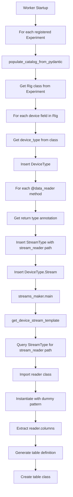

# Streams Maker Architecture

Auto-generates DataJoint table definitions for device and stream data based on Pydantic schema definitions.

## Overview

`streams_maker.py` bridges declarative Pydantic schema definitions (Experiment classes with Rig objects) and executable DataJoint tables (`streams.py`). It reads catalog entries from the database (`StreamType`, `DeviceType`, `Device`) and generates Python table classes dynamically.

## Package Dependencies

```
swc.aeon.rigs (aeon_swc_rigs)          swc.aeon.schema (aeon_api)
├── BaseSchema                          ├── BaseSchema (extends rigs)
├── Device (config only)                ├── DataSchema (adds @data_reader support)
├── SpinnakerCamera                     ├── data_reader decorator
├── UndergroundFeeder                   └── Reader classes (Video, Position, Encoder)
└── HarpDevices                                │
                                               ▼
                            Experiment packages (e.g., aeon_exp_foragingABC)
                            ├── Extend device classes with @data_reader methods
                            └── Define experiment-specific Rig(DataSchema)
```

**Key imports** (in experiment package):
```python
from swc.aeon.schema import BaseSchema, DataSchema, data_reader
from swc.aeon.schema.core import Video, Position, Encoder
from swc.aeon.schema.video import SpinnakerCamera
from swc.aeon.schema.foraging import UndergroundFeeder
from swc.aeon.io import reader
```

## Three Decoupled Steps

The streams_maker architecture is organized into three distinct steps that **must execute in order** but are **decoupled in their dependencies**:

```
┌─────────────────────────────────────────────────────────────────────────────┐
│                         THREE DECOUPLED STEPS                               │
├─────────────────────────────────────────────────────────────────────────────┤
│                                                                             │
│  STEP 1: CATALOG POPULATION (Class-level)                                   │
│  ─────────────────────────────────────────                                  │
│  Input:  Pydantic Experiment class                                          │
│  Output: DeviceType, StreamType, DeviceType.Stream tables                   │
│  When:   Experiment registration / worker startup                           │
│  Needs:  Pydantic class definition only (NO metadata.json)                  │
│                                                                             │
│                              ↓                                              │
│                                                                             │
│  STEP 2: TABLE CREATION (DDL)                                               │
│  ────────────────────────────                                               │
│  Input:  DeviceType, StreamType catalog                                     │
│  Output: ExperimentDevice, DeviceDataStream table classes                   │
│  When:   Worker startup (MUST be outside transaction)                       │
│  Needs:  Catalog only (columns extracted on-demand from reader class)       │
│                                                                             │
│                              ↓                                              │
│                                                                             │
│  STEP 3: DATA POPULATION (DML)                                              │
│  ─────────────────────────────                                              │
│  Input:  metadata.json (instances), data files (stream data)                │
│  Output: Entries in Device, ExperimentDevice, DeviceDataStream tables       │
│  When:   EpochConfig.populate(), DeviceDataStream.populate()                │
│  Needs:  metadata.json for device instances, EpochConfig.Meta for readers   │
│                                                                             │
└─────────────────────────────────────────────────────────────────────────────┘
```

### Key Insight: Columns are Class-Level Information

**Stream columns are defined by the reader CLASS, not by runtime/epoch-specific configuration.**

```python
class Video(reader.Harp):
    def __init__(self, pattern):
        # Columns are FIXED in the class definition!
        super().__init__(pattern, columns=["hw_counter", "hw_timestamp"])
```

The `pattern` argument affects WHERE data is loaded from, not WHAT columns exist. This means:
- **Step 2** can extract columns on-demand by importing the reader class from `StreamType.stream_reader`
- **No need to store columns** in the catalog - they're always available from the reader class
- **Step 3** uses metadata.json only for device INSTANCES (rows), not table SCHEMA (columns)

### Why This Separation Matters

**Problem with the old design**: `streams_maker.main()` was called inside `EpochConfig.make()`, which runs inside a DataJoint transaction. MySQL forbids DDL (`CREATE TABLE`) inside transactions.

**The old flow had a circular dependency**:
1. `get_device_stream_template()` needed reader columns
2. To get columns, it queried `EpochConfig.Meta` for `rig_config`
3. But `EpochConfig.Meta` wasn't populated until AFTER `streams_maker.main()`

**The new design breaks this dependency**:
1. `StreamType` stores `stream_reader` path (e.g., `"swc.aeon.io.reader.BitmaskEvent"`)
2. `get_device_stream_template()` imports the reader class directly and extracts columns on-demand
3. No `EpochConfig.Meta` query needed - `EpochConfig.make()` only does DML (inserts)

## Architecture Flow

```
┌─────────────────────────────────┐
│ Experiment Class                │
│ (Pydantic BaseSchema)           │
│ • "module.path:Experiment"      │
│ • Experiment.rig → Rig          │
└──────────────┬──────────────────┘
               │
               ▼
┌─────────────────────────────────┐
│ load_metadata.py                │
│                                 │
│ STEP 1 (Catalog - class-level): │
│ • get_experiment_pydantic()     │ ← Loads Experiment class from "module:Class" path
│ • populate_catalog_from_pydantic()│ ← Populates catalog from class definition
│                                 │
│ STEP 3 (DML - instance-level):  │
│ • insert_device_types()         │ ← Populates Device table (serial numbers)
│ • ingest_epoch_metadata_from_rig()│ ← Inserts device installations
│ • get_stream_reader_for_epoch() │ ← Runtime reader resolution (for data loading)
└──────────────┬──────────────────┘
               │
               ▼
┌─────────────────────────────────┐
│ Database Tables                 │
│                                 │
│ Catalog (Step 1):               │
│ • StreamType                    │ ← Stores stream_reader path for class import
│ • DeviceType                    │
│ • DeviceType.Stream             │
│                                 │
│ Instance Data (Step 3):         │
│ • Device                        │ ← Serial numbers from metadata.json
│ • EpochConfig.Meta (json)       │ ← Stores rig_config for reader resolution
└──────────────┬──────────────────┘
               │
               ▼
┌─────────────────────────────────┐
│ streams_maker.main()  (STEP 2)  │
│ • get_device_template()         │
│ • get_device_stream_template()  │ ← Imports reader class, extracts columns on-demand
│                                 │
│ ⚠️  MUST run outside transaction │
│ ⚠️  Called at worker startup     │
└──────────────┬──────────────────┘
               │
               ▼
┌─────────────────────────────────┐
│ streams.py (auto-generated)     │
│ • Device tables (dj.Manual)     │
│ • Stream tables (dj.Imported)   │
└─────────────────────────────────┘
```

## Key Concepts

### Rig

A Pydantic model representing the hardware configuration of an experiment. Extends `DataSchema` (not `BaseSchema`) to enable `@data_reader` support. Contains device collections organized by category:

```python
class Rig(DataSchema):  # DataSchema enables @data_reader on child devices
    cameras: Dict[CameraName, Camera]   # e.g., 13 cameras keyed by enum
    feeders: Dict[FeederName, Feeder]   # e.g., 6 feeders keyed by enum
    nest: Dict[NestName, WeightScale]   # Weight scale(s)
```

### Device

A physical or logical hardware unit. Each device:
- Has a `device_type` attribute (e.g., "SpinnakerCamera", "Feeder")
- May have a `serial_number` or `port_name` for identification
- Contains `@data_reader` methods that define its data streams

### Stream

A data collection channel from a device, defined as a `@data_reader` method on the Device class:

```python
class Camera(SpinnakerCamera):
    device_type: Literal["SpinnakerCamera"] = "SpinnakerCamera"

    @data_reader
    def video(self, pattern) -> reader.Video:
        """Video stream from camera."""
        return Video(f"{pattern}").reader  # Note: returns .reader attribute

    @data_reader
    def position(self, pattern) -> reader.Position:
        """Position tracking stream."""
        return Position(f"{pattern}").reader
```

The `@data_reader` decorator:
- Creates a cached property on the device instance
- Resolves file patterns using `_resolve_pattern_prefix()` based on device hierarchy
- Returns a **reader instance** (via `.reader` attribute) configured for that device's data location

### Pattern Resolution

Patterns in `@data_reader` methods are resolved relative to the device's position in the Rig hierarchy:

```python
# In Rig.cameras["top"].video(pattern="*.mp4")
# Pattern resolves to: <experiment_root>/cameras/top/*.mp4
```

This allows devices to reference their data files without hardcoding paths.

## Key Components

### Catalog Tables

**`StreamType`**: Catalog of unique stream types across all experiments
```python
definition = """
stream_hash: uuid  # hash(stream_type, stream_reader) - unique identifier
---
stream_type: varchar(36)  # e.g., "Video", "WeightRaw"
stream_reader: varchar(256)  # e.g., "swc.aeon.io.reader.Video"
stream_description='': varchar(256)
unique index(stream_type, stream_reader)
"""
```

The `stream_hash` serves as the primary key because different experiments may use the same `stream_type` name with different reader implementations. The hash uniquely identifies each (stream_type, stream_reader) combination.

The `stream_reader` field stores the fully-qualified class path (e.g., `"swc.aeon.io.reader.Video"`), which allows Step 2 to import the reader class directly and extract columns on-demand.

**`DeviceType`**: Catalog of device types
- `device_type`: Name (e.g., "SpinnakerCamera", "Feeder")
- `device_description`: Optional description

**`DeviceType.Stream`**: Links device types to their streams
```python
definition = """
-> master
-> StreamType  # References StreamType by stream_hash
"""
```

**`Device`**: Physical device instances
- `device_serial_number`: Unique identifier (or port_name)
- Foreign key to `DeviceType`

### Metadata Storage

**`EpochConfig.Meta`**: Stores epoch metadata including original rig configuration
```python
definition = """
-> master
---
bonsai_workflow: varchar(36)
commit: varchar(64)
source='': varchar(16)
metadata: json  # Original rig_config JSON for Pydantic reconstruction
metadata_file_path: varchar(255)
"""
```

The `metadata` field stores the **original nested rig configuration** as JSON, enabling Pydantic Rig reconstruction from the database without file I/O. This is used **only for runtime stream reader resolution** (Step 3), NOT for table creation (Step 2).

### Parsing Functions

**`get_experiment_pydantic(schema_name)`**
- Dynamically imports Experiment class from module path
- Uses colon separator format: `"module.path:ClassName"`
- Example: `"swc.aeon.exp.foragingABC.experiment:Experiment"` → Experiment class

**`populate_catalog_from_pydantic(experiment_class)`** *(NEW)*
- **Step 1 function**: Populates catalog from Pydantic class definition
- Extracts DeviceType, StreamType, DeviceType.Stream from class hierarchy
- Does NOT require metadata.json or any epoch data
- Idempotent: safe to call multiple times
- Replaces/improves upon `insert_stream_types()` and `insert_device_types()` for catalog population

```python
def populate_catalog_from_pydantic(experiment_class):
    """Populate catalog tables from Pydantic Experiment class (Step 1).

    Extracts DeviceType, StreamType, and their relationships from the class
    hierarchy. Does NOT extract or store columns - columns are extracted
    on-demand in Step 2 by importing the reader class.

    Args:
        experiment_class: Pydantic Experiment class with rig field
    """
    rig_class = experiment_class.model_fields["rig"].annotation

    for field_name, field_info in rig_class.model_fields.items():
        device_class = get_device_class_from_field(field_info)
        device_type = device_class.model_fields["device_type"].default

        # Insert DeviceType
        DeviceType.insert1({"device_type": device_type}, skip_duplicates=True)

        # Extract @data_reader methods → StreamType (stream_reader path for later import)
        for stream_name, stream_method in get_data_reader_methods(device_class):
            stream_reader_path = get_reader_path_from_annotation(stream_method)
            stream_hash = compute_hash(stream_name, stream_reader_path)

            StreamType.insert1({
                "stream_hash": stream_hash,
                "stream_type": to_pascal_case(stream_name),
                "stream_reader": stream_reader_path,  # Used in Step 2 to import reader class
            }, skip_duplicates=True)

            DeviceType.Stream.insert1({
                "device_type": device_type,
                "stream_hash": stream_hash,
            }, skip_duplicates=True)
```

**`get_device_info(rig)`**
- Iterates over Rig model fields to find device collections
- For each device, extracts:
  - `device_type` from `device.device_type` attribute
  - Stream types from `@data_reader` methods on the device class
- Returns dict mapping device names to their stream info (flat lists):
```python
{
    "CameraTop": {
        "stream_type": ["Video", "Position"],
        "stream_reader": ["swc.aeon.io.reader.Video", "swc.aeon.io.reader.Harp"],
        "stream_hash": [UUID(...), UUID(...)]
    },
    "CameraSide": {...},
    "Feeder1": {...}
}
```

**`get_device_mapper_from_rig(rig, metadata_filepath)`**
- Extracts device type and serial number mappings
- Uses `device.device_type` directly (no hardcoded inference)
- Handles both dict collections and single device instances

**`insert_stream_types(rig)`**
- Populates `StreamType` table with unique (stream_type, stream_reader) combinations
- Computes `stream_hash` for each entry
- Stores `stream_reader` path for on-demand column extraction in Step 2
- Required before `DeviceType.Stream` can be inserted (FK constraint)
- Note: Being replaced by `populate_catalog_from_pydantic()` for cleaner Step 1

**`insert_device_types(rig, metadata_filepath)`**
- Populates catalog tables (`DeviceType`, `DeviceType.Stream`, `Device`)
- Only inserts devices that exist in both Rig and metadata file
- Handles FK constraint by calling `insert_stream_types()` if needed

**`get_stream_reader_for_epoch(experiment_name, device_name, stream_type, epoch_start)`**
- **Runtime stream reader resolution** - used in Step 3 for data loading
- Process:
  1. Get Experiment class path from `Experiment.DevicesSchema` (e.g., `"swc...experiment:Experiment"`)
  2. Fetch `rig_config` JSON from `EpochConfig.Meta`
  3. Load Experiment class using `get_experiment_pydantic()`
  4. Reconstruct Experiment using `model_validate({"rig": rig_config})`
  5. Access `experiment.rig` to get Rig instance
  6. Find device by name in Rig hierarchy
  7. Call `@data_reader` method to get configured stream reader
- Returns reader instance ready for `io_api.load()`
- **Note**: This is only used for DATA LOADING (Step 3), NOT for column extraction (Step 1)

**`ingest_epoch_metadata_from_rig(experiment_name, rig, epoch_config, metadata_filepath)`**
- Inserts device installation/removal records
- Handles device attributes (settings/configurations)
- Tracks device removal times

### Template Generators

**`get_device_template(device_type)`**
- Creates `dj.Manual` table for device installation/removal tracking
- Includes `Attribute` and `RemovalTime` part tables
- Example: `SpinnakerCamera` table tracks when cameras are installed/removed

**`get_device_stream_template(device_type, stream_type, streams_module)`**
- Creates `dj.Imported` table for raw data streams
- **Column extraction** (on-demand):
  1. Query `StreamType` catalog for `stream_reader` path
  2. Import the reader class directly
  3. Instantiate with dummy pattern to get columns (columns are instance attributes)
  4. No `EpochConfig.Meta` query needed!
- **make() method**: Uses `get_stream_reader_for_epoch()` for data loading
- Example: `SpinnakerCameraVideo` table stores video metadata per chunk

```python
def get_device_stream_template(device_type, stream_type, streams_module):
    """Create DeviceDataStream table class.

    Columns are extracted on-demand by importing the reader class from
    the stream_reader path stored in StreamType. No EpochConfig.Meta needed.
    """
    # Get stream_reader path from catalog
    stream_detail = (
        DeviceType.Stream * StreamType
        & {"device_type": device_type, "stream_type": stream_type}
    ).fetch1()

    stream_reader_path = stream_detail["stream_reader"]  # e.g., "swc.aeon.io.reader.BitmaskEvent"

    # Import the reader class directly
    module_path, class_name = stream_reader_path.rsplit(".", 1)
    module = importlib.import_module(module_path)
    reader_class = getattr(module, class_name)

    # Instantiate with dummy pattern to get columns
    # (columns are instance attributes set in __init__, not class attributes)
    reader_instance = reader_class("_dummy_pattern_")
    columns = reader_instance.columns

    # Filter and normalize columns
    table_columns = []
    for col in columns:
        if col.startswith("_"):
            continue  # Skip metadata columns
        col_name = re.sub(r"\([^)]*\)", "", col).strip()  # Remove type annotations
        table_columns.append(f"{col_name}: longblob")

    # Generate table definition
    table_definition = f"""
    -> {device_type}
    -> acquisition.Chunk
    ---
    sample_count: int
    timestamps: longblob
    {chr(10).join(table_columns)}
    """

    # ... create and return table class
```

## Column Extraction Process



**Key difference from old design**: Columns are extracted **on-demand** during Step 2 (table creation) by importing the reader class directly. No `EpochConfig.Meta` query needed - just import from the `stream_reader` path stored in `StreamType`.

**Process**:
1. At worker startup, `populate_catalog_from_pydantic()` is called for each registered Experiment
2. For each device type in the Rig class:
   - Insert into `DeviceType` table
   - For each `@data_reader` method:
     - Get return type annotation (e.g., `reader.BitmaskEvent`)
     - Insert into `StreamType` with `stream_reader` path (e.g., `"swc.aeon.io.reader.BitmaskEvent"`)
     - Insert into `DeviceType.Stream`
3. `streams_maker.main()` creates table classes:
   - Query `StreamType` for `stream_reader` path
   - Import the reader class directly
   - Instantiate with dummy pattern to get columns
   - Generate table definition
   - Create and register table class

**Example**:
```python
# Reader class definition (in aeon_api):
class BitmaskEvent(Harp):
    def __init__(self, pattern):
        super().__init__(pattern, columns=["event"])

# Step 1: Store stream_reader path in StreamType (no columns stored)
StreamType.insert1({
    "stream_hash": ...,
    "stream_type": "BeamBreak",
    "stream_reader": "swc.aeon.io.reader.BitmaskEvent",  # Path for import
})

# Step 2: Extract columns on-demand (no EpochConfig.Meta needed!)
stream_reader_path = (StreamType & {"stream_type": "BeamBreak"}).fetch1("stream_reader")
# Returns: "swc.aeon.io.reader.BitmaskEvent"

# Import and instantiate to get columns
module = importlib.import_module("swc.aeon.io.reader")
reader_class = getattr(module, "BitmaskEvent")
columns = reader_class("_dummy_").columns
# Returns: ("event",)
```

## Stream Reader Resolution at Runtime

The `make()` method in generated stream tables uses `get_stream_reader_for_epoch()` to resolve readers for **data loading** (Step 3):

```python
def make(self, key):
    """Load and insert data for DeviceDataStream table."""
    from swc.aeon.io import api as io_api
    from aeon.dj_pipeline.utils.load_metadata import get_stream_reader_for_epoch

    chunk_start, chunk_end = (acquisition.Chunk & key).fetch1("chunk_start", "chunk_end")
    data_dirs = acquisition.Experiment.get_data_directories(key)
    device_name = (ExperimentDevice & key).fetch1("{device_type_name}_name")

    # Get stream reader using Pydantic approach (reconstructs Rig from stored metadata)
    # This is Step 3: we need EpochConfig.Meta for proper pattern resolution
    stream_reader = get_stream_reader_for_epoch(
        key["experiment_name"], device_name, "{stream_type}", key["epoch_start"]
    )

    stream_data = io_api.load(
        root=data_dirs,
        reader=stream_reader,
        start=pd.Timestamp(chunk_start),
        end=pd.Timestamp(chunk_end),
    )

    self.insert1({
        **key,
        "sample_count": len(stream_data),
        "timestamps": stream_data.index.values,
        **{col: stream_data[col].values for col in stream_reader.columns if not col.startswith("_")},
    })
```

**Key benefits of this approach**:
1. **No file I/O**: Metadata is fetched from database, not re-read from file
2. **Epoch-specific**: Each epoch can have different device configurations
3. **Pydantic validation**: Rig reconstruction uses `model_validate()` for type safety
4. **Pattern resolution**: `@data_reader` methods automatically resolve file patterns based on device hierarchy

**Note**: `get_stream_reader_for_epoch()` queries `EpochConfig.Meta`, but this is only used for **data loading** (Step 3), NOT for **table creation** (Step 2). By the time `make()` is called, the tables already exist.

## Stream Name Conversion

Stream names are converted from snake_case (method names) to PascalCase (catalog entries):

- `video` → `Video`
- `weight_raw` → `WeightRaw`
- `beam_break` → `BeamBreak`

This conversion is handled by `to_pascal_case()` in `load_metadata.py`.

## Integration Points

### Worker Startup (`worker.py`)

```python
# Called at module import time, OUTSIDE any transaction

from aeon.dj_pipeline import acquisition
from aeon.dj_pipeline.utils import streams_maker
from aeon.dj_pipeline.utils.load_metadata import (
    get_experiment_pydantic,
    populate_catalog_from_pydantic,
)

# STEP 1: Populate catalog from all registered Experiment classes
for exp in acquisition.Experiment.DevicesSchema.fetch(as_dict=True):
    experiment_class = get_experiment_pydantic(exp["devices_schema_name"])
    populate_catalog_from_pydantic(experiment_class)

# STEP 2: Create tables (MUST be outside transaction)
streams = streams_maker.main()
```

### EpochConfig.make() (inside transaction)

```python
def make(self, key):
    # 1. Get Experiment class path (e.g., "swc.aeon.exp.foragingABC.experiment:Experiment")
    schema_name = (Experiment.DevicesSchema & key).fetch1("devices_schema_name")

    # 2. Load metadata file and extract rig_config
    metadata = json.loads(metadata_filepath.read_text())
    rig_config = metadata.get("metadata", {}).get("rig", {})

    # 3. Validate and construct Experiment/Rig from rig_config
    experiment_class = get_experiment_pydantic(schema_name)
    experiment = experiment_class.model_validate({"rig": rig_config})
    rig = experiment.rig

    # 4. Store original rig_config in EpochConfig.Meta (as JSON)
    epoch_config = {
        ...
        "metadata": rig_config,  # Stored for Step 3 (data loading)
    }

    # 5. Insert device serial numbers (Device table)
    insert_device_instances(rig, metadata_filepath)

    # 6. Insert device installation records (ExperimentDevice tables)
    ingest_epoch_metadata_from_rig(experiment_name, rig, epoch_config, metadata_filepath)

    # 7. Insert epoch config with metadata
    self.Meta.insert1(epoch_config)

    # ⚠️ NO streams_maker.main() call!
    # Tables were created at worker startup (Step 2)
    # This method only does DML (inserts), no DDL (table creation)
```

**Key change**: `streams_maker.main()` is NO LONGER called inside `EpochConfig.make()`. Tables are pre-created at worker startup.

**StreamType handling**: `DeviceType.Stream` has FK to `StreamType`. The `populate_catalog_from_pydantic()` function handles this by inserting `StreamType` entries before `DeviceType.Stream`.

**Generated `streams.py` imports**:
```python
#----                     DO NOT MODIFY                ----
#---- THIS FILE IS AUTO-GENERATED BY `streams_maker.py` ----

import re
import datajoint as dj
import pandas as pd
from uuid import UUID

import aeon
from aeon.dj_pipeline import acquisition, get_schema_name
from swc.aeon.io import api as io_api

schema = dj.Schema(get_schema_name("streams"))
```

## Device vs Stream Distinction

### Pydantic Schema Definition

```python
# Multi-stream device (extends base from swc.aeon.schema.video)
class Camera(SpinnakerCamera):
    trigger: TriggerName = Field(default=TriggerName.TRIGGER0)

    @data_reader
    def video(self, pattern) -> reader.Video:
        return Video(f"{pattern}").reader

    @data_reader
    def position(self, pattern) -> reader.Position:
        return Position(f"{pattern}").reader

# Multi-stream device (extends base from swc.aeon.schema.foraging)
class Feeder(UndergroundFeeder):
    @data_reader
    def beam_break(self, pattern) -> reader.BitmaskEvent:
        return BeamBreak(f"{pattern}").reader

    @data_reader
    def encoder(self, pattern) -> reader.Encoder:
        return Encoder(f"{pattern}").reader
```

### Parsing Logic

The `get_device_info()` function extracts streams from `@data_reader` methods:

```python
# For each device in Rig
device_class = type(device)
stream_types = extract_stream_types_from_device(device_class)
# Returns: ["video", "position"] (snake_case method names)

# Convert to PascalCase for StreamType catalog
stream_type_names = [to_pascal_case(st) for st in stream_types]
# Returns: ["Video", "Position"]
```

### DataJoint Table Structure

| Component | Table Type | Purpose | Example |
|-----------|-----------|---------|---------|
| **Device** | `dj.Manual` | Track device installation/removal | `SpinnakerCamera` |
| **Stream** | `dj.Imported` | Store raw data per chunk | `SpinnakerCameraVideo` |

**Device Table** (`SpinnakerCamera`):
```python
-> Experiment
-> Device
spinnaker_camera_install_time: datetime(6)
---
spinnaker_camera_name: varchar(36)
```

**Stream Table** (`SpinnakerCameraVideo`):
```python
-> SpinnakerCamera
-> Chunk
---
sample_count: int
timestamps: longblob
hw_counter: longblob
hw_timestamp: longblob
```

## Example: ForagingABC Complete Flow

### 1. Schema Definition (from `aeon_exp_foragingABC/rig.py`)

```python
from swc.aeon.schema import BaseSchema, DataSchema, data_reader
from swc.aeon.schema.video import SpinnakerCamera
from swc.aeon.schema.foraging import UndergroundFeeder
from swc.aeon.io import reader

class Camera(SpinnakerCamera):
    trigger: TriggerName = Field(default=TriggerName.TRIGGER0)
    camera_tracking: Tracking | None = Field(default=None)

    @data_reader
    def video(self, pattern) -> reader.Video:
        return Video(f"{pattern}").reader

    @data_reader
    def position(self, pattern) -> reader.Position:
        if self.camera_tracking is None:
            raise ValueError(f"No tracking defined for {pattern}")
        return Position(f"{pattern}").reader


class Feeder(UndergroundFeeder):
    @data_reader
    def beam_break(self, pattern) -> reader.BitmaskEvent:
        return BeamBreak(f"{pattern}").reader

    @data_reader
    def encoder(self, pattern) -> reader.Encoder:
        return Encoder(f"{pattern}").reader


class Rig(DataSchema):
    cameras: Dict[CameraName, Camera]           # 13 cameras
    feeders: Dict[FeederName, Feeder]           # 6 feeders
    nest: Dict[NestName, ActivityWeightScale]   # Weight scale
```

### 2. Worker Startup (Step 1 + Step 2)

```python
# worker.py - at module import time

# STEP 1: Populate catalog
experiment_class = get_experiment_pydantic("swc.aeon.exp.foragingABC.experiment:Experiment")
populate_catalog_from_pydantic(experiment_class)

# Result: StreamType, DeviceType, DeviceType.Stream tables populated
# StreamType contains stream_reader path for on-demand column extraction

# STEP 2: Create tables
streams = streams_maker.main()

# Result: SpinnakerCamera, SpinnakerCameraVideo, UndergroundFeeder, etc. tables created
```

### 3. EpochConfig.make() (Step 3 - DML only)

```python
# When EpochConfig.populate() runs for a new epoch:

# Parse metadata.json → get device INSTANCES (CameraTop, Feeder1, etc.)
rig = experiment_class.model_validate({"rig": rig_config}).rig

# Insert device serial numbers
insert_device_instances(rig, metadata_filepath)

# Insert device installations (rows in ExperimentDevice tables)
ingest_epoch_metadata_from_rig(...)

# Store rig_config for data loading
self.Meta.insert1({..., "metadata": rig_config})

# Tables already exist - no DDL needed!
```

### 4. Epoch Config Storage

The original `rig_config` JSON is stored in `EpochConfig.Meta.metadata`:
```json
{
  "cameras": {
    "top": {"device_type": "SpinnakerCamera", "serial_number": "12345", ...},
    "side": {"device_type": "SpinnakerCamera", "serial_number": "12346", ...}
  },
  "feeders": {
    "feeder1": {"device_type": "UndergroundFeeder", "port_name": "COM3", ...}
  }
}
```

This enables Pydantic reconstruction for data loading (Step 3).

### 5. Data Population (Step 3 - Stream Data)

When `SpinnakerCameraVideo.populate()` is called:
1. `key_source` returns Chunk × SpinnakerCamera combinations
2. For each key, `make()` is called
3. `get_stream_reader_for_epoch()` is called which:
   - Fetches Experiment class path from `Experiment.DevicesSchema`
   - Fetches `rig_config` from `EpochConfig.Meta`
   - Loads Experiment class using `get_experiment_pydantic()`
   - Reconstructs via `Experiment.model_validate({"rig": rig_config})`
   - Accesses `experiment.rig` to get Rig instance
4. Camera device is found in `rig.cameras[device_name]`
5. `camera.video` property returns configured Video reader
6. `io_api.load()` reads data using the reader
7. Data is inserted into the stream table

### 6. Usage

```python
from aeon.dj_pipeline import streams

# Query installed cameras
streams.SpinnakerCamera & {"experiment_name": "foraging-abc"}

# Populate video data for all chunks
streams.SpinnakerCameraVideo.populate()

# Query encoder data
streams.UndergroundFeederEncoder & {"experiment_name": "foraging-abc"}
```

## Design Decisions

### Why Three Decoupled Steps?

The separation into three steps solves a fundamental constraint: **MySQL forbids DDL inside transactions**.

- `dj.Imported.populate()` wraps `make()` in a transaction
- If `streams_maker.main()` is called inside `make()`, and tables don't exist yet, DDL fails
- By pre-creating tables at worker startup (outside transaction), `make()` only does DML

**Limitation**: If a new experiment is registered AFTER worker startup, the catalog won't have entries for the new device/stream types, and the ExperimentDevice/DeviceDataStream tables won't exist. The worker must be restarted to pick up new experiments.

### Why Extract Columns On-Demand?

The old design queried `EpochConfig.Meta` to get columns, creating a circular dependency:
- `streams_maker` needed columns → queried `EpochConfig.Meta`
- `EpochConfig.Meta` needed tables → needed `streams_maker`

The new design extracts columns on-demand by importing the reader class:
- `StreamType` stores `stream_reader` path (e.g., `"swc.aeon.io.reader.BitmaskEvent"`)
- `get_device_stream_template()` imports the reader class directly
- Instantiates with dummy pattern to get columns (columns are instance attributes)
- No `EpochConfig.Meta` query needed - circular dependency eliminated
- No need to store columns in database - they're always available from the class

### Why `stream_hash` as Primary Key?

Different experiments may define the same `stream_type` name (e.g., "Video") with different reader implementations. The `stream_hash` (UUID of stream_type + stream_reader) ensures uniqueness while allowing the catalog to track all variations.

### Why Store `rig_config` as JSON?

1. **Avoids repeated file I/O**: Stream tables' `make()` methods don't need to read metadata files
2. **Enables Pydantic reconstruction**: `model_validate()` can recreate the full Rig from JSON
3. **Preserves nested structure**: Required for proper `@data_reader` pattern resolution
4. **Epoch-specific**: Each epoch stores its own configuration, supporting configuration changes over time

### Why Use `module.path:ClassName` Format?

The `devices_schema_name` uses colon separator (`module.path:ClassName`) instead of dot notation for clarity:
- **Explicit separation**: Clearly distinguishes module path from class name
- **Python convention**: Aligns with entry point syntax (e.g., `console_scripts`)
- **Simpler parsing**: `rsplit(':', 1)` reliably separates module from class
- Example: `"swc.aeon.exp.foragingABC.experiment:Experiment"`

### Why Point to Experiment Class Instead of Rig?

The schema path points to the `Experiment` class (which has `rig: Rig`) rather than the `Rig` class directly because:
1. **Pydantic validation**: `Experiment.model_validate({"rig": rig_config})` validates the full structure
2. **Future extensibility**: Experiment may contain other metadata (e.g., `meta_controller`)
3. **Consistent hierarchy**: Maintains the `Experiment.rig` relationship as defined in the schema

### Why Columns are Class-Level Information?

Stream columns are defined in the reader CLASS, not instance config:

```python
class Video(reader.Harp):
    def __init__(self, pattern):
        super().__init__(pattern, columns=["hw_counter", "hw_timestamp"])  # Fixed!
```

The `pattern` affects WHERE data is read from, not WHAT columns exist. This insight enables extracting columns from the Pydantic class without any epoch metadata.

## Handling Readers with Constructor Kwargs

### The Problem

Some readers require additional constructor arguments beyond `pattern`. When `get_device_stream_template()` tries to instantiate these readers with just a dummy pattern, it fails:

```python
# Simple case - works fine:
reader_instance = reader.Video("_dummy_")  # ✓

# Complex cases - FAIL:
reader_instance = reader.BitmaskEvent("_dummy_")
# Error: missing required args 'value' and 'tag'

reader_instance = reader.Harp("_dummy_")
# Error: missing required arg 'columns'
```

**Affected readers and their required kwargs:**

| Reader | Required Kwargs | Example Usage |
|--------|----------------|---------------|
| `BitmaskEvent` | `value`, `tag` | `BitmaskEvent(pattern, value=0x22, tag="PelletDetected")` |
| `Harp` | `columns` | `Harp(pattern, columns=["retried_delivery"])` |
| `DigitalBitmask` | `mask`, `columns` | `DigitalBitmask(pattern, mask=0x01, columns=["event"])` |
| `Csv` | `columns` (optional) | `Csv(pattern, columns=["channel", "value"])` |

### The Solution: Store `stream_reader_kwargs` in StreamType

Extend the `StreamType` table to store reader constructor kwargs:

```python
class StreamType(dj.Lookup):
    definition = """ # Catalog of unique stream types used across Project Aeon
    stream_hash: uuid  # hash(stream_type, stream_reader, stream_reader_kwargs)
    ---
    stream_type: varchar(36)
    stream_reader: varchar(256)
    stream_reader_kwargs=null: longblob  # JSON dict of kwargs (excluding pattern)
    stream_description='': varchar(256)
    unique index(stream_type, stream_reader)
    """
```

### Kwargs Extraction Strategy

During Step 1 (`populate_catalog_from_pydantic()`), extract kwargs by executing `@data_reader` methods:

```python
def get_reader_kwargs_from_method(device_class: type, method_name: str) -> dict | None:
    """Extract reader constructor kwargs by executing @data_reader method.

    Creates a minimal device instance and executes the method with a dummy
    pattern to get the configured reader. Returns kwargs dict or None.
    """
    try:
        # Create minimal device instance bypassing validation
        device = device_class.model_construct()

        # Get the @data_reader property (returns reader instance)
        reader = getattr(device, method_name)

        # Extract kwargs from reader instance attributes
        return _extract_kwargs_from_reader(reader)
    except Exception as e:
        # Method raised error (e.g., camera_tracking is None)
        logger.debug(f"Could not extract kwargs for {device_class}.{method_name}: {e}")
        return None


def _extract_kwargs_from_reader(reader) -> dict | None:
    """Extract constructor kwargs from reader instance.

    Different readers store kwargs as instance attributes:
    - Harp: self.columns
    - BitmaskEvent: self.value, self.tag
    - DigitalBitmask: self.mask, self.columns
    """
    kwargs = {}

    # Check for common kwargs attributes
    if hasattr(reader, 'columns') and reader.columns:
        kwargs['columns'] = list(reader.columns)
    if hasattr(reader, 'value'):
        kwargs['value'] = reader.value
    if hasattr(reader, 'tag'):
        kwargs['tag'] = reader.tag
    if hasattr(reader, 'mask'):
        kwargs['mask'] = reader.mask

    return kwargs if kwargs else None
```

### Usage in Table Creation (Step 2)

```python
def get_device_stream_template(device_type, stream_type, streams_module):
    # Fetch stream info including kwargs
    stream_detail = (
        DeviceType.Stream * StreamType
        & {"device_type": device_type, "stream_type": stream_type}
    ).fetch1()

    stream_reader_path = stream_detail["stream_reader"]
    stream_reader_kwargs = stream_detail.get("stream_reader_kwargs") or {}

    # Import reader class
    module_path, class_name = stream_reader_path.rsplit(".", 1)
    reader_module = importlib.import_module(module_path)
    reader_class = getattr(reader_module, class_name)

    # Instantiate with stored kwargs
    reader_instance = reader_class("_dummy_pattern_", **stream_reader_kwargs)
    columns = reader_instance.columns

    # ... generate table definition using columns
```

### Complete Flow with Kwargs

```
┌─────────────────────────────────────────────────────────────────────────────┐
│ STEP 1: Extract and Store Kwargs                                            │
├─────────────────────────────────────────────────────────────────────────────┤
│                                                                             │
│  @data_reader                                                               │
│  def beam_break(self, pattern) -> reader.BitmaskEvent:                      │
│      return BeamBreak(f"{pattern}").reader  # BeamBreak wraps BitmaskEvent  │
│                                                                             │
│              ↓                                                              │
│                                                                             │
│  populate_catalog_from_pydantic() calls:                                    │
│  1. device.model_construct() → minimal device instance                      │
│  2. getattr(device, "beam_break") → reader instance                         │
│  3. _extract_kwargs_from_reader(reader) → {"value": 0x22, "tag": "..."}     │
│                                                                             │
│              ↓                                                              │
│                                                                             │
│  StreamType.insert1({                                                       │
│      "stream_hash": ...,                                                    │
│      "stream_type": "BeamBreak",                                            │
│      "stream_reader": "swc.aeon.io.reader.BitmaskEvent",                    │
│      "stream_reader_kwargs": {"value": 0x22, "tag": "PelletDetected"},      │
│  })                                                                         │
│                                                                             │
└─────────────────────────────────────────────────────────────────────────────┘
                              ↓
┌─────────────────────────────────────────────────────────────────────────────┐
│ STEP 2: Use Kwargs for Column Extraction                                    │
├─────────────────────────────────────────────────────────────────────────────┤
│                                                                             │
│  get_device_stream_template():                                              │
│  1. Fetch stream_reader_kwargs from StreamType                              │
│  2. Import reader class from stream_reader path                             │
│  3. reader_class("_dummy_", **stream_reader_kwargs) → success!              │
│  4. Extract columns from reader instance                                    │
│  5. Generate table definition                                               │
│                                                                             │
└─────────────────────────────────────────────────────────────────────────────┘
```

### Edge Cases

**1. Methods that access `self` attributes:**
```python
@data_reader
def position(self, pattern) -> reader.Position:
    if self.camera_tracking is None:  # Accesses self.camera_tracking
        raise ValueError(f"No tracking defined for {pattern}")
    return Position(f"{pattern}").reader
```
- **Solution**: Catch exceptions and return `None` for kwargs
- These streams will have `stream_reader_kwargs=null`
- Table creation will attempt to instantiate without kwargs (may fail gracefully)

**2. Readers with no special kwargs (e.g., Video, Encoder):**
- `_extract_kwargs_from_reader()` returns `None` or `{}`
- `stream_reader_kwargs` stored as `null`
- Table creation instantiates with just pattern (current behavior)

**3. Kwargs changes between experiments:**
- Different experiments may use same stream_type with different kwargs
- The `stream_hash` should include kwargs in computation for uniqueness
- Each unique (stream_type, stream_reader, kwargs) combination gets its own entry
