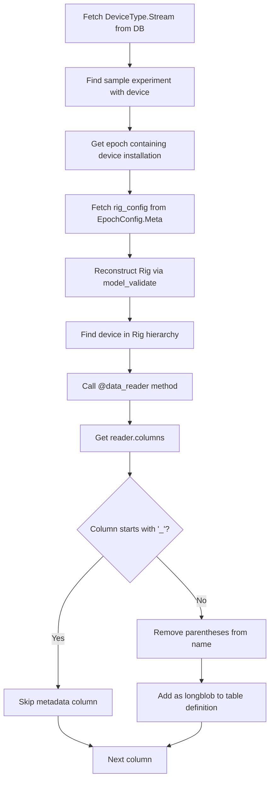

# Streams Maker Architecture

Auto-generates DataJoint table definitions for device and stream data based on Pydantic schema definitions.

## Overview

`streams_maker.py` bridges declarative Pydantic schema definitions (Experiment classes with Rig objects) and executable DataJoint tables (`streams.py`). It reads catalog entries from the database (`StreamType`, `DeviceType`, `Device`) and generates Python table classes dynamically.

## Package Dependencies

```
swc.aeon.rigs (aeon_swc_rigs)          swc.aeon.schema (aeon_api)
├── BaseSchema                          ├── BaseSchema (extends rigs)
├── Device (config only)                ├── DataSchema (adds @data_reader support)
├── SpinnakerCamera                     ├── data_reader decorator
├── UndergroundFeeder                   └── Reader classes (Video, Position, Encoder)
└── HarpDevices                                │
                                               ▼
                            Experiment packages (e.g., aeon_exp_foragingABC)
                            ├── Extend device classes with @data_reader methods
                            └── Define experiment-specific Rig(DataSchema)
```

**Key imports** (in experiment package):
```python
from swc.aeon.schema import BaseSchema, DataSchema, data_reader
from swc.aeon.schema.core import Video, Position, Encoder
from swc.aeon.schema.video import SpinnakerCamera
from swc.aeon.schema.foraging import UndergroundFeeder
from swc.aeon.io import reader
```

## Architecture Flow

```
┌─────────────────────────────────┐
│ Experiment Class                │
│ (Pydantic BaseSchema)           │
│ • ForagingABC                   │
│ • Experiment.rig                │
└──────────────┬──────────────────┘
               │
               ▼
┌─────────────────────────────────┐
│ load_metadata.py                │
│ • get_experiment_class()        │
│ • extract_rig_from_metadata()   │
│ • get_device_info()             │
│ • get_device_mapper_from_rig()  │
│ • insert_stream_types()         │ ← Populates StreamType (FK dependency)
│ • insert_device_types()         │ ← Populates DeviceType, DeviceType.Stream, Device
│ • ingest_epoch_metadata_from_rig()│
│ • get_stream_reader_for_epoch() │ ← Runtime stream reader resolution
└──────────────┬──────────────────┘
               │
               ▼
┌─────────────────────────────────┐
│ Database Tables                 │
│ Catalog:                        │
│ • StreamType (stream_hash PK)   │
│ • DeviceType                    │
│ • DeviceType.Stream             │
│ • Device                        │
│ Metadata Storage:               │
│ • EpochConfig.Meta (json)       │ ← Stores rig_config for reconstruction
└──────────────┬──────────────────┘
               │
               ▼
┌─────────────────────────────────┐
│ streams_maker.main()            │
│ • get_device_template()         │
│ • get_device_stream_template()  │
└──────────────┬──────────────────┘
               │
               ▼
┌─────────────────────────────────┐
│ streams.py (auto-generated)     │
│ • Device tables (dj.Manual)     │
│ • Stream tables (dj.Imported)   │
└─────────────────────────────────┘
```

## Key Concepts

### Rig

A Pydantic model representing the hardware configuration of an experiment. Extends `DataSchema` (not `BaseSchema`) to enable `@data_reader` support. Contains device collections organized by category:

```python
class Rig(DataSchema):  # DataSchema enables @data_reader on child devices
    cameras: Dict[CameraName, Camera]   # e.g., 13 cameras keyed by enum
    feeders: Dict[FeederName, Feeder]   # e.g., 6 feeders keyed by enum
    nest: Dict[NestName, WeightScale]   # Weight scale(s)
```

### Device

A physical or logical hardware unit. Each device:
- Has a `device_type` attribute (e.g., "SpinnakerCamera", "Feeder")
- May have a `serial_number` or `port_name` for identification
- Contains `@data_reader` methods that define its data streams

### Stream

A data collection channel from a device, defined as a `@data_reader` method on the Device class:

```python
class Camera(SpinnakerCamera):
    device_type: Literal["SpinnakerCamera"] = "SpinnakerCamera"

    @data_reader
    def video(self, pattern) -> reader.Video:
        """Video stream from camera."""
        return Video(f"{pattern}").reader  # Note: returns .reader attribute

    @data_reader
    def position(self, pattern) -> reader.Position:
        """Position tracking stream."""
        return Position(f"{pattern}").reader
```

The `@data_reader` decorator:
- Creates a cached property on the device instance
- Resolves file patterns using `_resolve_pattern_prefix()` based on device hierarchy
- Returns a **reader instance** (via `.reader` attribute) configured for that device's data location

### Pattern Resolution

Patterns in `@data_reader` methods are resolved relative to the device's position in the Rig hierarchy:

```python
# In Rig.cameras["top"].video(pattern="*.mp4")
# Pattern resolves to: <experiment_root>/cameras/top/*.mp4
```

This allows devices to reference their data files without hardcoding paths.

## Key Components

### Catalog Tables

**`StreamType`**: Catalog of unique stream types across all experiments
```python
definition = """
stream_hash: uuid  # hash(stream_type, stream_reader) - unique identifier
---
stream_type: varchar(36)  # e.g., "Video", "WeightRaw"
stream_reader: varchar(256)  # e.g., "swc.aeon.io.reader.Video"
stream_description='': varchar(256)
unique index(stream_type, stream_reader)
"""
```

The `stream_hash` serves as the primary key because different experiments may use the same `stream_type` name with different reader implementations. The hash uniquely identifies each (stream_type, stream_reader) combination.

**`DeviceType`**: Catalog of device types
- `device_type`: Name (e.g., "SpinnakerCamera", "Feeder")
- `device_description`: Optional description

**`DeviceType.Stream`**: Links device types to their streams
```python
definition = """
-> master
-> StreamType  # References StreamType by stream_hash
"""
```

**`Device`**: Physical device instances
- `device_serial_number`: Unique identifier (or port_name)
- Foreign key to `DeviceType`

### Metadata Storage

**`EpochConfig.Meta`**: Stores epoch metadata including original rig configuration
```python
definition = """
-> master
---
bonsai_workflow: varchar(36)
commit: varchar(64)
source='': varchar(16)
metadata: json  # Original rig_config JSON for Pydantic reconstruction
metadata_file_path: varchar(255)
"""
```

The `metadata` field stores the **original nested rig configuration** as JSON, enabling Pydantic Rig reconstruction from the database without file I/O. This is critical for the runtime stream reader resolution.

### Parsing Functions

**`get_experiment_class(schema_name)`**
- Dynamically imports Experiment class from module path
- Example: `"swc.aeon.exp.foragingABC.experiment.ForagingABC"` → class

**`extract_rig_from_metadata(experiment_class, metadata_filepath)`**
- Loads metadata JSON and validates with Pydantic
- Navigates to Rig (handles both `experiment.experiment.rig` and `experiment.rig` structures)
- Returns Rig instance with full device hierarchy

**`get_device_info(rig)`**
- Iterates over Rig model fields to find device collections
- For each device, extracts:
  - `device_type` from `device.device_type` attribute
  - Stream types from `@data_reader` methods on the device class
- Returns dict mapping device names to their stream info (flat lists):
```python
{
    "CameraTop": {
        "stream_type": ["Video", "Position"],
        "stream_reader": ["swc.aeon.io.reader.Video", "swc.aeon.io.reader.Harp"],
        "stream_hash": [UUID(...), UUID(...)]
    },
    "CameraSide": {...},
    "Feeder1": {...}
}
```

**`get_device_mapper_from_rig(rig, metadata_filepath)`**
- Extracts device type and serial number mappings
- Uses `device.device_type` directly (no hardcoded inference)
- Handles both dict collections and single device instances

**`insert_stream_types(rig)`**
- Populates `StreamType` table with unique (stream_type, stream_reader) combinations
- Computes `stream_hash` for each entry
- Required before `DeviceType.Stream` can be inserted (FK constraint)

**`insert_device_types(rig, metadata_filepath)`**
- Populates catalog tables (`DeviceType`, `DeviceType.Stream`, `Device`)
- Only inserts devices that exist in both Rig and metadata file
- Handles FK constraint by calling `insert_stream_types()` if needed

**`get_stream_reader_for_epoch(experiment_name, device_name, stream_type, epoch_start)`**
- **Runtime stream reader resolution** - the core of the Pydantic approach
- Process:
  1. Fetch `rig_config` JSON from `EpochConfig.Meta`
  2. Get experiment class from `Experiment.DevicesSchema`
  3. Reconstruct Rig using `model_validate({"rig": rig_config})`
  4. Find device by name in Rig hierarchy
  5. Call `@data_reader` method to get configured stream reader
- Returns reader instance ready for `io_api.load()`

**`ingest_epoch_metadata_from_rig(experiment_name, rig, epoch_config, metadata_filepath)`**
- Inserts device installation/removal records
- Handles device attributes (settings/configurations)
- Tracks device removal times

### Template Generators

**`get_device_template(device_type)`**
- Creates `dj.Manual` table for device installation/removal tracking
- Includes `Attribute` and `RemovalTime` part tables
- Example: `SpinnakerCamera` table tracks when cameras are installed/removed

**`get_device_stream_template(device_type, stream_type, streams_module)`**
- Creates `dj.Imported` table for raw data streams
- **Column extraction**: Uses Pydantic approach to get reader columns:
  1. Find sample experiment with this device type
  2. Get epoch containing device installation
  3. Call `get_stream_reader_for_epoch()` to get reader instance
  4. Extract `reader.columns` for table definition
- **make() method**: Uses `get_stream_reader_for_epoch()` for data loading
- Example: `SpinnakerCameraVideo` table stores video metadata per chunk

## Device vs Stream Distinction

### Pydantic Schema Definition

```python
# Multi-stream device (extends base from swc.aeon.schema.video)
class Camera(SpinnakerCamera):
    trigger: TriggerName = Field(default=TriggerName.TRIGGER0)

    @data_reader
    def video(self, pattern) -> reader.Video:
        return Video(f"{pattern}").reader

    @data_reader
    def position(self, pattern) -> reader.Position:
        return Position(f"{pattern}").reader

# Multi-stream device (extends base from swc.aeon.schema.foraging)
class Feeder(UndergroundFeeder):
    @data_reader
    def beam_break(self, pattern) -> reader.BitmaskEvent:
        return BeamBreak(f"{pattern}").reader

    @data_reader
    def encoder(self, pattern) -> reader.Encoder:
        return Encoder(f"{pattern}").reader
```

### Parsing Logic

The `get_device_info()` function extracts streams from `@data_reader` methods:

```python
# For each device in Rig
device_class = type(device)
stream_types = extract_stream_types_from_device(device_class)
# Returns: ["video", "position"] (snake_case method names)

# Convert to PascalCase for StreamType catalog
stream_type_names = [to_pascal_case(st) for st in stream_types]
# Returns: ["Video", "Position"]
```

### DataJoint Table Structure

| Component | Table Type | Purpose | Example |
|-----------|-----------|---------|---------|
| **Device** | `dj.Manual` | Track device installation/removal | `SpinnakerCamera` |
| **Stream** | `dj.Imported` | Store raw data per chunk | `SpinnakerCameraVideo` |

**Device Table** (`SpinnakerCamera`):
```python
-> Experiment
-> Device
spinnaker_camera_install_time: datetime(6)
---
spinnaker_camera_name: varchar(36)
```

**Stream Table** (`SpinnakerCameraVideo`):
```python
-> SpinnakerCamera
-> Chunk
---
sample_count: int
timestamps: longblob
hw_counter: longblob
hw_timestamp: longblob
```

## Column Extraction Process



**Process**:
1. Query `DeviceType.Stream` to find device/stream combination
2. Find a sample experiment that has this device type installed
3. Get the epoch containing the device installation time
4. Fetch `rig_config` JSON from `EpochConfig.Meta`
5. Reconstruct Rig using `experiment_class.model_validate({"rig": rig_config})`
6. Find device in Rig hierarchy by name
7. Call `@data_reader` method to get configured reader instance
8. Extract `reader.columns` (e.g., `["hw_counter", "hw_timestamp", "_frame"]`)
9. Filter: skip columns starting with `"_"` (metadata)
10. Normalize: remove type annotations from names (e.g., `"x (float)"` → `"x"`)
11. Generate table definition with all columns as `longblob`

**Example**:
```python
# Reader: Video(columns=["hw_counter", "hw_timestamp", "_frame", "_path"])
# Generated columns:
# - hw_counter: longblob
# - hw_timestamp: longblob
# (_frame, _path skipped - start with "_")
```

## Stream Reader Resolution at Runtime

The `make()` method in generated stream tables uses `get_stream_reader_for_epoch()` to resolve readers:

```python
def make(self, key):
    """Load and insert data for DeviceDataStream table."""
    from swc.aeon.io import api as io_api
    from aeon.dj_pipeline.utils.load_metadata import get_stream_reader_for_epoch

    chunk_start, chunk_end = (acquisition.Chunk & key).fetch1("chunk_start", "chunk_end")
    data_dirs = acquisition.Experiment.get_data_directories(key)
    device_name = (ExperimentDevice & key).fetch1("{device_type_name}_name")

    # Get stream reader using Pydantic approach (reconstructs Rig from stored metadata)
    stream_reader = get_stream_reader_for_epoch(
        key["experiment_name"], device_name, "{stream_type}", key["epoch_start"]
    )

    stream_data = io_api.load(
        root=data_dirs,
        reader=stream_reader,
        start=pd.Timestamp(chunk_start),
        end=pd.Timestamp(chunk_end),
    )

    self.insert1({
        **key,
        "sample_count": len(stream_data),
        "timestamps": stream_data.index.values,
        **{col: stream_data[col].values for col in stream_reader.columns if not col.startswith("_")},
    })
```

**Key benefits of this approach**:
1. **No file I/O**: Metadata is fetched from database, not re-read from file
2. **Epoch-specific**: Each epoch can have different device configurations
3. **Pydantic validation**: Rig reconstruction uses `model_validate()` for type safety
4. **Pattern resolution**: `@data_reader` methods automatically resolve file patterns based on device hierarchy

## Stream Name Conversion

Stream names are converted from snake_case (method names) to PascalCase (catalog entries):

- `video` → `Video`
- `weight_raw` → `WeightRaw`
- `beam_break` → `BeamBreak`

This conversion is handled by `to_pascal_case()` in `load_metadata.py`.

## Integration Points

**Called from `acquisition.py:EpochConfig.make()`**:
```python
def make(self, key):
    # 1. Load experiment schema and extract Rig
    experiment_class = get_experiment_class(schema_name)
    rig = extract_rig_from_metadata(experiment_class, metadata_filepath)

    # 2. Store original rig_config in EpochConfig.Meta (as JSON)
    rig_config = metadata.get("metadata", {}).get("rig", {})
    epoch_config = {
        ...
        "metadata": rig_config,  # Original nested JSON for Pydantic reconstruction
    }

    # 3. Insert device types (handles StreamType internally via try/except)
    insert_device_types(rig, metadata_filepath)

    # 4. Generate DataJoint tables from catalog
    streams_maker.main()

    # 5. Insert device installation records
    ingest_epoch_metadata_from_rig(experiment_name, rig, epoch_config, metadata_filepath)

    # 6. Insert epoch config with metadata
    self.Meta.insert1(epoch_config)
```

**StreamType handling**: `DeviceType.Stream` has FK to `StreamType`. The `insert_device_types()` function handles this by catching FK constraint errors and calling `insert_stream_types()` when needed.

**Generated `streams.py` imports**:
```python
#----                     DO NOT MODIFY                ----
#---- THIS FILE IS AUTO-GENERATED BY `streams_maker.py` ----

import re
import datajoint as dj
import pandas as pd
from uuid import UUID

import aeon
from aeon.dj_pipeline import acquisition, get_schema_name
from swc.aeon.io import api as io_api

schema = dj.Schema(get_schema_name("streams"))
```

## Example: ForagingABC Complete Flow

### 1. Schema Definition (from `aeon_exp_foragingABC/rig.py`)

```python
from swc.aeon.schema import BaseSchema, DataSchema, data_reader
from swc.aeon.schema.video import SpinnakerCamera
from swc.aeon.schema.foraging import UndergroundFeeder
from swc.aeon.io import reader

class Camera(SpinnakerCamera):
    trigger: TriggerName = Field(default=TriggerName.TRIGGER0)
    camera_tracking: Tracking | None = Field(default=None)

    @data_reader
    def video(self, pattern) -> reader.Video:
        return Video(f"{pattern}").reader

    @data_reader
    def position(self, pattern) -> reader.Position:
        if self.camera_tracking is None:
            raise ValueError(f"No tracking defined for {pattern}")
        return Position(f"{pattern}").reader


class Feeder(UndergroundFeeder):
    @data_reader
    def beam_break(self, pattern) -> reader.BitmaskEvent:
        return BeamBreak(f"{pattern}").reader

    @data_reader
    def encoder(self, pattern) -> reader.Encoder:
        return Encoder(f"{pattern}").reader


class Rig(DataSchema):
    cameras: Dict[CameraName, Camera]           # 13 cameras
    feeders: Dict[FeederName, Feeder]           # 6 feeders
    nest: Dict[NestName, ActivityWeightScale]   # Weight scale
```

### 2. Metadata Loading (`load_metadata.py`)

- `get_experiment_class("swc.aeon.exp.foragingABC.experiment.ForagingABC")` → loads class
- `extract_rig_from_metadata(ForagingABC, metadata_filepath)` → Rig instance
- `get_device_info(rig)` extracts:
  - Camera: `device_type="SpinnakerCamera"`, streams with hashes
  - Feeder: `device_type="UndergroundFeeder"`, streams with hashes
- `insert_device_types(rig, ...)` → populates `StreamType`, `DeviceType`, `DeviceType.Stream`, `Device`

### 3. Epoch Config Storage

The original `rig_config` JSON is stored in `EpochConfig.Meta.metadata`:
```json
{
  "cameras": {
    "top": {"device_type": "SpinnakerCamera", "serial_number": "12345", ...},
    "side": {"device_type": "SpinnakerCamera", "serial_number": "12346", ...}
  },
  "feeders": {
    "feeder1": {"device_type": "UndergroundFeeder", "port_name": "COM3", ...}
  }
}
```

This enables Pydantic reconstruction without re-reading the metadata file.

### 4. Table Generation (`streams_maker.py`)

Creates DataJoint tables based on catalog entries:
- `SpinnakerCamera` (dj.Manual) - device installation tracking
- `SpinnakerCameraVideo` (dj.Imported) - video stream data per chunk
- `SpinnakerCameraPosition` (dj.Imported) - position tracking data
- `UndergroundFeeder` (dj.Manual) - feeder installation tracking
- `UndergroundFeederBeamBreak` (dj.Imported) - beam break events
- `UndergroundFeederEncoder` (dj.Imported) - wheel encoder data

### 5. Data Population

When `SpinnakerCameraVideo.populate()` is called:
1. `key_source` returns Chunk × SpinnakerCamera combinations
2. For each key, `make()` is called
3. `get_stream_reader_for_epoch()` fetches `rig_config` from `EpochConfig.Meta`
4. Rig is reconstructed via `model_validate()`
5. Camera device is found in `rig.cameras[device_name]`
6. `camera.video` property returns configured Video reader
7. `io_api.load()` reads data using the reader
8. Data is inserted into the stream table

### 6. Usage

```python
from aeon.dj_pipeline import streams

# Query installed cameras
streams.SpinnakerCamera & {"experiment_name": "foraging-abc"}

# Populate video data for all chunks
streams.SpinnakerCameraVideo.populate()

# Query encoder data
streams.UndergroundFeederEncoder & {"experiment_name": "foraging-abc"}
```

## Design Decisions

### Why `stream_hash` as Primary Key?

Different experiments may define the same `stream_type` name (e.g., "Video") with different reader implementations. The `stream_hash` (UUID of stream_type + stream_reader) ensures uniqueness while allowing the catalog to track all variations.

### Why Store `rig_config` as JSON?

1. **Avoids repeated file I/O**: Stream tables' `make()` methods don't need to read metadata files
2. **Enables Pydantic reconstruction**: `model_validate()` can recreate the full Rig from JSON
3. **Preserves nested structure**: Required for proper `@data_reader` pattern resolution
4. **Epoch-specific**: Each epoch stores its own configuration, supporting configuration changes over time

### Why Not Store `stream_reader_kwargs`?

The previous approach stored reader initialization kwargs in `StreamType`. This was problematic because:
1. Kwargs vary by device instance (different patterns, serial numbers)
2. Readers are now instantiated via `@data_reader` methods, not direct construction
3. The Pydantic approach handles all reader configuration through the Rig hierarchy
