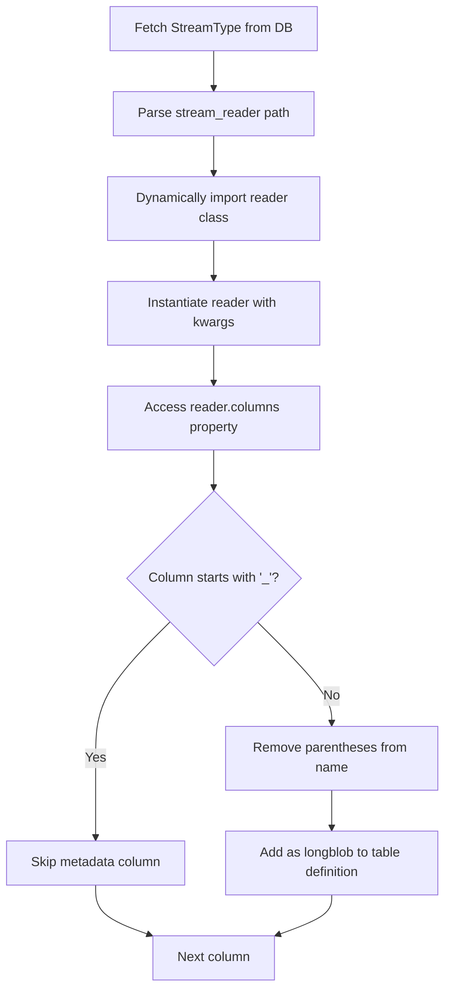

# Streams Maker Architecture

Auto-generates DataJoint table definitions for device and stream data based on Pydantic schema definitions.

## Overview

`streams_maker.py` bridges declarative Pydantic schema definitions (Experiment classes with Rig objects) and executable DataJoint tables (`streams.py`). It reads catalog entries from the database (`StreamType`, `DeviceType`, `Device`) and generates Python table classes dynamically.

## Package Dependencies

```
swc.aeon.rigs (aeon_swc_rigs)          swc.aeon.schema (aeon_api)
├── BaseSchema                          ├── BaseSchema (extends rigs)
├── Device (config only)                ├── DataSchema (adds @data_reader support)
├── SpinnakerCamera                     ├── data_reader decorator
├── UndergroundFeeder                   └── Reader classes (Video, Position, Encoder)
└── HarpDevices                                │
                                               ▼
                            Experiment packages (e.g., aeon_exp_foragingABC)
                            ├── Extend device classes with @data_reader methods
                            └── Define experiment-specific Rig(DataSchema)
```

**Key imports** (in experiment package):
```python
from swc.aeon.schema import BaseSchema, DataSchema, data_reader
from swc.aeon.schema.core import Video, Position, Encoder
from swc.aeon.schema.video import SpinnakerCamera
from swc.aeon.schema.foraging import UndergroundFeeder
from swc.aeon.io import reader
```

## Architecture Flow

```
┌─────────────────────────────────┐
│ Experiment Class                │
│ (Pydantic BaseSchema)           │
│ • ForagingABC                   │
│ • Experiment.rig                │
└──────────────┬──────────────────┘
               │
               ▼
┌─────────────────────────────────┐
│ load_metadata.py             │
│ • get_experiment_class()         │
│ • extract_rig_from_metadata()    │
│ • get_device_info()              │
│ • get_device_mapper_from_rig()   │
│ • insert_stream_types()          │ ← Populates StreamType (FK dependency)
│ • insert_device_types()          │ ← Populates DeviceType, DeviceType.Stream, Device
│ • ingest_epoch_metadata_from_rig()│
└──────────────┬──────────────────┘
               │
               ▼
┌─────────────────────────────────┐
│ Database Catalog Tables          │
│ • StreamType                    │
│ • DeviceType                    │
│ • DeviceType.Stream             │
│ • Device                        │
└──────────────┬──────────────────┘
               │
               ▼
┌─────────────────────────────────┐
│ streams_maker.main()            │
│ • get_device_template()        │
│ • get_device_stream_template()  │
└──────────────┬──────────────────┘
               │
               ▼
┌─────────────────────────────────┐
│ streams.py (auto-generated)     │
│ • Device tables (dj.Manual)     │
│ • Stream tables (dj.Imported)   │
└─────────────────────────────────┘
```

## Key Concepts

### Rig

A Pydantic model representing the hardware configuration of an experiment. Extends `DataSchema` (not `BaseSchema`) to enable `@data_reader` support. Contains device collections organized by category:

```python
class Rig(DataSchema):  # DataSchema enables @data_reader on child devices
    cameras: Dict[CameraName, Camera]   # e.g., 13 cameras keyed by enum
    feeders: Dict[FeederName, Feeder]   # e.g., 6 feeders keyed by enum
    nest: Dict[NestName, WeightScale]   # Weight scale(s)
```

### Device

A physical or logical hardware unit. Each device:
- Has a `device_type` attribute (e.g., "SpinnakerCamera", "Feeder")
- May have a `serial_number` or `port_name` for identification
- Contains `@data_reader` methods that define its data streams

### Stream

A data collection channel from a device, defined as a `@data_reader` method on the Device class:

```python
class Camera(SpinnakerCamera):
    device_type: Literal["SpinnakerCamera"] = "SpinnakerCamera"

    @data_reader
    def video(self, pattern) -> reader.Video:
        """Video stream from camera."""
        return Video(f"{pattern}").reader  # Note: returns .reader attribute

    @data_reader
    def position(self, pattern) -> reader.Position:
        """Position tracking stream."""
        return Position(f"{pattern}").reader
```

The `@data_reader` decorator:
- Creates a cached property on the device instance
- Resolves file patterns using `_resolve_pattern_prefix()` based on device hierarchy
- Returns a **reader instance** (via `.reader` attribute) configured for that device's data location

### Pattern Resolution

Patterns in `@data_reader` methods are resolved relative to the device's position in the Rig hierarchy:

```python
# In Rig.cameras["top"].video(pattern="*.mp4")
# Pattern resolves to: <experiment_root>/cameras/top/*.mp4
```

This allows devices to reference their data files without hardcoding paths.

## Key Components

### Catalog Tables

**`StreamType`**: Catalog of all stream types
- `stream_type`: Name (e.g., "Video", "WeightRaw")
- `stream_reader`: Class path (e.g., "swc.aeon.io.reader.Video")
- `stream_reader_kwargs`: Dict of initialization parameters
- `stream_hash`: UUID hash for uniqueness

**`DeviceType`**: Catalog of device types
- `device_type`: Name (e.g., "SpinnakerCamera", "Feeder")
- `device_description`: Optional description

**`DeviceType.Stream`**: Links device types to their streams
- Foreign keys to `DeviceType` and `StreamType`
- Defines which streams are available for each device type

**`Device`**: Physical device instances
- `device_serial_number`: Unique identifier (or port_name)
- Foreign key to `DeviceType`

### Parsing Functions

**`get_device_info(rig)`**
- Iterates over Rig model fields to find device collections
- For each device, extracts:
  - `device_type` from `device.device_type` attribute
  - Stream types from `@data_reader` methods on the device class
- Returns dict mapping device names to their configuration

**`get_device_mapper_from_rig(rig, metadata_filepath)`**
- Extracts device type and serial number mappings
- Uses `device.device_type` directly (no hardcoded inference)
- Handles both dict collections and single device instances

**`insert_stream_types(rig)`** *(must be called first or handled internally)*
- Populates `StreamType` table with stream reader info
- Required before `DeviceType.Stream` can be inserted (FK constraint)

**`insert_device_types(rig, metadata_filepath)`**
- Populates catalog tables (`DeviceType`, `DeviceType.Stream`, `Device`)
- Only inserts devices that exist in both Rig and metadata file
- **Note**: Should call `insert_stream_types()` internally or rely on caller to do so

**`ingest_epoch_metadata_from_rig(experiment_name, rig, epoch_config, metadata_filepath)`**
- Inserts device installation/removal records
- Handles device attributes (settings/configurations)
- Tracks device removal times

### Template Generators

**`get_device_template(device_type)`**
- Creates `dj.Manual` table for device installation/removal tracking
- Includes `Attribute` and `RemovalTime` part tables
- Example: `SpinnakerCamera` table tracks when cameras are installed/removed

**`get_device_stream_template(device_type, stream_type, streams_module)`**
- Creates `dj.Imported` table for raw data streams
- Dynamically instantiates reader to extract column definitions
- Implements `make()` method for data loading
- Example: `SpinnakerCameraVideo` table stores video metadata per chunk

## Device vs Stream Distinction

### Pydantic Schema Definition

```python
# Multi-stream device (extends base from swc.aeon.schema.video)
class Camera(SpinnakerCamera):
    trigger: TriggerName = Field(default=TriggerName.TRIGGER0)

    @data_reader
    def video(self, pattern) -> reader.Video:
        return Video(f"{pattern}").reader

    @data_reader
    def position(self, pattern) -> reader.Position:
        return Position(f"{pattern}").reader

# Multi-stream device (extends base from swc.aeon.schema.foraging)
class Feeder(UndergroundFeeder):
    @data_reader
    def beam_break(self, pattern) -> reader.BitmaskEvent:
        return BeamBreak(f"{pattern}").reader

    @data_reader
    def encoder(self, pattern) -> reader.Encoder:
        return Encoder(f"{pattern}").reader
```

### Parsing Logic

The `get_device_info()` function extracts streams from `@data_reader` methods:

```python
# For each device in Rig
device_class = type(device)
stream_types = extract_stream_types_from_device(device_class)
# Returns: ["video", "position"] (snake_case method names)

# Convert to PascalCase for StreamType catalog
stream_type_names = [to_pascal_case(st) for st in stream_types]
# Returns: ["Video", "Position"]
```

### DataJoint Table Structure

| Component | Table Type | Purpose | Example |
|-----------|-----------|---------|---------|
| **Device** | `dj.Manual` | Track device installation/removal | `SpinnakerCamera` |
| **Stream** | `dj.Imported` | Store raw data per chunk | `SpinnakerCameraVideo` |

**Device Table** (`SpinnakerCamera`):
```python
-> Experiment
-> Device
spinnaker_camera_install_time: datetime(6)
---
spinnaker_camera_name: varchar(36)
```

**Stream Table** (`SpinnakerCameraVideo`):
```python
-> SpinnakerCamera
-> Chunk
---
sample_count: int
timestamps: longblob
hw_counter: longblob
hw_timestamp: longblob
```

## Column Extraction Process



**Process**:
1. Fetch `stream_reader` and `stream_reader_kwargs` from `StreamType` table
2. Parse class path (e.g., `"swc.aeon.io.reader.Video"`)
3. Dynamically import and instantiate: `Video(**kwargs)`
4. Extract `reader.columns` (e.g., `["hw_counter", "hw_timestamp", "_frame"]`)
5. Filter: skip columns starting with `"_"` (metadata)
6. Normalize: remove type annotations from names (e.g., `"x (float)"` → `"x"`)
7. Generate table definition with all columns as `longblob`

**Example**:
```python
# Reader: Video(columns=["hw_counter", "hw_timestamp", "_frame", "_path"])
# Generated columns:
# - hw_counter: longblob
# - hw_timestamp: longblob
# (_frame, _path skipped - start with "_")
```

## Stream Name Conversion

Stream names are converted from snake_case (method names) to PascalCase (catalog entries):

- `video` → `Video`
- `weight_raw` → `WeightRaw`
- `beam_break` → `BeamBreak`

This conversion is handled by `to_pascal_case()` in `load_metadata.py`.

## Integration Points

**Called from `acquisition.py:EpochConfig.make()`**:
```python
# 1. Load experiment schema and extract Rig
experiment_class = get_experiment_class(schema_name)
rig = extract_rig_from_metadata(experiment_class, metadata_filepath)

# 2. Insert device types (handles StreamType internally via try/except or explicit call)
insert_device_types(rig, metadata_filepath)

# 3. Generate DataJoint tables from catalog
streams_maker.main()

# 4. Insert device installation records
ingest_epoch_metadata_from_rig(experiment_name, rig, epoch_config, metadata_filepath)
```

**StreamType handling**: `DeviceType.Stream` has FK to `StreamType`. Options:
1. `insert_device_types()` calls `insert_stream_types()` internally when needed (legacy pattern uses try/except)
2. Caller explicitly calls `insert_stream_types(rig)` before `insert_device_types()`

**Generated `streams.py` is imported**:
- Direct: `from aeon.dj_pipeline import streams`
- Fallback: Uses `VirtualModule` if import fails


## Example: ForagingABC Complete Flow

### 1. Schema Definition (from `aeon_exp_foragingABC/rig.py`)

```python
from swc.aeon.schema import BaseSchema, DataSchema, data_reader
from swc.aeon.schema.video import SpinnakerCamera
from swc.aeon.schema.foraging import UndergroundFeeder
from swc.aeon.io import reader

class Camera(SpinnakerCamera):
    trigger: TriggerName = Field(default=TriggerName.TRIGGER0)
    camera_tracking: Tracking | None = Field(default=None)

    @data_reader
    def video(self, pattern) -> reader.Video:
        return Video(f"{pattern}").reader

    @data_reader
    def position(self, pattern) -> reader.Position:
        if self.camera_tracking is None:
            raise ValueError(f"No tracking defined for {pattern}")
        return Position(f"{pattern}").reader


class Feeder(UndergroundFeeder):
    @data_reader
    def beam_break(self, pattern) -> reader.BitmaskEvent:
        return BeamBreak(f"{pattern}").reader

    @data_reader
    def encoder(self, pattern) -> reader.Encoder:
        return Encoder(f"{pattern}").reader


class Rig(DataSchema):
    cameras: Dict[CameraName, Camera]           # 13 cameras
    feeders: Dict[FeederName, Feeder]           # 6 feeders
    nest: Dict[NestName, ActivityWeightScale]   # Weight scale
```

### 2. Metadata Loading (`load_metadata.py`)

- `get_experiment_class("swc.aeon.exp.foragingABC.experiment.ForagingABC")` → loads class
- `extract_rig_from_metadata(ForagingABC, metadata_filepath)` → Rig instance
- `get_device_info(rig)` extracts:
  - Camera: `device_type="SpinnakerCamera"`, streams: `["Video", "Position"]`
  - Feeder: `device_type="UndergroundFeeder"`, streams: `["BeamBreak", "Encoder", ...]`
- `insert_device_types(rig, ...)` → populates `StreamType`, `DeviceType`, `DeviceType.Stream`, `Device`
  - Handles `StreamType` insertion internally (FK dependency)

### 3. Table Generation (`streams_maker.py`)

Creates DataJoint tables based on catalog entries:
- `SpinnakerCamera` (dj.Manual) - device installation tracking
- `SpinnakerCameraVideo` (dj.Imported) - video stream data per chunk
- `SpinnakerCameraPosition` (dj.Imported) - position tracking data
- `UndergroundFeeder` (dj.Manual) - feeder installation tracking
- `UndergroundFeederBeamBreak` (dj.Imported) - beam break events
- `UndergroundFeederEncoder` (dj.Imported) - wheel encoder data

### 4. Device Installation (`ingest_epoch_metadata_from_rig()`)

- Inserts device installation records with `install_time`
- Stores device attributes (serial_number, exposure_time, gain, etc.)
- Tracks device removal times for configuration changes

### 5. Usage

```python
from aeon.dj_pipeline import streams

# Query installed cameras
streams.SpinnakerCamera & {"experiment_name": "foraging-abc"}

# Populate video data for all chunks
streams.SpinnakerCameraVideo.populate()

# Query encoder data
streams.UndergroundFeederEncoder & {"experiment_name": "foraging-abc"}
```
