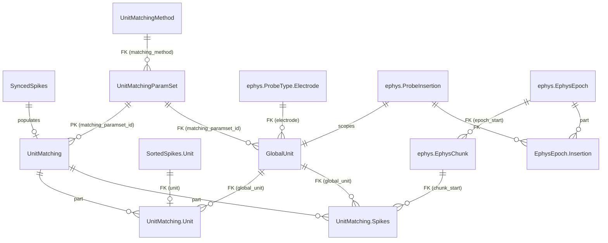

# Unit Matching Specifications

## Table of Contents
1. [Overview](#overview)
2. [Upstream Schema Changes](#upstream-schema-changes)
3. [Database Schema](#database-schema)
4. [Algorithm](#algorithm)
5. [Ownership Convention for Overlapping Chunks](#ownership-convention-for-overlapping-chunks)
6. [Integration with Existing Pipeline](#integration-with-existing-pipeline)
7. [Re-processing and Deletion](#re-processing-and-deletion)
8. [Query Patterns](#query-patterns)
9. [Design Decisions and Rationale](#design-decisions-and-rationale)

---

## Overview

### Purpose

Long-running AEON experiments record neural activity across multiple consecutive ephys blocks, each independently spike-sorted. The same neuron appears as a different `unit` ID in each block's sorting results. The unit matching system solves this by assigning a persistent **global unit** identity to neurons across blocks, enabling longitudinal analysis of single-neuron activity over days or weeks.

The system works by exploiting temporal overlap between consecutive ephys blocks: when two blocks share a time window, the same neurons produce spikes in both blocks' sorted data. By comparing spike times in the overlap region, the system identifies which units across blocks correspond to the same neuron.

### Prerequisites

Unit matching sits at the end of the spike sorting pipeline. An ephys block must have completed the full chain before it is eligible for matching:

```
SortingTask → PreProcessing → SpikeSorting → PostProcessing
→ SortedSpikes → SyncedSpikes → [OfficialCuration + ApplyOfficialCuration]
→ UnitMatching (this system)
```

Specifically, `UnitMatching.key_source` requires that `ApplyOfficialCuration` exists for the block, ensuring only curated (quality-controlled) results enter the matching pipeline.

### Key Concepts

A **global unit** is a persistent neuron identity scoped to a single probe insertion (i.e., one physical probe in one subject in one experiment). Global unit IDs are integers starting at 1, unique within a `(experiment_name, subject, insertion_number)` scope.

A **matched unit** links a block-specific `SortedSpikes.Unit` to its assigned global unit. Each block's unit maps to exactly one global unit. A global unit may be matched to units from multiple blocks (that's the whole point).

**Temporal overlap** between consecutive ephys blocks is the mechanism that enables matching. The overlap region contains spikes from the same neurons captured by both blocks' independent sorting runs. The matching algorithm compares spike times in this overlap window to identify corresponding units.

The **ownership convention** determines which block "owns" the spike data for a given (global_unit, chunk) pair when multiple blocks cover the same chunk. This prevents duplicate rows in `Spikes`.

### Critical Constraint: Seed-Based Bidirectional Propagation

Ephys blocks are processed starting from a user-specified **seed block** (the block with the best signal quality), then propagating outward in both directions. Each `UnitMatchingParamSet` entry specifies a `seed_block_start` — the block from which matching begins.

This constraint is enforced at two levels:

1. **`key_source` gate**: Yields at most 3 blocks per (insertion, paramset) — the seed (if unprocessed), the forward frontier (nearest unprocessed block after the processed region), and the backward frontier (nearest unprocessed block before the processed region). Workers processing different insertions or paramsets can run in parallel; within an (insertion, paramset), processing is serialized to at most 3 candidates.

2. **`make()` guard**: Before processing, verifies that either (a) this is the first block and it matches `seed_block_start`, or (b) this block overlaps with at least one previously-matched block. This is a defense-in-depth check that catches direct `make(key)` calls bypassing `key_source`.

```python
# key_source: seed block if unprocessed, else forward/backward frontiers
eligible = SyncedSpikes & spike_sorting_curation.ApplyOfficialCuration
all_candidates = eligible * UnitMatchingParamSet
candidates = all_candidates - self

# Case 1: seed block itself is unprocessed
seed_candidates = candidates & "block_start = seed_block_start"

# Case 2: seed already processed -> find frontiers
processed = all_candidates & self
processed_bounds = dj.U(...).aggr(processed, proc_min="MIN(block_start)", proc_max="MAX(block_start)")
fwd_candidates = candidates * fwd & "block_start = fwd_start"  # MIN unprocessed > proc_max
bwd_candidates = candidates * bwd & "block_start = bwd_start"  # MAX unprocessed < proc_min

return seed_candidates + fwd_candidates + bwd_candidates
```

```python
# make() guard: seed-first + overlap check
previously_matched = (self & insertion_key & paramset_key).to_dicts()
if not previously_matched:
    # First block must be the seed
    if key["block_start"] != seed_block_start:
        raise ValueError("First block must be the seed.")
else:
    # Subsequent blocks must overlap with at least one processed block
    if not any(s["block_start"] < block_end and s["block_end"] > block_start for s in previously_matched):
        raise ValueError("Block does not overlap with any previously matched block.")
```

**Interaction with `reserve_jobs=True`**: When the seed is consumed, the next `populate()` cycle yields up to 2 frontier blocks (forward and backward). Workers processing different insertions or paramsets run in parallel. Within an (insertion, paramset), the seed must complete before frontiers are yielded, and each frontier must complete before the next frontier in that direction is yielded.

---

## Upstream Schema Changes

This section documents design changes to the `ephys` module tables that support the unit matching system and the broader ephys pipeline. These changes are proposed as part of the same design effort and should be implemented together.

### ProbeInsertion: Subject Restored to PK

**Change**: `subject` is restored to the `ProbeInsertion` primary key.

**Before** (upstream v2):
```
ProbeInsertion (Manual)
    -> acquisition.Experiment              # experiment_name
    insertion_number: int
    ---
    -> Probe
    probe_label: varchar(32)
    implantation_date=null: datetime(6)
```

**After** (proposed):
```
ProbeInsertion (Manual)
    -> acquisition.Experiment              # experiment_name
    -> acquisition.Experiment.Subject      # subject
    insertion_number: int                  # unique per (experiment, subject)
    ---
    -> Probe
    implantation_date=null: datetime(6)
```

**Rationale**: A ProbeInsertion models a *surgical event* — a specific probe implanted into a specific subject's brain. The subject is a natural part of this identity, not an afterthought:

- **Probe swaps are correctly modeled**: The same physical probe moved from Subject1 to Subject2 creates two distinct ProbeInsertion rows, each with its own GlobalUnit lineage. These are different neuron populations in different brains — they must not share a global unit namespace.
- **Subject is structurally required**: With subject in the PK, every downstream row (EphysChunk, EphysBlock, GlobalUnit, Spikes) carries subject identity. No extra joins needed. With subject as a separate FK (the v2 approach via `EphysSubject`), an unfilled Manual table silently breaks every subject-based query.
- **The information is always available**: Probe implantation is a planned surgical procedure. The experimenter always knows which subject carries which probe before recording begins.
- **`probe_label` moves off ProbeInsertion**: The file label (e.g., "ProbeA") is an epoch-level detail determined by hardware port assignment, not a property of the surgical event. It moves to `EphysEpoch.Insertion` (see below).

**Eliminated table**: `EphysSubject` is no longer needed and is removed.

### EphysEpoch: Per-Epoch Probe Registry

**Change**: `EphysEpoch` is redesigned from a probe auto-creator to a per-epoch probe registry. It discovers probes in each epoch's files, reads subject-probe mapping (from file or carry-forward), and records which ProbeInsertions are active in each epoch.

```
EphysEpoch (Manual peer of acquisition.Epoch)
    experiment_name, epoch_start           # PK

EphysEpochConfig (Imported)
    -> EphysEpoch
    ---
    n_probes: int32                        # number of probes discovered in this epoch

    EphysEpochConfig.Insertion (Part)
        -> master
        -> ProbeInsertion                  # which insertion is active in this epoch
        ---
        probe_label: varchar(32)           # file label discovered from this epoch's files (e.g., "ProbeA")
        -> ElectrodeConfig                 # per-(epoch, probe) electrode configuration
        config_file_name: varchar(255)     # basename of this probe's ProbeInterface JSON
```

See `SPEC_EPHYS_PIPELINE.md` for the full design; this section is a summary
of what unit matching consumes.

**EphysEpoch.make() responsibilities**:

1. **Discover probes** from epoch directory files (probe serial + probe_type are available from files).
2. **Auto-create `Probe` entries** (serial + type) — idempotent, since probe_type is now discoverable from files.
3. **Read subject-probe mapping** (**not yet implemented** — placeholder raises `NotImplementedError`). The intended design is:
   - **Per-epoch file** (e.g., `probe_assignments.json` in epoch directory): Contains `{probe_label: {probe: serial, subject: name, ...}}` mapping.
   - **Carry-forward**: If no file exists, reuse the mapping from the most recent `EphysEpoch` that had one. The first epoch with ephys data MUST have the file (no previous to carry forward from).
   - The exact file format and carry-forward logic will be determined once the experimental data conventions are finalized.
4. **Create `ProbeInsertion` entries** (with subject) — idempotent. If a probe-swap is detected (same probe, different subject), a new ProbeInsertion is created.
5. **Insert `EphysEpoch.Insertion`** Part rows recording which ProbeInsertions are active in this epoch with their file labels.

**Carry-forward semantics** (planned, not yet implemented) for probe-swap detection:

```
Epoch 1: probe_assignments.json found
  → ProbeA: Subject1, serial 12345
  → Inserts ProbeInsertion(exp, Subject1, 1, probe=12345)
  → EphysEpoch.Insertion: {(exp, Subject1, 1): probe_label="ProbeA"}

Epoch 2: no file
  → Carries forward from Epoch 1
  → EphysEpoch.Insertion: same as Epoch 1

Epoch 3: probe_assignments.json found (PROBE SWAP)
  → ProbeA: Subject2, serial 12345  ← different subject!
  → Inserts NEW ProbeInsertion(exp, Subject2, 1, probe=12345)
  → EphysEpoch.Insertion: {(exp, Subject2, 1): probe_label="ProbeA"}
```

**Manual alternative**: Users may also insert `ProbeInsertion` rows directly (e.g., at surgery time). If `EphysEpoch.make()` finds an existing ProbeInsertion matching the discovered probe serial, it validates and links to it rather than creating a new one.

### EphysChunk: Epoch FK Added

**Change**: `EphysChunk` gains a FK to `EphysEpoch`, explicitly recording which epoch each chunk came from.

**Before**:
```
EphysChunk (Manual)
    -> ProbeInsertion
    chunk_start: datetime(6)
    ---
    chunk_end: datetime(6)
    -> ElectrodeConfig
```

**After**:
```
EphysChunk (Manual)
    -> ProbeInsertion                      # (experiment_name, subject, insertion_number)
    chunk_start: datetime(6)
    ---
    -> EphysEpoch                          # adds epoch_start — "this chunk came from this epoch"
    chunk_end: datetime(6)
    -> ElectrodeConfig
```

**Rationale**:

- **Traceability**: Given any chunk, trace back to its epoch → EphysEpoch.Insertion → the exact subject-probe mapping active at that time.
- **Probe-swap correctness**: Two chunks from the same physical probe but different epochs can point to different ProbeInsertions (different subjects) — the epoch FK disambiguates.
- **Structural dependency**: EphysEpoch must process an epoch before ingest_chunks can create chunks for it. This enforces the correct ordering: subject-probe mapping must be established before data ingestion.

### ingest_chunks: Epoch-Aware with Subject Guard

**Change**: `ingest_chunks()` is restructured to process files epoch-aware, using `EphysEpoch.Insertion` to resolve which ProbeInsertion each file belongs to.

**Revised flow**:

1. **Discover files** via rglob across the raw data directory (unchanged — still real-time, chunk-by-chunk).
2. **For each file**, determine its epoch from the directory path (epoch directory is encoded in the file path).
3. **Look up `EphysEpoch.Insertion`** for that epoch + probe_label to get the correct ProbeInsertion (with subject).
4. **If no `EphysEpoch.Insertion` found** → warn and skip:
   ```
   "Skipping {file}: no subject-probe mapping for ProbeA in epoch {epoch_start}.
    Register via probe_assignments.json or manual ProbeInsertion insert,
    then run EphysEpoch.populate()."
   ```
5. **If found** → insert EphysChunk with the epoch_start FK and the resolved ProbeInsertion key.

**Real-time compatibility**: This flow does NOT wait for epochs to end. As soon as an epoch starts and `EphysEpoch.make()` runs (which only needs the epoch directory and `Metadata.yml` to exist, not any chunk files), the subject-probe mapping is established. Subsequent chunk files are ingested as they arrive.

### InsertionTargetArea: Subject in PK

`InsertionTargetArea` inherits the subject PK change from ProbeInsertion — no other structural changes needed.

### Summary of Upstream Changes

| Table | Change | Impact |
|-------|--------|--------|
| `ProbeInsertion` | `subject` restored to PK; `probe_label` removed | Subject in every downstream PK |
| `EphysSubject` | **Eliminated** | No longer needed |
| `EphysEpoch` | Redesigned: per-epoch probe registry with `.Insertion` Part | Reads subject-probe mapping, carry-forward semantics |
| `EphysChunk` | FK to `EphysEpoch` added | Epoch traceability, probe-swap correctness |
| `ingest_chunks()` | Epoch-aware file routing with subject guard | Skips files without subject-probe mapping |
| `EphysBlock` | Inherits subject from ProbeInsertion PK | No structural change needed |
| `EphysBlockInfo` | Inherits subject from ProbeInsertion PK | No structural change needed |

### PK Cascade

With subject restored, the full PK chain is:

```
ProbeInsertion: (experiment_name, subject, insertion_number)
  → EphysChunk: (experiment_name, subject, insertion_number, chunk_start)
  → EphysBlock: (experiment_name, subject, insertion_number, block_start, block_end)
    → EphysBlockInfo
    → SortingTask: + (probe_type, electrode_config_name, electrode_group, sorting_method, paramset_id)
      → PreProcessing → SpikeSorting → PostProcessing → SortedSpikes → SyncedSpikes
        → UnitMatching: + (matching_paramset_id)
          → GlobalUnit: (experiment_name, subject, insertion_number, global_unit)
```

---

## Database Schema

### Table Definitions

```
UnitMatchingMethod (Lookup)
    matching_method: varchar(32)
    ---
    matching_method_description: varchar(1000)

UnitMatchingParamSet (Lookup)
    matching_paramset_id: smallint
    ---
    -> UnitMatchingMethod
    seed_block_start: datetime(6)           # block_start of the seed block (first to process)
    matching_paramset_description='': varchar(1000)
    params: longblob                        # dictionary of all applicable parameters

UnitMatching (Computed)
    -> SyncedSpikes                         # inherits full block key
    -> UnitMatchingParamSet                 # PK: which paramset was used
    ---
    execution_time: datetime
    execution_duration: float               # hours

    UnitMatching.Unit (Part)
        -> master
        -> SortedSpikes.Unit                # adds `unit` to PK
        ---
        -> GlobalUnit                       # global_unit as dependent FK
        match_confidence=null: float
        match_comment='': varchar(1000)

    UnitMatching.Spikes (Part)
        -> master
        -> GlobalUnit                       # adds global_unit to PK
        -> ephys.EphysChunk                 # adds chunk_start to PK
        ---
        spike_times: longblob               # datetime64[ns] (UTC), HARP-synced — same format as SyncedSpikes.Unit
        spike_count: int
        unique index (experiment_name, subject, insertion_number, global_unit, chunk_start)

GlobalUnit (Manual)
    -> ephys.ProbeInsertion                 # experiment_name, subject, insertion_number
    global_unit: int                        # unique ID within this insertion
    ---
    -> UnitMatchingParamSet                 # FK: which paramset produced this unit
    -> ephys.ProbeType.Electrode            # peak electrode (denormalized, updated each block)
    global_unit_comment='': varchar(1000)
```

### Entity Relationship Diagram



### Design Notes

- **`UnitMatchingParamSet` as PK in `UnitMatching`, FK in `GlobalUnit`**: Each block can be matched with multiple parameter sets (different methods or tuning). `UnitMatchingParamSet` is in the PK of `UnitMatching`, so each (block, paramset) is a separate matching result. However, `GlobalUnit` has `UnitMatchingParamSet` as a non-PK FK — a neuron's identity is scoped to the insertion `(experiment_name, subject, insertion_number)`, not to the method that discovered it. The FK records provenance (which paramset produced this global unit).

- **`GlobalUnit` is Manual with denormalized electrode**: Populated programmatically by `UnitMatching.make()`, not by DataJoint's `populate()` machinery. This means it cannot be auto-cleared. Orphaned entries (those with no remaining `Unit` references) must be cleaned up explicitly during re-processing. The peak `electrode` is denormalized from `SortedSpikes.Unit` and stored directly on `GlobalUnit`. It is updated each time a new block is matched (latest block = best estimate of the unit's electrode position). This enables a clean unit roster query — `GlobalUnit & insertion_key` returns one row per unit with its electrode, no joins required.

- **`unique index` on `Spikes`**: The Part table PK includes the master's block key, so the same `(global_unit, chunk_start)` from different blocks would be valid at the PK level. The unique index on `(experiment_name, subject, insertion_number, global_unit, chunk_start)` provides a schema-level guarantee that only one block can own a given (insertion, unit, chunk) pair. The index is scoped per-insertion because `global_unit` IDs are only unique within an insertion — two insertions in the same experiment can both have `global_unit=1`.

- **`UnitMatching.Unit` references `SortedSpikes.Unit` via formal FK**: This enforces referential integrity (cannot match a non-existent unit). Since `UnitMatching` sits downstream of `SortedSpikes` in the pipeline, and curation cleanup deletes `UnitMatching` before `SortedSpikes`, cascade ordering is correct.

---

## Algorithm

### Matching Method: `spike_time_overlap`

The current (and only) matching method uses SpikeInterface's `compare_two_sorters()` to identify corresponding units between ephys blocks based on spike time coincidence in the overlap window.

#### Steps

1. **Load this block's synced spike times** from `SyncedSpikes.Unit`. Concatenate across chunks per unit. Convert `datetime64[ns]` to epoch seconds for the overlap comparison and SpikeInterface compatibility.

2. **Find overlapping previous blocks**: Query all previously-completed `UnitMatching` entries for the same `(experiment_name, subject, insertion_number)`. Filter to those whose `(block_start, block_end)` overlaps with this block's time range.

3. **For each overlapping previous block**:
   a. Load the previous block's synced spike times (same format).
   b. Compute the overlap window: `overlap_start = max(this.block_start, prev.block_start)`, `overlap_end = min(this.block_end, prev.block_end)`.
   c. Restrict both blocks' spike times to the overlap window, converting to relative times (seconds from overlap start).
   d. Convert to sample indices at 30 kHz and build `NumpySorting` objects.
   e. Run `compare_two_sorters(delta_time=0.4)` (0.4 ms coincidence window).
   f. Extract matched pairs. For each match, look up the previous block's unit's `global_unit` assignment (via `UnitMatching.Unit`). Assign this block's unit to the same global unit.

4. **Assign new global units** for unmatched units: find the current maximum `global_unit` ID for this insertion, increment sequentially.

5. **Insert `GlobalUnit`** entries for newly created global units, with peak electrode from `SortedSpikes.Unit`.

6. **Update electrode** on existing `GlobalUnit` entries for matched units (overwrite with this block's peak electrode — latest block = best estimate).

7. **Insert `UnitMatching`** master entry with execution metadata. (Master must exist before Part inserts.)

8. **Insert `UnitMatching.Unit`** entries linking each block's unit to its global unit.

9. **Insert `UnitMatching.Spikes`** entries following the ownership convention (see next section).

#### Parameters

| Parameter | Value | Description |
|-----------|-------|-------------|
| `delta_time` | 0.4 ms | Spike time coincidence window for `compare_two_sorters` |
| Sampling frequency | 30,000 Hz | Used internally to convert timestamps to sample indices for SpikeInterface comparison |

---

## Ownership Convention for Overlapping Chunks

### Problem

When two ephys blocks overlap in time, the same `EphysChunk` (1-hour raw data segment) is sorted independently by both blocks. For a global unit present in both blocks, `SyncedSpikes.Unit` contains spike times from both blocks for the overlapping chunks. Without a convention, `Spikes` would contain duplicate rows for the same `(global_unit, chunk)` from different blocks.

Duplicates cause incorrect downstream analysis: inflated spike counts, artificial short ISIs, and wrong firing rate estimates.

### Convention: Earlier Block Owns

**Rule: for each `(global_unit, chunk)` pair, the first block (in processing order) to write a `Spikes` row wins. Later blocks skip that pair.**


Implementation in `UnitMatching.make()`:

```python
for gu_id in this_block_global_units:
    for chunk_key in this_block_chunks:
        # Check if ANY block already wrote this (global_unit, chunk)
        if self.Spikes & {"global_unit": gu_id, "chunk_start": chunk_key["chunk_start"]}:
            continue  # earlier block owns it
        # Get synced spikes for this block's unit in this chunk
        # ... insert if spikes exist
```

### Edge Cases

| Scenario | Behavior |
|----------|----------|
| Non-overlapping chunks | Each chunk covered by exactly one block. No ambiguity. |
| Overlapping chunks, same global unit in both blocks | Earlier block writes the row. Later block skips. |
| New global unit in later block (not matched to prior) | No prior data exists for this unit. Later block writes all its chunks, including overlap ones. |
| Unit has no spikes in a chunk (silent period) | No row written. A later block that does have spikes for this unit in this chunk will write it. |

### Invariant

After all blocks are processed, each `(global_unit, chunk_start)` pair appears in **at most one** `UnitMatching.Spikes` row across all blocks. This invariant is enforced at two levels:

1. **Schema-level**: A `unique index (experiment_name, subject, insertion_number, global_unit, chunk_start)` on `Spikes` guarantees that the database rejects any duplicate per-insertion `(global_unit, chunk_start)` insertion, regardless of which block attempts it. The index is scoped per-insertion because `global_unit` IDs are only unique within an insertion. A later block trying to write an already-owned pair will raise an `IntegrityError`.

2. **Code-level**: The `make()` method checks for existing rows before inserting, skipping already-owned pairs. This prevents the `IntegrityError` from ever being raised during normal operation and provides clear logging of skipped chunks.

---

## Integration with Existing Pipeline

### Full Pipeline Position

```
Epoch (Manual)
  → EphysEpoch (Imported)                     ← REDESIGNED
    ├─ .Insertion (Part)                       ← NEW: per-epoch active ProbeInsertions
    └─ Probe (Lookup, auto-created)

ProbeInsertion (Manual)                        ← CHANGED: subject in PK, probe_label removed
  → EphysChunk (Manual, via ingest_chunks)     ← CHANGED: FK to EphysEpoch
    → EphysBlock (Manual)
      → EphysBlockInfo (Imported)
        → SortingTask (Manual)
          → PreProcessing (Computed)
            → SpikeSorting (Computed)
              → PostProcessing (Computed)
                → SIExport (Computed)
                → SortedSpikes (Imported)
                  → Waveform (Imported)
                  → SortingQuality (Imported)
                  → SyncedSpikes (Imported)
                    → UnitMatching (Computed)          ← PK includes UnitMatchingParamSet
                      ├─ .Unit (Part)
                      └─ .Spikes (Part)

UnitMatchingMethod (Lookup) → UnitMatchingParamSet (Lookup)
GlobalUnit (Manual, populated by UnitMatching.make())  ← FK to UnitMatchingParamSet
```

### Ingestion Flow

```
Manual (one-time, at surgery time):
  1. Probe entries           ← OR auto-created by EphysEpoch from files
  2. ProbeInsertion          ← OR auto-created by EphysEpoch from probe_assignments file

Automated pipeline (real-time):
  3. Epoch.ingest_epochs()         → discover epoch directories
  4. EphysEpoch.populate()         → discover probes, read subject-probe mapping, carry forward
  5. EphysChunk.ingest_chunks()    → process binary files (guarded: skips if no subject-probe mapping)
  6. EphysBlock (manual)           → user defines block boundaries
  7. EphysBlockInfo.populate()     → compute block metadata
  8. SortingTask → ... → UnitMatching.populate()  → spike sorting + unit matching
```

Steps 3-5 can run continuously as data arrives. Step 4 only needs the epoch directory to exist (not any chunk files). Step 5 processes chunk files as they appear, consulting step 4's output for the correct ProbeInsertion.

### Curation Gate

`UnitMatching.key_source` restricts to blocks that have `ApplyOfficialCuration`. This means:
- Raw (uncurated) blocks are never matched
- The matching uses curated spike sorting results
- Changing a curation requires re-running the matching (see next section)

### Worker Integration

`UnitMatching` is a `Computed` table and can be registered with a DataJoint worker for automated processing. The `key_source` gate (see [Critical Constraint: Temporal Ordering](#critical-constraint-temporal-ordering)) ensures that `populate(reserve_jobs=True)` respects temporal ordering even under parallel execution — workers processing different insertions or paramsets run in parallel, while blocks within an (insertion, paramset) are serialized automatically.

---

## Re-processing and Deletion

### Scenario: Re-curation of an EphysBlock

When a block's curation is changed (via `restore_raw_sorting()` → new curation → `ApplyOfficialCuration`):

1. `restore_raw_sorting()` deletes `UnitMatching` for the block → cascades to `Unit` and `Spikes` Part rows for that block.
2. Orphaned `GlobalUnit` entries (those with no remaining `Unit` references from any block) are explicitly deleted.
3. `SortedSpikes` and downstream tables are deleted and re-populated with the new curation.
4. `UnitMatching.populate()` re-runs for the block, re-matching and re-writing `Spikes`.

**Important**: Later blocks' `UnitMatching` entries are NOT automatically invalidated. If the re-curation changes which units exist or how they match, downstream blocks may have stale global unit assignments. In this case, the user should re-run matching for affected downstream blocks as well.

### Cascade Behavior

```
Delete UnitMatching entry
  → Cascades to UnitMatching.Unit (Part)
  → Cascades to UnitMatching.Spikes (Part)

Delete SortedSpikes.Unit
  → Blocked if UnitMatching.Unit references it
  → Solution: delete UnitMatching first (handled by restore_raw_sorting)
```

### Cleanup Steps in `restore_raw_sorting()`

```
Step 1: Delete OfficialCuration (cascades to ApplyOfficialCuration)
Step 2: Delete UnitMatching for this block (cascades to Unit + Spikes)
Step 3: Delete orphaned GlobalUnit entries
Step 4: Delete SortedSpikes (cascades to Waveform, SortingQuality, SyncedSpikes)
```

Note: Step 2 no longer requires `force=True` on Part tables (unlike the previous design where `GlobalUnit.Matched` was a Part of `GlobalUnit` but referenced `SortedSpikes.Unit`). With `Unit` as a Part of `UnitMatching`, deleting `UnitMatching` cleanly cascades.

---

## Query Patterns

The primary query interface is designed around a natural workflow: start from an insertion, discover its units (with electrode), then access spike times filterable by chunk for alignment with other data streams.

### Unit roster: all global units for an insertion (with electrode)

```python
insertion_key = {"experiment_name": "exp02", "subject": "BAA-1104545", "insertion_number": 1}

# One row per global unit, with electrode — the primary entry point
GlobalUnit & insertion_key
```

Returns `(experiment_name, subject, insertion_number, global_unit, probe_type, electrode)` — one row per unit. No joins needed. Subject is directly in the result.

### All global units for a subject across insertions

```python
GlobalUnit & {"subject": "BAA-1104545"}
```

No join through a separate EphysSubject table — subject is in the PK.

### Spike times for a unit across all time

```python
(UnitMatching.Spikes & insertion_key & {"global_unit": 5}).to_arrays(
    "chunk_start", "spike_times", "spike_count", order_by="chunk_start"
)
```

Returns one row per chunk (guaranteed by unique index). Block key fields (block_start, block_end, etc.) exist in the PK but are not fetched.

### Spike times filtered by chunk range (for alignment with other streams)

```python
# Time window — align with behavioral or other neural data by chunk
(UnitMatching.Spikes & insertion_key & {"global_unit": 5}
 & f'chunk_start BETWEEN "{start}" AND "{end}"'
).to_arrays("chunk_start", "spike_times", order_by="chunk_start")

# Single chunk
(UnitMatching.Spikes & insertion_key
 & {"global_unit": 5, "chunk_start": chunk_ts}
).fetch1("spike_times")
```

### All units + all spikes for an insertion

```python
(UnitMatching.Spikes & insertion_key).to_arrays(
    "global_unit", "chunk_start", "spike_times", "spike_count",
    order_by="global_unit, chunk_start"
)
```

### Which blocks contributed to a global unit?

```python
UnitMatching.Unit & insertion_key & {"global_unit": 5}
```

Returns one row per block where the unit was matched, with the block-specific `unit` ID and match confidence.

### Global unit assignments for a specific block

```python
UnitMatching.Unit & block_key
```

### Raw (non-deduplicated) spike times via join

```python
SyncedSpikes.Unit * UnitMatching.Unit & insertion_key & {"global_unit": 5}
```

Returns per-block per-chunk spike times with global unit labels. Overlap chunks appear with multiple rows (one per block). Use `UnitMatching.Spikes` for the deduplicated version.

### Trace a chunk back to its epoch and subject-probe mapping

```python
# Given a chunk, find the epoch it came from and the active probe assignment
chunk_key = {"experiment_name": "exp02", "subject": "BAA-1104545",
             "insertion_number": 1, "chunk_start": chunk_ts}
epoch_start = (ephys.EphysChunk & chunk_key).fetch1("epoch_start")
ephys.EphysEpoch.Insertion & {"epoch_start": epoch_start} & chunk_key
```

---

## Design Decisions and Rationale

### Why Subject Belongs in ProbeInsertion PK

**Decision**: `subject` is a primary key field of `ProbeInsertion`, cascading to all downstream tables.

**Rationale**: A ProbeInsertion is a surgical event: a specific probe implanted into a specific subject's brain. The alternative (subject as a separate FK in `EphysSubject`) was motivated by an ingestion constraint — raw files don't encode which subject carries which probe. However:

1. **The experimenter always knows** which subject has which probe. This information is available at surgery time, well before ingestion.
2. **Probe swaps break the no-subject model**: If the same physical probe is moved from Subject1 to Subject2, the no-subject design creates a single ProbeInsertion shared by both subjects — mixing neurons from different brains into one GlobalUnit lineage. With subject in PK, two distinct insertions are created automatically.
3. **EphysSubject (Manual) is fragile**: Being Manual with no enforcement, it can be left empty, silently breaking every subject-based query downstream.
4. **Every consumer needs subject**: Neural analysis correlates spikes with behavior. Subject identity is needed at every analysis boundary. Having it in the PK eliminates a join from every query.

The operational cost is small: subject-probe association must be provided (via file or manual entry) before ingestion. This is a reasonable requirement given that probe surgery is a planned procedure.

### Why `probe_label` Moves to EphysEpoch.Insertion

**Decision**: `probe_label` (e.g., "ProbeA") is stored per-epoch on `EphysEpoch.Insertion`, not on `ProbeInsertion`.

**Rationale**: The probe_label is a file-system naming convention determined by hardware port assignment (which port the probe is plugged into). It is:
- **Not a property of the surgical event**: The same insertion could appear as "ProbeA" in one epoch and theoretically a different label if hardware is reconfigured.
- **An epoch-level detail**: It's used by `ingest_chunks()` to match files to ProbeInsertions, and this matching happens per-epoch.
- **Discoverable from files**: The label is parsed from filenames (e.g., `NeuropixelsV2Beta_ProbeA_AmplifierData_0.bin`).

### Why EphysChunk Has an Epoch FK

**Decision**: `EphysChunk` references `EphysEpoch` via `epoch_start` as a non-PK FK.

**Rationale**:
- **Traceability**: Given any chunk, you can trace back to its epoch and from there to the subject-probe mapping that was active.
- **Probe-swap correctness**: The epoch FK disambiguates which ProbeInsertion a chunk belongs to when a probe is swapped between subjects across epochs.
- **Dependency enforcement**: EphysEpoch must be populated (subject-probe mapping established) before chunks can be created for that epoch. This is the correct ordering.
- **Real-time compatible**: The FK references `epoch_start`, not `epoch_end`. As soon as an epoch begins and EphysEpoch runs (Metadata.yml exists immediately), the mapping is established. Chunks are ingested as they arrive — no waiting for the epoch to end.

### Why `UnitMatchingParamSet` is PK in `UnitMatching` but FK in `GlobalUnit`

**Decision**: `UnitMatchingParamSet` is part of the `UnitMatching` PK (enabling parallel matching with different parameters), but is a non-PK FK on `GlobalUnit` (a neuron's identity is scoped to the insertion, not the matching method).

**Rationale**: Unit matching is parameterizable — different methods (spike time overlap, template matching) and different tuning (delta_time, sampling frequency) should be explorable in parallel. Making `UnitMatchingParamSet` part of the `UnitMatching` PK allows each (block, paramset) combination to produce independent matching results. However, a global unit represents a physical neuron in a specific subject's brain via a specific probe insertion. Its identity should not depend on how it was discovered. The FK on `GlobalUnit` records which paramset produced the unit for provenance, without fragmenting the global unit namespace.

### Why `Unit` is a Part of `UnitMatching` (not `GlobalUnit`)

**Decision**: `UnitMatching.Unit` instead of `GlobalUnit.Matched`.

**Rationale**: Part table lifecycle should be governed by the master. `Unit` rows are created and destroyed with their block's `UnitMatching` entry. Placing them under `GlobalUnit` (which has a different lifecycle — it persists across blocks) creates cascade problems: deleting `SortedSpikes.Unit` is blocked by `GlobalUnit.Matched`'s FK, requiring `force=True` hacks. Under `UnitMatching`, the cascade is clean: delete `UnitMatching` → cascades to `Unit` and `Spikes`.

### Why `Spikes` is a Part of `UnitMatching` (not standalone)

**Decision**: Part table with ownership convention, not a standalone Computed table.

**Alternatives considered**:
- **Standalone Computed keyed on `(GlobalUnit, EphysChunk)`**: Clean one-row-per-pair semantics, but the cartesian `key_source` (all units x all chunks) is prohibitively large. A restricted `key_source` is complex to express correctly.
- **No table at all** (use `SyncedSpikes.Unit * UnitMatching.Unit` join): Simplest schema, but overlap chunks produce duplicate rows. Every downstream analysis must implement deduplication.
- **Part of `UnitMatching`** with ownership convention: Avoids cartesian explosion (scoped to block's chunks). Ownership convention guarantees at most one row per (unit, chunk), enforced by a `unique index (experiment_name, subject, insertion_number, global_unit, chunk_start)` at the schema level. Lifecycle managed by cascade.

The Part table approach was chosen because it provides pre-materialized, deduplicated spike times (the primary analysis output) while keeping the scope naturally bounded per block.

### Why `GlobalUnit` is Manual (not Computed)

**Decision**: `GlobalUnit` is a Manual table populated programmatically by `UnitMatching.make()`.

**Rationale**: Global units are created incrementally as blocks are processed. They persist across blocks — a global unit created by block 1 is referenced by blocks 2, 3, etc. A Computed table would need a well-defined `key_source` that doesn't exist (you can't predict which global units will be needed before running the matching). The Manual tier correctly reflects that these entries are managed by application logic, not by DataJoint's populate machinery.

### Why `seed_block_start` on `UnitMatchingParamSet`

**Decision**: `seed_block_start` is a required dependent attribute on `UnitMatchingParamSet`, not a separate configuration table or a runtime parameter.

**Rationale**: Scientists need control over where matching starts — the block with the best signal quality (e.g., highest unit count, cleanest waveforms). Placing the seed on the paramset means:

1. **Different seeds → different paramset entries**: Even if all other parameters are identical, two paramsets with different seeds produce different matching chains (different propagation order → potentially different global unit assignments). This is correct: the seed is a meaningful parameter that affects the result.

2. **Reproducibility**: The seed is recorded as part of the paramset, so the matching result is fully reproducible from the paramset alone.

3. **Bidirectional propagation**: From the seed, `key_source` propagates outward in both directions — forward (toward later blocks) and backward (toward earlier blocks). This eliminates the old restriction that matching must start from the earliest block, which was suboptimal when early blocks have poor signal quality.

4. **No separate Manual table**: A separate "seed configuration" table would add complexity without benefit. The seed is a matching parameter, not an independent entity.

**Alternative rejected: Pair-based matching** (`UnitMatchingPair` + `PairMatching`). This design gave users explicit control over which pairs of blocks to compare, but was functionally equivalent to seed-based sequential matching with extra complexity. The seed-based approach provides the same user control (choosing the starting point) with simpler schema and automatic propagation.
